<picture>
  <source media="(prefers-color-scheme: dark)" srcset="docs/assets/rune-wordmark-dark.svg">
  <source media="(prefers-color-scheme: light)" srcset="docs/assets/rune-wordmark-light.svg">
  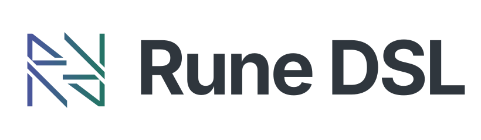
</picture>

# Rune DSL — The next evolution

Explore model-driven development, how Rune DSL works today, and the design and progress of the proposed contribution.

- **Code/Docs snapshot:** 22 September 2026
- **Compatibility baseline:** Rune DSL 9.83.0

## Background

<table>
<tr><td><a href="docs/model-driven-development.md">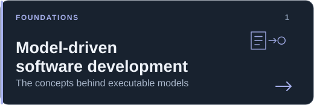</a></td><td><a href="docs/rune-architecture.md">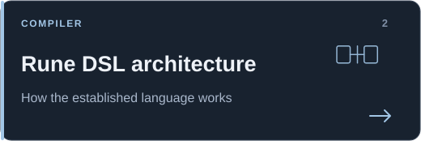</a></td></tr>
<tr><td><a href="docs/rune-cdm-drr.md">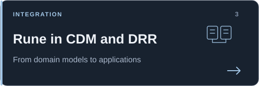</a></td><td><a href="docs/current-drawbacks.md">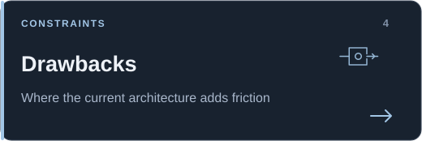</a></td></tr>
</table>

## Contribution

<table>
<tr><td><a href="docs/design-goals.md">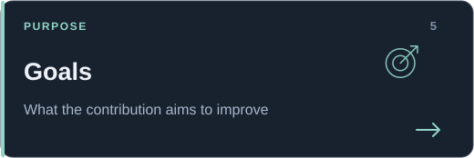</a></td><td><a href="docs/contribution-design.md">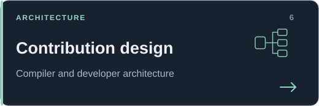</a></td></tr>
<tr><td><a href="docs/current-future-state.md">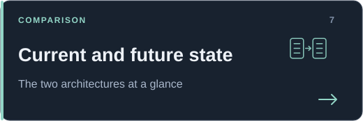</a></td><td><a id="current-ir-capabilities" href="docs/phasing-progress.md">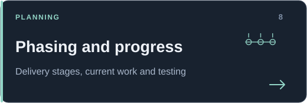</a></td></tr>
<tr><td><a href="docs/measured-outcomes.md">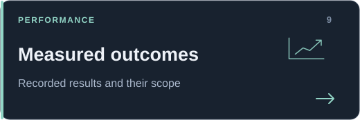</a></td><td><a href="docs/sdk-preview.md">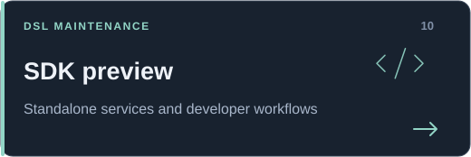</a></td></tr>
</table>

## Explore it

<table>
<tr><td><a href="docs/BUILDING.md">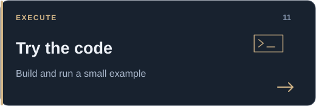</a></td><td><a href="docs/EVIDENCE.md">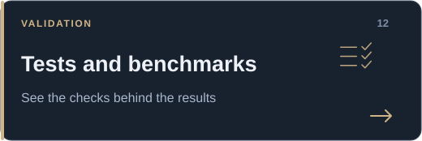</a></td></tr>
<tr><td><a href="docs/SOURCE-SNAPSHOT.md">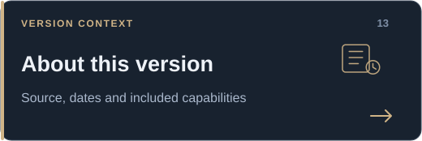</a></td><td></td></tr>
</table>

[Review or contribute](CONTRIBUTING.md) · [Current limitations](docs/LIMITATIONS-AND-PLAN.md) · [Licence](LICENSE) · [Notices](NOTICE)
