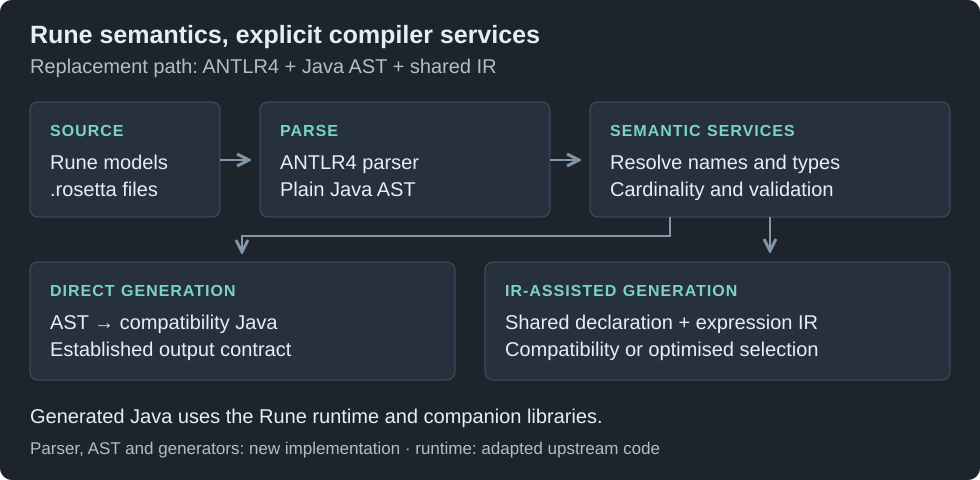

# Architecture

The language remains Rune DSL. This implementation changes the compiler machinery and introduces an intermediate model for future generation and integration work. The reference contract is upstream Rune DSL 9.83.0; this is not a claim to reproduce every later release.

[Design context and primary references](DESIGN-CONTEXT.md) explains the AST/IR boundaries, strategic rationale, implementation trade-offs and relevant compiler research.

## From source to generated code

1. **Parse.** ANTLR4 recognises Rune syntax from checked-in lexer/parser grammars. Generated parser code is used to build a handwritten Java abstract syntax tree (AST): the structured representation of declarations and expressions.
2. **Resolve and validate.** Workspace services link names across files and imports, determine types and cardinalities, and produce diagnostics. The AST alone is not a fully resolved semantic model.
3. **Generate directly or adapt.** The compatibility generator consumes the source model. The IR route adapts source and resolved information into explicit declaration/expression nodes, with reconciliation checks for facts consumed by new emitters.
4. **Emit Java.** The compatibility target seeks the established output contract. The optimised route changes implementation choices and is assessed by compilation and execution equivalence. Some current IR paths still use existing rendering; complete native emission is the active closure task.
5. **Run generated programs.** Generated Java depends on the Rune runtime and selected companion libraries. Replacing the compiler does not eliminate runtime, serialization or model-library contracts.

Going through an AST before IR is intentional. The AST preserves language structure; the IR provides a representation on which generation and analysis can depend. A language-neutral IR reduces coupling to source syntax, but future generators still need defined semantics, runtime support and interoperability tests.

## What changed, and what remains

| Component | Relationship to the original system |
|---|---|
| Xtext language integration | Replaced in the alternative compiler path by explicit Java parsing, linking, validation and generation services |
| EMF/Ecore source model | Replaced in that path by a handwritten AST/workspace model; IR is a further representation, not a new name for the AST |
| Xtend generator implementation | Reimplemented in Java with StringTemplate templates and explicit render helpers |
| `rune-parser`, `rune-java-generator` | Replacement implementations behind familiar language and output contracts |
| `rune-ir`, `rune-ir-java`, `rune-ir-java-optimised` | Added intermediate model and generation modules |
| `rune-maven-plugin` | Updated/reimplemented integration; complete alternate-route dispatch is an explicit integration requirement |
| `rune-runtime` | Retained role and compatibility surface, with targeted implementation/dependency changes; it is not replaced by the IR |
| Rune Common | External companion for generated-model serialization/post-processing; not replaced by the compiler and not the same as `rune-runtime` |
| CDM, DRR, ISO 20022, Rune FpML | Model implementations and compatibility consumers |
| Editor/language-server experience | Current upstream capability that the proposed SDK/LSP work must establish and verify for the replacement |

The original Xtext grammar also generates a parser; using ANTLR in both designs is not contradictory. In the replacement, the `.g4` grammar is maintained directly and ANTLR generates Java parser sources. A checked-in grammar does not mean the generated parser is manually maintained. Grammar compatibility, semantic behaviour and editor support remain separate responsibilities.

## Main libraries and why they fit

| Library | Inspected dependency | Role |
|---|---|---|
| ANTLR4 | 4.13.2; parser generation/runtime | Lexer/parser generation and recognition; the language grammar is explicit |
| StringTemplate 4 | ST4 4.3.4; generator dependency | Source-code templates, separating output structure from semantic decisions |
| Java `ServiceLoader` | JDK API | Optional discovery of IR providers; no separate dependency |
| SnakeYAML | 2.3; plugin production dependency, generator test dependency | Configuration input |
| Jackson | 2.18.9; runtime dependency, IR test dependency | Runtime/data serialization and IR representation checks; not a production dependency of the IR API |
| JSON Schema Validator | 1.5.9; IR test dependency | Schema checks for IR representations |
| Guice / Commons Lang | 6.0.0 / 3.18.0; runtime dependencies | Retained runtime services/utilities |
| JUnit 5 / jqwik / Surefire / JMH | Versions declared per module | Example/property tests, execution and controlled benchmarks |

Module POMs own the exact dependency versions and scopes. Runtime annotations, collections and companion libraries in generated programs are separate dependencies from parser/generator implementation choices. Rune Common appears as `rosetta-common:11.121.2` at test scope in `rune-equivalence`; the original 9.83 compiler/runtime baseline is a different coordinate.

## IR completion boundaries

Enums are emitted by a native IR emitter. Data types and choices are emitted as **type units** by the same six emitters: the POJO, the type-format, cardinality and only-exists validators, the meta registry and the deep-path utility are written together from the declaration IR (`IRTypeNode`, the reconciled property model and derived facts) or the unit is refused whole by name and the existing generator writes all six files. The choice kind is admitted to the same unit through a kind-scoped switch rather than a second unit implementation. Legitimate no-file outcomes, such as an ineligible deep-path utility, are accounted for separately from refusals.

Metafield wrappers shared across a workspace and namespace-level package information are separate units and are not yet emitted from IR. Function, rule and data-rule expressions are processed through the IR, but their files are still written by the existing generator; the remaining adapter and existing-renderer dependencies prevent a blanket claim that every generated file comes from IR alone. [Evidence](EVIDENCE.md) gives the file-ownership figures.

The optimised writer currently uses IR selection while substantial rendering is hosted on the AST compiler. “Two targets over one completed IR” is the direction, not an assertion that rehosting is finished.

## Extensibility and editor services

The proposed SDK should expose stable workspace, diagnostic, semantic-query and generator extension boundaries. LSP and MCP should consume those same services. An SDK API alone does not provide completion, rename, navigation, formatting, incomplete-input recovery, cancellation or live-edit responsiveness; those need implementation and acceptance tests.

The project considered an additional language-workbench layer, including Langium, and chose to explore direct ownership of the Java stack. This trades framework services for control and responsibility. It does not show that other frameworks cannot support generators, IR or AI integration.

See [Modes](MODES.md), [Testing](TESTING.md) and [Limitations and plan](LIMITATIONS-AND-PLAN.md).
