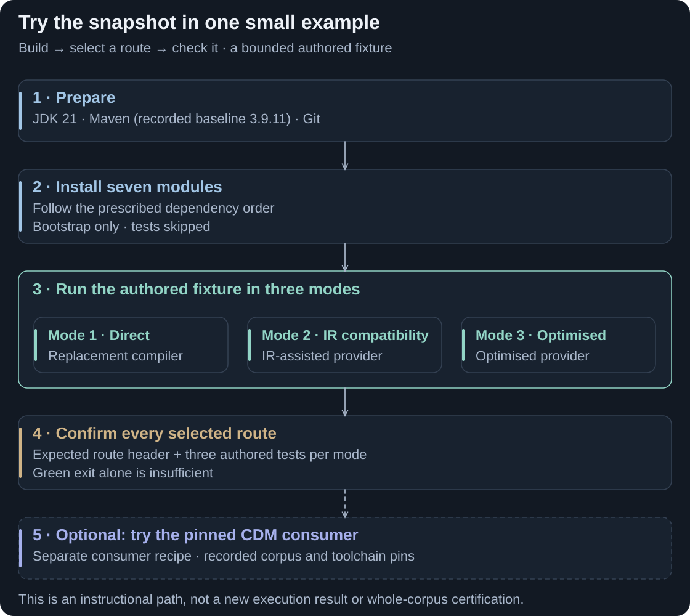

# Execute

Build the snapshot and run a small generated-code example. This path needs no external CDM/DRR corpus and exercises the three Java modes.

<picture>
  <source media="(max-width: 800px)" srcset="assets/contribution-execute-mobile.svg">
  
</picture>

**From a local build to a bounded working example.** Check the selected route as well as the test result. [Full-size walkthrough](assets/contribution-execute.svg).

<p class="chapter-meta"><strong>EXPLORE</strong> · Code/Docs snapshot: 22 September 2026 · Small authored fixture</p>

## Prerequisites

Use **JDK 21** on both `JAVA_HOME` and `PATH`, Maven and Git, with access to the declared public dependency repositories. Maven 3.9.11 is the recorded baseline. There is no root reactor POM or Maven wrapper. Python 3 and PowerShell 7 are optional for separate corpus/receipt tooling.

## Install the compiler and Maven plugin

From the repository root, run these in order and stop on failure. `-DskipTests` bootstraps the artifacts; it is not test evidence.

```sh
mvn -B -ntp -Dmaven.build.cache.enabled=false -f rune-parser/pom.xml install -DskipTests
mvn -B -ntp -Dmaven.build.cache.enabled=false -f rune-java-generator/pom.xml install -DskipTests
mvn -B -ntp -Dmaven.build.cache.enabled=false -f rune-ir/pom.xml install -DskipTests
mvn -B -ntp -Dmaven.build.cache.enabled=false -f rune-ir-java/pom.xml install -DskipTests
mvn -B -ntp -Dmaven.build.cache.enabled=false -f rune-ir-java-optimised/pom.xml install -DskipTests
mvn -B -ntp -Dmaven.build.cache.enabled=false -f rune-runtime/pom.xml install -DskipTests
mvn -B -ntp -Dmaven.build.cache.enabled=false -f rune-maven-plugin/pom.xml install -DskipTests
```

## Run the small three-mode example

```sh
mvn -B -ntp -Dmaven.build.cache.enabled=false -f examples/review/pom.xml clean verify -Dreview.mode=m1 -Drosetta.generator.ir=false -Drosetta.generator.ir.optimised=false
mvn -B -ntp -Dmaven.build.cache.enabled=false -f examples/review/pom.xml clean verify -Dreview.mode=m2 -Drosetta.generator.ir=true -Drosetta.generator.ir.optimised=false
mvn -B -ntp -Dmaven.build.cache.enabled=false -f examples/review/pom.xml clean verify -Dreview.mode=m3 -Drosetta.generator.ir=false -Drosetta.generator.ir.optimised=true
```

| Mode | What it selects |
|---|---|
| 1 · Direct | Replacement compiler's direct compatibility generator. IR off does not select the stock compiler. |
| 2 · IR compatibility | IR-assisted compatibility Java provider; some whole files still use existing writers. |
| 3 · Optimised | Optimised provider and selected runtime; general contract is compilation/behaviour rather than byte identity. |

Expect generated sources under `examples/review/target/<mode>/generated-sources/rune` and **three authored tests per mode**: echo-function execution, valid value accepted and invalid value rejected. Check the log also selects the intended route: Mode 1 `IR route: OFF`, Mode 2 `IRGenerationProviderImpl`, Mode 3 `OptimisedIRGenerationProviderImpl`. Provider fallback can leave tests green, so exit status alone is insufficient; a provider header establishes selection, not whole-file native IR ownership.

The export record reports three tests with zero failures/errors/skips in each mode. These commands have not been rerun for this guide refresh.

## Use it with a real model

Next, use a disposable checkout and the pinned [Maven consumer recipe](MAVEN-CONSUMERS.md). It shows how to select the compiler plugin, runtime and IR flags for CDM; the [corpus catalogue](CORPUS-9.83.md) records the model/toolchain pins. Review the [current limitations](LIMITATIONS-AND-PLAN.md) before evaluating it for an application.

<details>
<summary>Configuration, troubleshooting and broader checks</summary>

`review.mode` names output directories; JVM properties select routes. The fixture explicitly uses the adapted snapshot runtime; the general generator defaults to released Rune 9.83.0. Both provider jars must be installed because plugin dependencies resolve even with tests skipped. Local modules share `0.0.1-SNAPSHOT`; reinstall after source changes.

An optional private Maven cache needs the same absolute `-Dmaven.repo.local=…` on every command. Some broader corpus helpers assume the normal cache, so this small recipe does not promise fully isolated execution of every gate. Run corpus-heavy JVM tasks serially.

Missing dependencies: check JDK/PATH, repository access and install order. Missing corpus: use the small fixture first, then follow [Corpus](CORPUS-9.83.md). A successful bootstrap is not proof every module suite passes. See [consumer configuration](MAVEN-CONSUMERS.md), [mode contracts](MODES.md), [testing](TESTING.md) and the [original detailed build recipe](BUILDING-DETAILS.md).

</details>

[Previous: DSL maintenance](sdk-preview.md) · [Guide index](../README.md) · [Next: Verify and reproduce](EVIDENCE.md)
