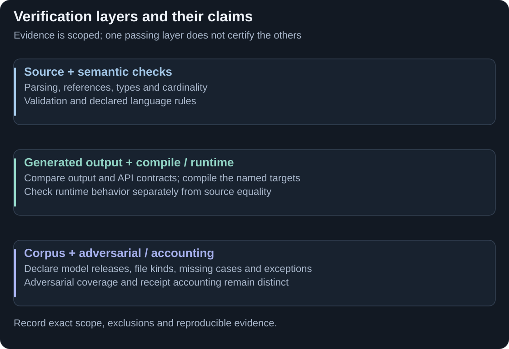

# Verify and reproduce

Use the check that matches the claim: accepted source semantics, generated text, executable behaviour, native writer ownership or performance. The retained records below are historical evidence, not fresh certification of this guide.

<picture>
  <source media="(max-width: 800px)" srcset="assets/contribution-verification-mobile.svg">
  
</picture>

**Correctness and ownership need different evidence.** [Full-size verification map](assets/contribution-verification.svg).

<strong>EXPLORE</strong> · Code/Docs snapshot: 22 September 2026 · Retained results and reproduction limits

## Compatibility

The historical **25 real release cells × 11 file kinds, on each of two compatibility routes** contain **174,129 identical / 174,141 reference files**, zero differing and **12 named missing wrappers**, after declared line-ending normalisation. The cells are ten CDM, ten DRR, one ISO 20022 and four Rune FpML, deliberately tested on Rune **9.83.0**. Chaos is a separate population.

This establishes scoped output fidelity, not complete native IR ownership. [Off-route rows](evidence/compatibility-25cell-off.txt) · [On-route rows](evidence/compatibility-25cell-on.txt) · [Complete release list](CORPUS-9.83.md).

## What was checked on the curated export

The [source record](SOURCE-SNAPSHOT.md) distinguishes executed package checks from earlier development evidence. Executed checks included bootstrap installs, all three small-fixture modes, negative controls, focused module checks, a public CDM/builtin example, plugin checks and document/integrity gates.

Full 25-cell reruns, complete DRR/ISO/FpML coverage, the optimised paired gate, full runtime benchmarks and hosted CI were **not rerun on the assembled export**. Some full-module tests hit expected unavailable-corpus guards. Fresh CDM verification accepted independently witnessed upstream ordering variants; it was not raw-byte identity.

## Reproduce a bounded result

Start with [Execute](BUILDING.md). For a corpus or benchmark, obtain the pinned inputs, matching goldens, toolchain/runtime variants and machine conditions recorded by [Experiments](EXPERIMENTS.md) and [Testing](TESTING.md). Record scope, skips and named exceptions. Inspect acceptance reports as well as exit codes; a report-only compilation gate is not established by Maven returning zero.

The [CI guide](CI.md) explains which checks can run locally and which need authorised corpora; no hosted CI workflow is included. To report a finding, follow [Review and contribution](../CONTRIBUTING.md) with the revision, model/version, route, command and observed result.

Receipts by claim and important boundaries

### Source-to-Java generation

The [performance page](measured-outcomes.md) gives exact medians, populations and memory trade-offs. Raw compact receipts: [direct reference](evidence/codegen.legacy.json), [replacement](evidence/codegen.m1.json), [comparison](evidence/diff.legacy-vs-m1.json), [Maven reference](evidence/build.legacy.clean.json), [replacement](evidence/build.plus.clean.json), [comparison](evidence/build.paritydiff.json). These are generation tasks, not full-build or native-IR speed claims.

### Runtime changes

The [U020](evidence/runtime-U020-source.txt), [U021](evidence/runtime-U021-source.txt), [U022](evidence/runtime-U022-source.txt) extracts preserve uncertainty for separate six-fork pairs. They are not complete raw JMH logs and do not supply every predecessor runtime/input needed for exact reproduction.

### AI-context experiment: what changed and why

The [context receipt](evidence/ai.context.json) records a selective structural digest, not all source meaning or improved LLM answers. The [access receipts](evidence/analytics.legacy-emf.json) compare with the [replacement JVM](evidence/analytics.plus-jvm.json) and [separate Python prototype](evidence/analytics.nojvm.json). Startup/preparation, warm requests and token selection are different measurements.

### Current IR maturity (the choice milestone)

Historical snapshot ownership is **93,703 / 174,141 files** across **25 real cells × 11 kinds on the compatibility IR route**, chaos excluded. [Writer populations](evidence/ir-writers-32f8c9ec4.txt), [shadow/acceptance lines](evidence/ir-unit-shadows-32f8c9ec4.txt) and [Planning](phasing-progress.md) explain what this counts. It is not an end-to-end certification percentage.

### Optimised-route paired execution (the exported revision)

The [census](evidence/optimised-pair-census-32f8c9ec4.txt) records **150,831 paired executions with zero behaviour difference over 21 function-bearing cells: ten CDM, ten DRR and authored chaos**. ISO/FpML are outside that gate. Inputs are synthesised; this is execution equivalence, not byte identity or performance. Chaos has an explicit exception register.

Fresh CDM manifest verification covers **87 source + 3,950 Java = 4,037 files**: W1 had 4,035 identical plus two witnessed orderings; W2 had 4,034 plus three. Both passed with `rawBytesIdentical:false`. Alternative orderings were regenerated by released upstream, not accepted merely because the replacement produced them. API/ABI checks use a separate **9.58.1** baseline.

See [receipt custody and hashes](evidence/README.md), [adversarial controls](CHAOS-GATE.md) and the [complete original evidence account](EVIDENCE-DETAILS.md). Historical chaos categories overlap and must not be added as a disjoint file total.

[Previous: Execute](BUILDING.md) · [Guide index](../README.md) · [Next: About this snapshot](SOURCE-SNAPSHOT.md)
