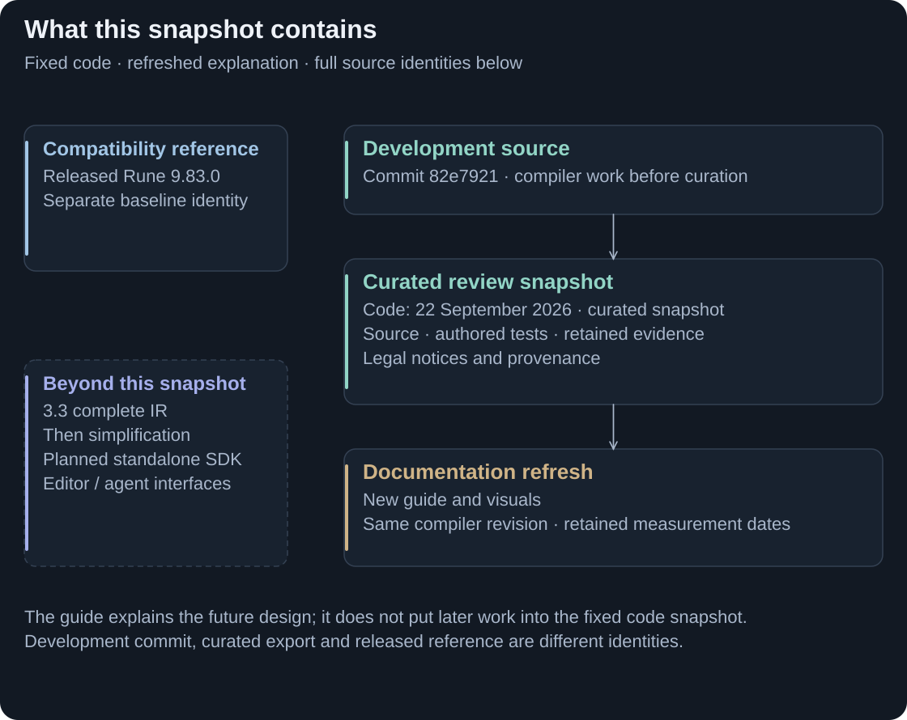

# About this snapshot

This repository presents a **22 September 2026 code/docs snapshot** of the proposed contribution. The public guide explains that fixed code and the intended design; it does not advance the compiler revision or redate retained measurements.

<picture>
  <source media="(max-width: 800px)" srcset="assets/contribution-provenance-mobile.svg">
  
</picture>

**A new guide to the same code snapshot.** Source provenance, retained evidence and future plans have distinct roles. [Full-size provenance map](assets/contribution-provenance.svg).

<strong>EXPLORE</strong> · Code/Docs snapshot: 22 September 2026 · Compatibility baseline: Rune DSL 9.83.0

## Included and planned

**Included:** replacement parser/workspace/semantic services, direct Java generation, IR infrastructure and partial compatibility/optimised generation, adapted Java runtime, Maven plugin, authored fixtures and retained evidence.

**Still in development:** complete native compatibility Java IR integration. **Planned afterward:** simplification, standalone SDK, replacement editor/LSP workflows and agent interfaces. New language targets, profiles and model bridges need separate acceptance. See [Planning](phasing-progress.md).

## Source revision

| Identity | Recorded value |
|---|---|
| Review repository history | One curated root commit; compiler snapshot dated 22 September 2026 |
| Development source commit | `82e7921352111c4b0ae38fd37b8f8c89402f64c7` |
| Development source tree | `5790c45314c8d39663300e198390bea9772fd497` |
| Tree-equivalent validated development commit | `32f8c9ec4b337c5d3d33c9158e8410dd2225b36e` |
| Released Rune 9.83.0 reference | [`5fb8d697911d2ca62532d1801265b67752d03ef9`](https://github.com/finos/rune-dsl/tree/5fb8d697911d2ca62532d1801265b67752d03ef9) |
| Public CDM 5.38.0 reference | [`788f63af47723ca2ef2ec8d24f31c01a4ac4505f`](https://github.com/finos/common-domain-model/tree/788f63af47723ca2ef2ec8d24f31c01a4ac4505f) |

These are different identities: a source commit, its tree and a curated export are not interchangeable. This repository presents one curated root commit; earlier private review commits and the private development history are not included. Receipt hashes and declared redactions retain evidence provenance.

Packaging and validation scope

Source curation preserves authored fixtures, third-party/legal notices and upstream attribution. External corpora, generated trees and private journals are not included. Existing legal/provenance notices are separate from the guide's presentation branding.

### Packaging differences

The curated repository contains the review source and declared fixtures rather than private development history or external corpora. The [original packaging account](SOURCE-SNAPSHOT-DETAILS.md#packaging-differences) records the specific curation.

### Environment of the executed checks

The original preparation used its recorded Windows/Linux environments. Machine details and commands remain in the [source record](SOURCE-SNAPSHOT-DETAILS.md#environment-of-the-executed-checks); they are not new guide verification runs.

### Executed checks and results

Bootstrap installs, three fixture modes, focused checks and bounded public CDM verification were executed during export preparation. [Verify and reproduce](EVIDENCE.md) explains their limits; the [original result table](SOURCE-SNAPSHOT-DETAILS.md#executed-checks-and-results) retains individual outcomes.

### Findings during validation

CDM output included witnessed upstream ordering alternatives, and broader suites encountered unavailable-corpus guards. See the [recorded findings](SOURCE-SNAPSHOT-DETAILS.md#findings-during-validation). Accepted ordering variants must not be relabelled raw-byte equality.

### Corrections after the committed-snapshot review (first correction)

The [first correction record](SOURCE-SNAPSHOT-DETAILS.md#corrections-after-the-committed-snapshot-review-first-correction) describes bounded package fixes and their checks.

### Corrections after the correction review (second correction)

The [second correction record](SOURCE-SNAPSHOT-DETAILS.md#corrections-after-the-correction-review-second-correction) retains the follow-up validation. Neither correction is a claim of complete IR delivery.

### Not executed from this export

The full historical 25-cell matrices, full runtime experiments, optimised paired gate and hosted CI were not rerun on the assembled export. The [complete excluded scope](SOURCE-SNAPSHOT-DETAILS.md#not-executed-from-this-export) remains part of the record.

### Fresh-clone check

The retained packaging handback and status logs record a completed check on **23 September 2026, 00:50–00:52 UK time**, on the original curated code snapshot. It used JDK 21.0.8, Maven 3.9.11, a new empty Maven cache, empty review settings and the build cache disabled. All seven bootstrap installs succeeded with tests skipped.

For the **small authored fixture only**, each of Modes 1, 2 and 3 generated **47 Java files** and ran **3 tests with zero failures, errors or skips**. The logs identify the intended providers. The handback reports 47 common paths, no extra paths and 47 raw-SHA-256-identical files for both Mode 1 versus 2 and Mode 1 versus 3. Tracked files remained unchanged. Those operational logs are retained outside this package; this is a historical report, not a new run or whole-corpus certification.

The [original source/validation record](SOURCE-SNAPSHOT-DETAILS.md) predates that post-commit check. It retains the earlier preparation results and limitations; the [evidence entry point](EVIDENCE.md) explains their scope.

The source package is a review contribution, not a published stable compiler/SDK release. Reproduction uses the explicit [build recipe](BUILDING.md), [corpus pins](CORPUS-9.83.md), [mode contracts](MODES.md) and [receipt inventory](evidence/README.md).

[Previous: Verify and reproduce](EVIDENCE.md) · [Guide index](../README.md)
