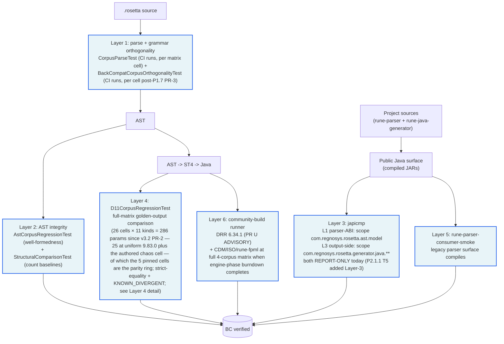

> **Review snapshot note.** This engineering document is retained from the development repository because tests lock it to the code. Its references to the development changelog, flip ledger, IR page, an audit and the ring-fence note point at records that are not included in this snapshot; they are rendered as plain text.

# Backward Compatibility Verification

How rune-dsl-plus proves it doesn't break upstream consumers. Six gates,
each with explicit failure modes. (P2.1.1 added the 6th gate — community-
build runner — at HEAD `c1f1368` (PR #59 merge, 2026-05-11); japicmp gate
at § Layer 3 was extended with the output-side-jars Layer-3 sub-execution
in the same PR. Layer 4's `KNOWN_DIVERGENT` waiver was 120-entry-shrunk at
P2.1.3 (Cluster F 120-entry retirement via D35) + P2.1.3b (Cluster F α/β2
32-entry retirement via D36; cumulative 152 of 184 retired = 83%) — see
§ Layer 4 *Waiver inventory* for details.)

**CI vs local execution reality (re-audited 2026-05-11 against all six PR/push-relevant CI workflow files at HEAD; the sixth — `community-build.yml` — landed at P2.1.1 T6. `fuzz-nightly.yml` is `schedule:` + `workflow_dispatch:` only and `cache-wipe.yml` is `workflow_dispatch:`-only — neither is included here).** Each workflow has its own gating semantics — there is no single "all workflows" rule. Per-workflow table:

| Workflow | PR trigger | Push trigger | Paths filter | `ci:run` label gate |
|---|---|---|---|---|
| `ci.yml` | yes (`labeled` event-type included) | branches `main` | `paths-ignore` excludes `docs/**`, `research/**`, `**/*.md`, `.github/copilot-instructions.md`, `.gitignore`, `.gitattributes`, `.editorconfig`, `LICENSE`, `NOTICE`, `CODE_OF_CONDUCT`, `SECURITY`, `GOVERNANCE`, `MAINTAINERS` | yes on PR events — `build-and-test` + `grammar-validation` jobs use predicate **G1** below; `corpus-regression` + `d11-corpus-regression` (P1.7 PR-2) jobs use predicate **G2** below + step-level **G3** below; `d5-budget-gate` uses predicate **G4** below; `d5-budget-gate-d11` (P1.7 PR-2) uses predicate **G4-D11** below. Non-PR events (push to non-docs paths, `workflow_dispatch`) **bypass** the label requirement when the workflow itself is triggered |
| `japicmp-gate.yml` | yes | **none** | `paths-ignore` excludes `docs/**`, `research/**`, `**/*.md`, `.github/copilot-instructions.md`, `.gitignore`, `.gitattributes`, `.editorconfig`, `LICENSE`, `NOTICE` (narrower than `ci.yml` — does **NOT** ignore `CODE_OF_CONDUCT`, `SECURITY`, `GOVERNANCE`, `MAINTAINERS`) | yes — both `gate` job (Layer 1: parser ABI) and `layer3-gate` job (Layer 3: output-side jars, added P2.1.1 T5) use predicate **G5** below (unconditional). Workflow only triggers on PR so each gate effectively requires the label always |
| `community-build.yml` | yes (`labeled` event-type included) | **none** | same 9-entry `paths-ignore` as `japicmp-gate.yml` (narrower than `ci.yml` — does **NOT** ignore `CODE_OF_CONDUCT`, `SECURITY`, `GOVERNANCE`, `MAINTAINERS`) | yes on PR events — `community-build-drr-5-59` job uses predicate **G1** below; non-PR events (nightly cron `0 4 * * *` UTC and `workflow_dispatch`) bypass the label requirement and always run when the workflow triggers. ADVISORY-only at P2.1.1 (`continue-on-error: true`); flips to ENFORCING at P2.1.6 per spec § 6 R10 |
| `ci-hygiene.yml` | yes | branches `main` (no paths filter) | **none** (broad triggers) | yes on PR events — `lints` job uses predicate **G1** below; non-PR events (push / `schedule` / `workflow_dispatch`) bypass the label requirement and always run lints when the workflow triggers. The workflow's other job (`nightly-bypass`) is schedule/dispatch-only and never PR-/label-gated |
| `ci-paths-skip.yml` | yes (matches docs-only `paths:`) | branches `main` (matches docs-only `paths:`) | **inverse** — uses `paths:` to MATCH docs-only changes (not ignore them) | **NO** — intentional docs-only required-checks shim (label gate would re-create the docs-only branch-protection deadlock) |
| `byte-diff-catalogue.yml` | yes (`labeled` event-type included) | branches `main` | **inverse** — uses `paths:` to MATCH byte-diff scope (`docs/byte-diff-catalogue/**`, `scripts/byte-diff/**`, `rune-japicmp/**`, this workflow file) | yes on PR events — every job uses predicate **G1** below; non-PR events (push matching the `paths:` scope, `workflow_dispatch`) **bypass** the label requirement when the workflow itself is triggered |

**Canonical job-level `if:` predicates (literal, copy-pasteable — referenced as G1..G5 in the table above):**

```yaml
# G1 — simple label-gate (used by build-and-test, grammar-validation, lints, byte-diff-catalogue jobs)
if: github.event_name != 'pull_request' || contains(github.event.pull_request.labels.*.name, 'ci:run')

# G2 — composite label-gate + fork-safety (used by ci.yml's corpus-regression + d11-corpus-regression jobs)
if: >-
  (github.event_name != 'pull_request' || contains(github.event.pull_request.labels.*.name, 'ci:run'))
  && (github.event_name != 'pull_request' || github.event.pull_request.head.repo.full_name == github.repository)

# G3 — step-level CORPUS_PAT secret check (skips steps when secret absent, e.g. external forks)
if: env.CORPUS_PAT != ''

# G4 — d5-budget-gate (post-corpus-regression aggregator)
if: always() && needs.corpus-regression.result != 'skipped'

# G4-D11 — d5-budget-gate-d11 (post-d11-corpus-regression aggregator; P1.7 PR-2)
if: always() && needs.d11-corpus-regression.result != 'skipped'

# G5 — japicmp-gate.yml's gate job (PR-only workflow, label always required)
if: contains(github.event.pull_request.labels.*.name, 'ci:run')
```

Implication: PRs touching only `docs/**`, `research/**`, `**/*.md`, or other paths in `ci.yml`'s `paths-ignore` list (the broader 13-entry list above) do **not** run `ci.yml` regardless of label; `ci-paths-skip.yml` posts the synthetic required-context SUCCESS for those. `japicmp-gate.yml` uses a **narrower** `paths-ignore` list (9 entries — see workflow row above) and does **NOT** ignore the extensionless governance docs (`CODE_OF_CONDUCT`, `SECURITY`, `GOVERNANCE`, `MAINTAINERS`), so a labeled PR touching only those files **can still trigger japicmp-gate.yml** even though `ci.yml` would skip. `community-build.yml` mirrors `japicmp-gate.yml`'s narrower 9-entry `paths-ignore` (PR-only — no push trigger) and adds two non-PR triggers (nightly cron + manual `workflow_dispatch`) that bypass the label requirement, so the same labeled-PR-touching-governance-docs scenario also triggers Layer 6 (community-build); the workflow stays ADVISORY at P2.1.1 (`continue-on-error: true`), so a Layer 6 failure surfaces as a separate check but doesn't block merge. `ci-hygiene.yml` triggers on every PR
event (`opened` / `synchronize` / `reopened` / `labeled`), every push-to-main, and every nightly schedule — but its **`lints` job** is the PR-event-gated piece (job-level `if:`); push / schedule / dispatch always run lints, and PR-event runs only do the heavy work when `ci:run` is attached. `byte-diff-catalogue.yml` runs on labeled PRs (and push-to-main) **when changes match its `paths:` scope** (`docs/byte-diff-catalogue/**`, `scripts/byte-diff/**`, `rune-japicmp/**`, the workflow file itself) — note that `docs/byte-diff-catalogue/**` is in scope, so docs-only PRs that touch only the byte-diff-catalogue tree can still run this workflow if labeled.

| Test | CI today | Local | Notes |
|---|---|---|---|
| `CorpusParseTest` | **runs** (corpus-regression matrix, per cell) — gated at job level by label gate **+ fork-safety** (`github.event.pull_request.head.repo.full_name == github.repository`); several steps additionally gated by **`if: env.CORPUS_PAT != ''`** (skip when secret absent, e.g. external forks) | runs when `test-corpus/` cloned | parses every `.rosetta` file |
| `BackCompatCorpusOrthogonalityTest` | **runs** (corpus-regression matrix per cell — P1.7 PR-3 T5; same composite gate as `CorpusParseTest`; rune-dsl builtins copied per-cell to satisfy `CorpusWalker.BUILTINS_DIR`); each cell asserts orthogonality on its corpus subset, matrix aggregate covers all 1,628 fixtures | runs (1,628) when `test-corpus/` + `rune-dsl/` both cloned | orthogonality of new grammar surfaces |
| `AstCorpusRegressionTest` | **runs** (corpus-regression matrix per cell — P1.7 PR-3 T5; same composite gate as above) | runs (1,628) when both dirs cloned | AST well-formedness |
| `StructuralComparisonTest` | **runs** (corpus-regression matrix, per cell) — same composite gate as `CorpusParseTest` (job-level label gate + fork-safety using `github.event.pull_request.head.repo.full_name`; step-level `CORPUS_PAT` check) | runs when `test-corpus/` cloned | element-kind count baselines |
| `D11CorpusRegressionTest` (+ 5 local-only siblings) | **`D11CorpusRegressionTest` runs** in the new `d11-corpus-regression` matrix job (P1.7 PR-2; per-(corpus, version) cell dispatch — 5 pinned cells at uniform rune-dsl 9.83.0 (the PR #85 rebaseline set); all 10 element kinds run as 10 distinct `@ParameterizedTest` methods, each `@MethodSource("activeCells")`-parametrized over cells — with `KNOWN_DIVERGENT` waiver; every cell uses `mvn -pl rosetta-source -am process-sources` pre-test to materialise goldens (output roots + bound phases per corpus → the CI workflow YAML). ISO's `-Pgenerate` profile rewrites `.rosetta` source via `iso20022-rosetta-importer` (destructive); use only for recovery, not routine pre-test. **Per-kind GH-check attribution is deferred to P2** — a matrix split per kind; no Java change needed (Surefire supports per-method selection). **5 siblings remain local-only** (investigation/diagnostic helpers, single-cell scope) | primary `D11CorpusRegressionTest` runs when `test-corpus/` cells cloned + builtins available via `test-corpus/rune-dsl-builtins/rune-runtime/src/main/resources/model/` OR sibling `../rune-dsl/rune-runtime/src/main/resources/model/` clone (per the `BUILTINS_SEARCH_ROOTS` constant in `D11CorpusRegressionTest`). 5 siblings additionally require `common-domain-model/` cloned for their `cdmAvailable()` predicates — see each predicate in source | codegen byte-comparison |
| `LegacyParserSurfaceSmokeTest` | **runs** (rune-parser-consumer-smoke step) | runs | legacy parser surface compiles |
| japicmp Layer-1 | **runs** (`japicmp-gate.yml`, `gate` job) | runs (`mvn -f rune-japicmp/pom.xml verify`) | parser-side public Java surface (`rune-parser` JAR) vs upstream Maven Central baseline |
| japicmp Layer-3 (output-side jars; P2.1.1 T5) | **runs** (`japicmp-gate.yml`, `layer3-gate` job) — `ci:run`-label-gated; PR-only trigger; activated via `-Djapicmp.layer3.skip=false`; `<skip>${japicmp.layer3.skip}</skip>` default `true` (skipped locally unless baseline jar dropped per the development methodology note § 3 Phase 2) | runs (`mvn -f rune-japicmp/pom.xml verify -Djapicmp.layer3.skip=false`) when baseline jar at `rune-japicmp/.japicmp-baselines/baseline-rune-java-generator.jar` populated (that jar cannot be rebuilt from this review snapshot; see Layer 3.2) | output-side public Java surface (`rune-java-generator` JAR at PR HEAD) vs baseline jar built from post-P2.0.3-close main HEAD `edda5ea`; REPORT-ONLY at P2.1.1 |
| `community-build / community-build-drr-6-34` (PR #85; was `drr-5-59` pre-rebaseline) | **runs** (`community-build.yml`, `community-build-drr-6-34` job) — ADVISORY (`continue-on-error: true`); PR-only triggers: labeled-PR (`ci:run`); nightly cron `0 4 * * *` UTC; manual `workflow_dispatch`; 45-min timeout per the development methodology note § 5 d5-budget-gate level-7 | runs (`scripts/community-build/clone.sh drr 6.34.1 && scripts/community-build/run.sh drr 6.34.1`) when an authorised-access credential for the private model repositories is configured + fork jars built locally | downstream consumer corpus (DRR 6.34.1) Maven test suite compiles + passes against fork jars; full 4-corpus matrix extends when engine-phase typed-pipeline burndown completes |

**Honest summary (post-P2.1.1 T5/T6):** **all 9 test rows above run in CI** — the three CI-backed rune-parser-side tests (`CorpusParseTest`, `StructuralComparisonTest`, `LegacyParserSurfaceSmokeTest`) plus `BackCompatCorpusOrthogonalityTest` + `AstCorpusRegressionTest` (newly CI-wired in P1.7 PR-3 T5 via the existing `corpus-regression` matrix; rune-dsl builtins copied per cell to satisfy `CorpusWalker.BUILTINS_DIR`) plus japicmp Layer-1 plus japicmp Layer-3 (added at P2.1.1 T5 as a second `<execution>` block in `rune-japicmp/pom.xml` + a parallel `layer3-gate` job in `japicmp-gate.yml`; REPORT-ONLY, default-skipped via `<skip>${japicmp.layer3.skip}</skip>` and CI activates with `-Djapicmp.layer3.skip=false`) plus `D11CorpusRegressionTest` (added in P1.7 PR-2 via the new `d11-corpus-regression` matrix job, parallel to `corpus-regression`; runs `working-directory: rune-java-generator` on a separate D5 budget tier — 900s PR / 2700s nightly per `scripts/ci/d5-budget-gate.sh` `d11-cell` prefix) plus the community-build runner (`community-build / community-build-drr-6-34` job in
`community-build.yml`; DRR 6.34.1 ADVISORY at PR #85, was DRR 5.59.0 pre-rebaseline; matrix extends to full 4-corpus when engine-phase typed-pipeline burndown completes). On **PR events**, the `ci:run` label is required (per `ci.yml` job-level `if:`). On **push-to-main with non-docs paths** (i.e., when `ci.yml`'s `paths-ignore` doesn't filter the push), the label requirement is bypassed and the workflow runs without the label. Docs-only pushes don't trigger `ci.yml` at all (paths-ignore filters them out). Of those 9, **`CorpusParseTest`, `StructuralComparisonTest`, `BackCompatCorpusOrthogonalityTest`, `AstCorpusRegressionTest`, `LegacyParserSurfaceSmokeTest`, and `D11CorpusRegressionTest` also run on non-docs push-to-main via `ci.yml`**; japicmp Layer-1, japicmp Layer-3, and the community-build runner all have **no push trigger** — `japicmp-gate.yml` (both jobs) is PR-only + unconditional label-gate; `community-build.yml` is PR-only + label-gate, with the additional nightly cron + `workflow_dispatch` triggers that bypass the label. The 5 D11 sibling test classes (`D11DiagnosticTest`,
`D11GoldenComparisonTest`, `D11MismatchAnalysisTest`, `D11SampleDiffTest`, `DocRefDebugTest`) remain local-only (investigation/diagnostic helpers, single-cell scope).

## Four-layer success gate

The four-layer gate is the release-readiness *goal* (it replaces byte-identity-alone, D1): all four layers must pass to close a parity milestone. This doc is the canonical home for the gate (the README links here); it records the **enforcement mechanisms** in place today - which test in which module locks which BC invariant - and the six-layer map below is the fine-grained view of these four.

| Layer | Today's state |
|---|---|
| japicmp (API/ABI parity) | runs on every PR; **report-only** today (both parser-ABI + output-side jars set `breakBuildOnModifications=false`); build-break enforcement deferred to P2.1.6 |
| Community-build (downstream) | ADVISORY (DRR 6.34.1 at PR #85; was DRR 5.59.0 pre-rebaseline); ENFORCING when the full 4-corpus matrix lands |
| Full-matrix byte-compare | **ACTIVE** - D11 strict-equality across 5 pinned cells at uniform 9.83.0 across 4 kinds; `KNOWN_DIVERGENT` waivers under the D34 taxonomy (7-category since PR #85, adding `CODEGEN_BODY_GAP` + `CODEGEN_MISSING`) |
| Byte-diff catalogue | skeleton landed P1.3.3; full catalogue P2 scope |

## At a glance



**Per the workflow-gating table at top-of-doc:** `ci.yml` (Layers 1+2+5) is `paths-ignore`d for docs-only PRs/pushes (broader 13-entry list including extensionless governance docs) and label-gated on **PR events only** (non-PR events that the workflow is configured to trigger on — non-docs push-to-main and `workflow_dispatch` — bypass the label requirement via job-level `if:`). `japicmp-gate.yml` (Layer 3 — both 3.1 parser ABI and 3.2 output-side jars since P2.1.1 T5) uses a **narrower** `paths-ignore` (9 entries; does **NOT** ignore `CODE_OF_CONDUCT`, `SECURITY`, `GOVERNANCE`, `MAINTAINERS`), is **PR-only** (no push trigger), and label-gated unconditionally on both jobs (`gate` and `layer3-gate`) — so a labeled PR touching only the extensionless governance docs would still trigger Layer 3 (japicmp) even though Layer 5 (`ci.yml`) skips. `community-build.yml` (Layer 6 — added P2.1.1 T6) shares `japicmp-gate.yml`'s narrower 9-entry `paths-ignore` and PR-only-trigger shape on PR events, with additional nightly cron (`0 4 * * *` UTC) and `workflow_dispatch` triggers that bypass the
label; ADVISORY-only (`continue-on-error: true`) at P2.1.1, flipping to ENFORCING at P2.1.6. Net: Layer 5 runs on labeled non-docs PRs + on non-docs push-to-main without label (via `ci.yml`); Layer 3 runs on labeled PRs that don't match `japicmp-gate.yml`'s narrower paths-ignore (via `japicmp-gate.yml`'s two jobs); Layer 6 runs on labeled PRs + nightly cron + manual dispatch (via `community-build.yml`); Layers 1 and 2 are **fully wired in CI post-P1.7 PR-3** under the same `ci.yml` gating (parse + count-baseline gates already ran via the corpus-regression matrix pre-PR-3; PR-3 T5 added orthogonality + AST-well-formedness gates per cell with rune-dsl builtins copied per cell to satisfy `CorpusWalker.BUILTINS_DIR`). Layer 4 runs in CI post-P1.7 PR-2 via the new `d11-corpus-regression` matrix job in `ci.yml` (parallel to `corpus-regression`; same G2 composite gate; per-(corpus, version) cell dispatch over the 5 pinned cells at uniform rune-dsl 9.83.0 — PR #85 rebaseline 2026-05-28; the pre-rebaseline 14th `cdm-master` `continue-on-error` cell was dropped per D41 as part of v10
deferral); the 5 sibling D11 helper classes remain local-only.

---

## Layer 1 — Source-level parse + grammar orthogonality

**Tests:**
- `CorpusParseTest` (`rune-parser/src/test/java/com/regnosys/rosetta/parser/CorpusParseTest.java`) — every `.rosetta` file in the corpus must parse without errors.
- `BackCompatCorpusOrthogonalityTest` (`rune-parser/src/test/java/com/regnosys/rosetta/ast/BackCompatCorpusOrthogonalityTest.java`) — additive-only invariant: every legacy fixture produces empty-list / `Optional.empty()` for new P1.4.2 grammar surfaces (`fileHeader()`, `runeAnnotations()`, `namedArgs()`). If a pre-existing token is silently reclassified by the new optional prefix grammar, this test fails with a precise pointer to the offending fixture.

**What they lock together:** every existing `.rosetta` file (a) continues to parse, AND (b) is unaffected by new optional grammar prefixes. Either gate alone is insufficient — `CorpusParseTest` catches "file no longer parses"; `BackCompatCorpusOrthogonalityTest` catches "file parses but new grammar reclassified one of its tokens."

**Universe:**
- `test-corpus/` total = **1,626** files per `test-corpus/CATALOGUE.md`: 13 CATALOGUE cells (CDM × 5 = 617; DRR × 4 = 843; ISO × 3 = 122; rune-fpml × 1 = 42; cell-total **1,624**) **+ 2 builtins** (annotations.rosetta + basictypes.rosetta in `test-corpus/rune-dsl-builtins/`) = **1,626**.
- + `rune-dsl/rune-runtime/src/main/resources/model/` = **+2** (the same 2 builtin files, sourced from the upstream rune-dsl sibling clone — `CorpusWalker.allRosettaFiles()` walks both copies when both directories exist).
- Fully-populated local total: **1,628**.
- Both `test-corpus/` and `rune-dsl/` are gitignored / cloned-on-demand.

**Where they run (per the audit table at top-of-doc):**
- `CorpusParseTest` — runs in CI (corpus-regression matrix, label/PAT-gated, one cell per matrix entry). Locally walks the populated `test-corpus/`. ~5 minutes standalone in the rune-parser test cell.
- `BackCompatCorpusOrthogonalityTest` — **runs in CI** post-P1.7 PR-3 T5 (corpus-regression matrix, per cell; rune-dsl builtins copied per cell to satisfy `CorpusWalker.BUILTINS_DIR` so `CorpusWalker.corpusExists()` returns true). Each cell asserts orthogonality on its corpus subset; matrix aggregate covers all 1,628 fixtures when fully populated locally. Runs locally (1,628) when both `test-corpus/` and `rune-dsl/` directories are populated.

**Failure mode:**
- *Parse failure* → `CorpusParseTest` reports the file + parse error.
- *Token reclassification* → `BackCompatCorpusOrthogonalityTest` reports the file + which new surface (`fileHeader`, `runeAnnotations`, `namedArgs`) became non-empty. (Note: skipped fixtures with parse errors are excluded from the orthogonality check via `assumeTrue(errors.isEmpty())`; parse-success is `CorpusParseTest`'s domain.)

**Recovery:** revisit grammar additivity. P1.4.2 explicitly designed annotations / file-headers / named-args as additive optional prefixes precisely because of this orthogonality gate.

---

## Layer 2 — AST integrity

Two complementary AST gates running in the rune-parser test cell:

**Test 2A — `AstCorpusRegressionTest`** (`rune-parser/src/test/java/com/regnosys/rosetta/ast/AstCorpusRegressionTest.java`).

*What it locks:* every `.rosetta` file builds a well-formed AST through the full pipeline (lexer → parser → `AstBuilder`). No exceptions during AST building; non-null namespace; non-null root elements; parent pointers wired correctly (every non-root node has a parent that includes it as a child). This is the strongest pipeline regression gate — if parser output and typed-AST output drift, this catches it.

**Test 2B — `StructuralComparisonTest`** (`rune-parser/src/test/java/com/regnosys/rosetta/parser/StructuralComparisonTest.java`).

*What it locks:* element-kind counts per `(corpus, version)` cell match the committed baseline in `rune-parser/src/test/resources/structural-baselines.properties` — 5-cell CATALOGUE × 18 known kinds = 90 baseline assertions (PR #85 rebaseline 2026-05-28; pre-rebaseline 13-cell × 18 = 234 baseline retired per D41). Any extractor regression that starts emitting a different count for an existing cell fails loud. Baselines are produced by `StructuralBaselineDumper` and pin all kinds (including `=0` for kinds absent in a given version) so a previously-zero kind suddenly emitting fails too.

**Universe:**
- 2A — same universe shape as Layer 1's `BackCompatCorpusOrthogonalityTest` (1,628 fully populated local; per-cell coverage in CI post-P1.7 PR-3, matrix aggregate covers full corpus). Uses own `CORPUS_DIR` + `BUILTINS_DIR` constants in `AstCorpusRegressionTest` with the same `Files.exists(BUILTINS_DIR)` gate.
- 2B — 5-cell CATALOGUE matrix × 18 kinds = 90 baseline assertions.

**Where they run:**
- 2A `AstCorpusRegressionTest` — **runs in CI** post-P1.7 PR-3 T5 (corpus-regression matrix, per cell; same wiring as Layer 1's orthogonality test). Runs locally when corpus is populated.
- 2B `StructuralComparisonTest` — **runs in CI** (corpus-regression matrix, label/PAT-gated, one `(corpus, version)` cell per matrix entry). Runs locally too.

**Failure modes:**
- *AST malformation* → 2A reports the file + invariant violated (null root, missing parent pointer, etc.).
- *Count drift* → 2B reports the `(corpus, version, kind)` cell and the expected-vs-actual count.

**Recovery:**
- For 2A: fix the AST builder regression; the test guards against pipeline drift, not deliberate shape changes.
- For 2B: either revert the extractor change, OR accept the shape change by re-running `StructuralBaselineDumper` and committing the new `structural-baselines.properties` diff as part of the PR review.

---

## Layer 3 — Public Java API (japicmp Layer-1 parser ABI + Layer-3 output-side jars)

Two `japicmp-maven-plugin` executions in `rune-japicmp/pom.xml`, both
REPORT-ONLY at P2.1.1: Layer-1 (parser ABI; landed P1.3.1) + Layer-3
(output-side jars; landed P2.1.1 T5). Layer-3 flips to ENFORCING at
P2.1.6 (subject to spec § 6 R10 budget mitigation per the development
methodology note § 3 Phase 6).

### Layer 3.1 — japicmp Layer-1 (parser ABI, P1.3.1)

**Test:** `rune-japicmp/pom.xml` `<execution id="api-compat-gate">`.

**What it locks (today):** a **report-only** compatibility diff between the built `rune-parser` JAR and the **Maven Central baseline** `com.regnosys.rosetta:com.regnosys.rosetta:9.58.1` (pre-rename; pinned in `rune-japicmp/pom.xml` `<upstream.baseline.version>` per D17). The comparison's `<includes>` filter is currently scoped to the single package `com.regnosys.rosetta.ast.model` (a fork-only package); in this snapshot's pom the filter is not applied, so the report lists every added, removed and modified public class ([Source snapshot, finding 5](SOURCE-SNAPSHOT.md#findings-during-validation)). It does **NOT** presently enforce full-surface additive-only compatibility across all rune-dsl-plus artifacts; that re-targeting partly landed at P2.1.1 T5 via the Layer 3.2 sub-execution (output-side `rune-java-generator.jar` against the post-P2.0.3-close `edda5ea` baseline; scope `com.regnosys.rosetta.generator.java.**`). Further widening to additional packages remains P2.1+ scope (see `rune-japicmp/README.md` for the up-to-date Layer 1 + Layer 3 scope detail).

**Universe:** public classes / methods / fields in `com.regnosys.rosetta.ast.model` matched by the current `<includes>` filter — present in the built `rune-parser` JAR, compared against the Maven Central baseline. **Excludes** other packages and excludes `rune-java-generator` (its outputs are Layer 4's scope).

**Where it runs:** `.github/workflows/japicmp-gate.yml` (`gate` job) — `ci:run`-label-gated and `paths-ignore`d (narrower than `ci.yml`'s — does NOT ignore extensionless governance docs `CODE_OF_CONDUCT`/`SECURITY`/`GOVERNANCE`/`MAINTAINERS`; see workflow-gating table at top-of-doc). **No push trigger** — runs only on labeled PRs that don't match the narrower paths-ignore (no main-push runs). ~3 sec standalone (`mvn -f rune-japicmp/pom.xml verify`).

**Failure mode (today):** **report-only** — `rune-japicmp/pom.xml` pins both `<breakBuildOnBinaryIncompatibleModifications>` and `<breakBuildOnSourceIncompatibleModifications>` to `false`. japicmp generates `target/japicmp/api-compat-gate.{md,xml,html,diff}` artefacts but never fails the build. Real enforcement is deferred to P2.1.6 (when both Layer 3.1 and Layer 3.2 flip to ENFORCING per the development methodology note § 3 Phase 6, subject to spec § 6 R10 budget mitigation).

**Recovery:** read the report. ADDED entries are generally non-breaking; REMOVED / CHANGED entries are flagged for **manual** review within the filtered `com.regnosys.rosetta.ast.model` scope. **This layer does not currently enforce any automated diff-count budget for japicmp results** — the only D5 "budget" in this repo is a wall-clock timing budget enforced by `ci.yml`'s `d5-budget-gate` job (see `rune-japicmp/docs/budget-measurement.md`), unrelated to japicmp's API-diff output.

### Layer 3.2 — japicmp Layer-3 (output-side jars, P2.1.1 T5)

> **Review snapshot note.** This layer's baseline cannot be rebuilt from this snapshot. It is the `rune-java-generator` jar that the development repository built from its commit `edda5ea`, which is not part of this repository's history, and the hosted workflow that captured it is not included. The capture procedure under **Where it runs** is therefore historical. Layer 3.2 runs here only with that baseline jar supplied as a file ([`rune-japicmp/README.md`](../rune-japicmp/README.md), Layer 3); Layer 3.1 runs as documented and stays report-only. As with Layer 3.1, this snapshot's pom does not apply the Layer 3.2 `<includes>` and `<excludes>` filters ([Source snapshot, finding 5](SOURCE-SNAPSHOT.md#findings-during-validation)).

**Test:** `rune-japicmp/pom.xml` `<execution id="japicmp-layer-3-output-jars">` — the SECOND execution under the same Maven plugin invocation. Default-skipped via `<skip>${japicmp.layer3.skip}</skip>` (`japicmp.layer3.skip=true` default); CI activates via `-Djapicmp.layer3.skip=false`.

**What it locks (today):** a **report-only** compatibility diff between the built HEAD `rune-java-generator.jar` and a baseline `rune-java-generator.jar` captured from post-P2.0.3-close main HEAD `edda5ea`. Scope: `com.regnosys.rosetta.generator.java.**` (the primary codegen package + all subpackages, recursive `**` glob). Inner-class noise excluded via `<exclude>**$*</exclude>` per the development methodology note § 4 pitfall #4.

**Why this layer exists:** Layer 3.1 catches parser-side breaks but does NOT catch generator-side breaks. P2.1's parity rebaseline retires `KNOWN_DIVERGENT` entries by changing generator output; Layer 3.2 ensures we don't accidentally break the GENERATOR jar's public Java surface for downstream consumers (separate from the GENERATED-CODE byte-identity, which is Layer 4's scope per Layer 4's "generated-code BC is covered by D11 strict-equality" framing).

**Universe:** public classes / methods / fields in `com.regnosys.rosetta.generator.java.**` (recursive — `**` glob) matched by the `<includes>` filter, present in HEAD `rune-java-generator-0.0.1-SNAPSHOT.jar`, compared against the baseline jar.

**Where it runs:** in the development repository (historical; see the note above), `.github/workflows/japicmp-gate.yml` (`layer3-gate` job — added at P2.1.1 T5). Same `ci:run`-label-gate as Layer 3.1's `gate` job. Worktree-checkout dance per the development methodology note § 3 Phase 2 — `git worktree add /tmp/baseline edda5ea`, build baseline jars, copy `rune-java-generator-*.jar` to `rune-japicmp/.japicmp-baselines/`, remove worktree. Then build under-test jar at PR HEAD; invoke `mvn -f rune-japicmp/pom.xml verify -Djapicmp.layer3.skip=false`. 30-min timeout to accommodate 2× `mvn package`.

**Failure mode (today):** **report-only at P2.1.1-P2.1.5** — `<breakBuildOnModifications>false</breakBuildOnModifications>`. Report at `target/japicmp/japicmp-layer-3-output-jars.{md,xml,html,diff}`. P2.1.6 flip to ENFORCING is a single-line edit (`false` → `true`); subject to spec § 6 R10 budget mitigation if community-build runner blows wallclock budget.

**Recovery:** read the Layer 3.2 report. Re-baseline at each P2.1.x close (post-T15 commit per the development methodology note § 3 Phase 2 + per-PR-close convention). With a supplied baseline jar, activate it locally per `rune-japicmp/README.md` "Layer 3 (output-side jars) — needs a supplied baseline jar" section.

---

## Layer 4 — Generated-Java byte-identity

**Test:** `D11CorpusRegressionTest` (full-matrix, 5 pinned cells at uniform rune-dsl 9.83.0 × 11 element kinds = 55 active parametrized instances — 4 kinds since the PR #85 rebaseline 2026-05-28, +3 coverage-wave-A kinds at PR #405, +2 coverage-wave-B kinds at PR #407, +1 coverage-wave-C kind at PR #408, +1 coverage-wave-D kind at PR #409; primary gate). Sibling D11 helper classes at `rune-java-generator/src/test/java/com/regnosys/rosetta/generator/java/` provide diagnostic / per-failure-mode investigation (all `@EnabledIf("cdmAvailable")`-gated against the CDM-master-HEAD probe path):
- `D11DiagnosticTest` — mismatch sample-diff dumps + classification (report-only; the canonical mismatch-mode investigator).
- `D11GoldenComparisonTest` — 16 `@EnabledIf("cdmAvailable")` methods covering side-by-side per-element-kind golden comparison helpers.
- `D11MismatchAnalysisTest` — additional mismatch-classification helpers.
- `D11SampleDiffTest` — per-sample diff probe.
- `DocRefDebugTest` — single-enum `@docReference` AST inspection probe: one `@Test` method (`inspect_BusinessCenterEnum_doc_refs`) that loads `base-datetime-enum.rosetta`, finds `BusinessCenterEnum`, and prints its AST `docReferences()` content (regulatoryRef bool, regulatoryDocRef + nested bodyRef/corpusRefs/segmentRefs, provision).

The primary gate is `D11CorpusRegressionTest`; the sibling classes are local-only investigative tools (skip when `cdmAvailable()` predicate evaluates false in their host environment — predicate semantics differ slightly per class; see each source for detail).

**What it locks (today, post-P2.1.3c Cluster F final retirement):**

- *Goal:* `.rosetta` → ST4 → Java codegen output is byte-identical to each cell's upstream reference output (`<cell>/rosetta-source/src/generated/java/` for CDM/DRR/rune-fpml; `<cell>/rosetta-source/target/classes/generated/java/` for ISO-20022 per the per-corpus path resolver D25).
- *Today (strict equality with explicit waiver, per (cell, kind) instance):* `D11CorpusRegressionTest.assertCellKind(cell, kind, results)` asserts `unwaivedMismatches.isEmpty() && unwaivedNoGolden.isEmpty() && unwaivedMissingOutput.isEmpty()` — strict-equality failure on any unwaivered drift. Documented per-(cell, kind) divergences are suppressed via `KNOWN_DIVERGENT` (Freezing pattern) loaded from the classpath resource `/d11-known-divergent.txt` at static init. Since PR #637 (v3.3 seat 1) the same class, on the ON route alone, also asserts the IR-share decline register `/d11-ir-declines.txt` per cell, seam and axis, EQUAL to the measured print — the coverage fact and the register's exit clause live on ir-layer.md.

### Two parity measures (byte vs functional)

The headline parity figure is **strict byte-identity** — the exact, deterministic measure this gate enforces. A second, looser **functional (compile) parity** is reported alongside it on the README parity-progress card and the `functional parity` badge. Both describe the *same* compared population; they differ only in the bar they hold a file to.

| Measure | Value | A file counts if it is… | Grounding |
|---|--:|---|---|
| **Output (byte) parity** | 99.99% | byte-for-byte identical to upstream | exact — this D11 gate (deterministic byte compare); the population grew 11,384 → **21,005** at PR #405 (coverage wave A: only-exists + cardinality validators + package-info) → **30,477** at PR #407 (wave B: type-format validators + XMeta registries) → **30,833** at PR #408 (wave C: deep-path utils) → **34,686 — the full upstream tree** at PR #409 (wave D: data-rule conditions; the piecewise-population law — history never re-scaled); 34,685/34,686 since PR #413 (the package-info order heal) |
| **Functional parity** | 99.99% | byte-identical **OR** byte-divergent but compiles cleanly | compile-grounded — a real `javac` per file (PR #233); coincides with byte (byte-divergent files reached ZERO at PR #399; the 1 remaining non-identical entry is the PERMANENT upstream `ReferenceWithMetaVoid` MISSING output — an absent file, never divergent bytes; the 4 order-only package-info mismatches were healed at PR #413 by the golden input-order replay) |

**Why two measures.** "Identical" and "correct" are different bars. A byte-divergent file may still be valid, compilable Java that behaves the same as upstream — it just isn't reproduced to the byte. Output parity is the strict goal (reproduce the toolchain exactly); functional parity measures how much of the output is already *usable* even where bytes differ. Functional parity is always ≥ output parity, and the **W42 behaviour-diffing** follow-on will tighten "compiles" into "behaves identically." Functional parity was displayed approximate (`~99%`) while its looser bar ("compiles") could produce a different figure than the exact byte compare; since PR #399 no byte-divergent *file* remains, so the two measures coincide exactly and both display **99.99%** — the only remaining non-identical entry is the 1 permanent waiver, a *missing* output rather than divergent bytes (the upstream `ReferenceWithMetaVoid` artifact; the 4 package-info order artifacts waivered at PR #405 were healed at PR #413).

**The compile-gate (PR #233 — `CompileGate` / `D11CompileGateTest`, `@Tag("compile-gate")`).** Per cell, the golden output is compiled once into a `.class` closure (a self-validating proving checkpoint — 0 errors or HARNESS-BLOCKED), then each divergent fork file is compiled individually against that closure with a real `javac` on the **upstream 9.83.0** classpath (resolved per-cell from each `rosetta-source` POM, *not* the fork's drifted `rune-runtime`). Ground truth over the compilable divergent set (re-measured 2026-07-06 — the third full-gate run, all 5 closures self-checked clean, 0 generation failures; PR #283 was the deferred refresh, PR #233 the original baseline):

| Cell | divergent (compilable) | COMPILES | NON_COMPILING |
|---|--:|--:|--:|
| cdm/5.38.0 | 33 | 7 | 26 |
| cdm/6.20.6 | 104 | 7 | 97 |
| drr/6.34.1 | 339 | 18 | 321 |
| iso20022/1.38.0 | 0 | 0 | 0 |
| rune-fpml/2.0.0 | 0 | 0 | 0 |
| **Total** | **476** | **32** | **444** |

Plus 25 DRR `*Rule.java` POJOs that emit no body (no fork output to compile — counted broken) and 13 inert waivers (12 stale `gen==golden`, 1 permanent) = the 1,555 waivers at PR #233. The live split today is **0 compiling-divergent / 0 non-compiling** (of the 1 waiver: 0 divergent + 1 permanent-inert — the compile-gate population is CLEAN): the last compiling-divergent file flipped byte-identical at PR #390 and the last non-compiling one at PR #399 (non-compiling 3 → 1 at the PR #398 pair, 1 → 0 at the PR #399 ENDGAME flip — every verdict PATH-qualified per-carrier), so functional parity coincides with byte at 99.99%. Measurement anchors: the PR #233 gate originally measured 338 COMPILES / 1,179 NON_COMPILING; the PR #283 re-run re-measured 178 / 847 — a +16 silent drift between gate runs from rule-body generator improvements moving NON_COMPILING files to compiling-divergent WITHOUT byte-flipping them; the 2026-07-06 re-run re-measured **32 / 444**. The bookkept COMPILES_DIVERGENT is therefore refreshed only at full gate re-runs, and per-carrier verdicts are checked against the per-cell `compile-gate.json` at every flip (the #306/#320 precedent). A COMPILES_DIVERGENT flip moves a file from compiling-divergent to byte-identical (functional parity HELD, net 0); a NON_COMPILING flip raises BOTH measures — both converged at the last divergent flip. Per-PR flip/verdict history → the CHANGELOG + flip-ledger.

**Worked example — now RETROSPECTIVE: `drr.enrichment.upi.functions.Create_AnnaDsbUpiRequestFromReportableEventAndUnderlying` (DRR 6.34.1).** The file that carried this example — the largest (465 diff lines) and **last** byte-divergent file in the compared set — **flipped byte-identical at PR #399** (THE ENDGAME FLIP: ten seat families in one release; the DRR FUNCTION cell EMPTIED, functions reached TRUE 100%, the M7B_PAUSED bucket ELIMINATED). No divergent file remains to exemplify, so the example shows the signature divergence AS IT WAS through PR #398, and its graduated form:

```diff
  // BEFORE (the fork, through PR #398): re-assigned the whole builder, passing an
  // AnnaDsbOptionExerciseStyleEnum where toBuilder(...) takes an AnnaDsbUpiRequest
  // (a type error, so it did not compile)
- 	request = toBuilder(ifThenElseResult1.get());
  // AFTER (the fork, since PR #399 == upstream byte-for-byte): SETS the value on
  // the nested attributes builder
+ 	request
+ 		.getOrCreateAttributes()
+ 		.setOptionExerciseStyle(ifThenElseResult1.get());
```

Both bars now admit this file: the pathed-SET setter-chain law reached the seat at PR #399 (with the hoisted filter-chain rung conditions, the evaluate-arg chain hoists, the in-lambda nested blocks, the meta-deref relocations, the first/last-collapse coercion witness, and the method-wide identifier-numbering law — the ten-family together-restructure). (The full graduation line — `Create_ReportingSideFromReportableEvent` at PR #390, `CheckCriteria` at PR #395, `Qualify_AssetClass_Credit` at PR #396, `NewEquitySwapProduct` at PR #397 (the CDM 6.20.6 FUNCTION cell EMPTIED), `DTCC_UnderlyingAssetReportRule` at PR #398 (the DRR POJO cell EMPTIED, data types reached true 100%), then this file at PR #399 — all sit inside the strict measure.) **0** divergent files compile divergent (the compiles-divergent bucket was ELIMINATED at PR #390) and **0** fail to compile (the non-compiling bucket EMPTIED at PR #399) — nothing the compile-gate measures remains divergent; behaviour-diffing, the W42 follow-on, will confirm behaviour-neutrality if either bucket ever repopulates. The 2026-07-06 full-gate re-run is the measured base, updated per-carrier at every flip (the PATH-qualified verdicts — see the headline ledger above); the per-PR byte-flip history is in `docs/internal/CHANGELOG.md` (kept there, not duplicated, per Rule 3 — single source of truth for drift-prone facts).
- *Waiver inventory (PR #85 rebaseline 2026-05-28, D41 LOCKED; current through PR #413 2026-07-16 — last CHANGED at PR #413):* **1 entry** in 1 (cell, kind) group — the `PERMANENT` upstream artifact. Breakdown: CODEGEN_DRIFT 0 (bucket ELIMINATED at PR #331) / PERMANENT 1 (the cdm6 `ReferenceWithMetaVoid` METAFIELD missing-output [an upstream CDM 6.20.6 defect]; the 4 PACKAGE_INFO description-order artifacts added with the PR #405 wave-A kinds were HEALED at PR #413 — the golden input orders decoded from description fingerprints and replayed by per-cell input-order pins in the D11 loader) / TRANSITIVE_CDM_GAP 0 / CODEGEN_BODY_GAP 0 (ELIMINATED at PR #398) / CODEGEN_MISSING 0 (retired PR #112) / M7B_PAUSED 0 (ELIMINATED at PR #399).
- *Waiver category taxonomy (D34 LOCKED 2026-05-12 at P2.1.2a; extended to 7 categories at PR #85 per D41 LOCKED 2026-05-28):* top-level categories in `d11-known-divergent.txt`:
  - **`VERSION_DELTA`** — annotation-evolution gap between pre-9.76.0 corpora and 9.76.0+ fork emit. **Empty post-PR-#85** (uniform 9.83.0 closed the gap). Pre-rebaseline this bucket held ~7,500 entries from Clusters B + C + older-twin D + E.
  - **`CODEGEN_DRIFT`** — fork-only codegen drift on cells that match the fork's rune-dsl version. **Empty (bucket ELIMINATED at PR #331):** the last 4 entries (3 iso `ClearingPartyAndTime*Choice__1` + 1 rune-fpml `CommodityMarketDisruption`) drained via the `rosetta-config.yml` `doNotPrune` prune/hasData config channel + the List-param sibling-collision escape (was 210 post-PR-#85 — the burn-down history lives in the CHANGELOG).
  - **`PERMANENT`** — frozen-at-clone, un-fixable without regenerating corpus goldens. **1 entry post-PR-#413**: cdm/6.20.6 `ReferenceWithMetaVoid.java` METAFIELD missingOutput (**an upstream CDM 6.20.6 defect** — a wrapper over `java.lang.Void`, the unresolvable-type mapping; an orphan with zero golden references and no corresponding model type; evidence + draft upstream issue in the waiver file). The 4 PACKAGE_INFO description-order artifacts (2 cdm5 + 2 cdm6 — upstream per-build enumeration order) sat here from PR #405 until **PR #413 healed them**: the golden orders were decoded from description-text fingerprints and are replayed by per-cell input-order pins in the D11 loader (`GOLDEN_INPUT_ORDER_PINS` — the versionStamp precedent; the upstream reproducible-builds defect is documented alongside the draft issue in the waiver file).
  - **`TRANSITIVE_CDM_GAP`** — DRR transitive CDM closure resolution gaps. **Empty post-PR-#85** (the uniform 9.83.0 alignment + the `DRR_TO_CDM_VERSION` map `6.34.1 → 5.38.0` close the gap; pre-rebaseline this held Cluster D's missingOutput subset + Cluster H).
  - **`CODEGEN_BODY_GAP`** (NEW at PR #85 per D41) — rule-family generation gap; **0 entries** (bucket ELIMINATED at PR #398; was 2,259 at rebaseline). The drr rule / report / label-provider body emission converged facet-by-facet on the shared `ExpressionCompiler` over PRs #321–#398 — the LabelProvider + report-operations subsystems drained first, then the rule-body seat families wave by wave, until the meta-field hoist-and-coerce + elseless-ladder wrapper-join pair (PR #398 — DTCC_UnderlyingAssetReportRule, the LAST drr Rule POJO) eliminated the bucket, emptied the drr POJO cell and took data types to true 100% (PR #382 and PR #396 were FUNCTION-only); residual = NONE. Per-PR facet detail → the CHANGELOG.
  - **`CODEGEN_MISSING`** (NEW at PR #85 per D41; **RETIRED at PR #112 → 0 entries**) — was a `D11CorpusRegressionTest` filename-suffix classifier gap: RosettaEnum types whose filename does not end with `Enum.java` (e.g. `*Code.java` / collision-disambiguated `*Code__N.java` in iso20022, `*Class.java`/`*Type.java`/`*Scheme.java` in drr) were classified as POJO. The fork emits them correctly under ENUM kind and they match there (verified by `enum_comparison`), but the POJO comparator counted them as missing. **466 entries post-PR-#85** (13 drr + 453 iso); all byte-identical (never a generator bug). PR #112 made the comparator content-aware — it consults a model-derived enum path-set (the `EnumGenerator` output keys, no filename/content string-match) so these route to ENUM and compare clean. Bucket now empty; category retained for the taxonomy (like `VERSION_DELTA`).
  - **`M7B_PAUSED`** — the M7b function-generator tail. **1 entry** (2,789 post-PR-#85), RE-OPENED at PR #325 and ground every release since; the latest FUNCTION slice is PR #398’s NotionalLeg whole-function together-restructure (1 FUNCTION flip: NotionalLeg drr); the prior slice was PR #397’s cascade-cardinality / constructor-hoist dectet (3 FUNCTION flips: NewEquitySwapProduct cdm6 + Create_AnnaDsbUpiRequestUnderlyingForCreditNonStandard drr + Create_AnnaDsbUpiRequestBaseProductForCommodity drr; NewEquitySwapProduct emptied the cdm6 FUNCTION cell); the prior-prior slice was PR #396’s choice-ladder/alias-join distribution quartet (4 FUNCTION flips: Qualify_AssetClass_Credit cdm6 + ExtractNotionalAdjustmentByLeg cdm6 + CheckEligibilityByDetails cdm5 + Contract_Price_Monetary drr; Qualify_AssetClass_Credit is the first M7b-4 DeepPathUtil-injection flip). The lone remaining entry is Create_AnnaDsbUpiRequestFromReportableEventAndUnderlying drr (banked for PR #399; per-cell cdm5 0 / cdm6 0 / drr 1). Per-PR detail → the CHANGELOG.
  - **`RETIRED`** sentinel — fully-retired clusters preserved as documentation (Cluster A as of P2.1.1; Cluster F as of P2.1.3c).
  - See `docs/audits/p2.1/cluster-b-fix-design.md` § 4 (pre-rebaseline taxonomy definitions) + § 8 (flip-out discipline). Loader contract preserved: `D11CorpusRegressionTest#loadKnownDivergent` treats the new `# === <CATEGORY> ===` block-comment headers as regular `#`-prefixed comments.

**Universe (PR #85 rebaseline 2026-05-28):** the 5 pinned corpus cells under `test-corpus/`, all at uniform rune-dsl 9.83.0. Goldens are NOT committed in upstream tags (the tags gitignore `src/generated/`) — they are generated locally via `mvn` per the column below; `D11CorpusRegressionTest.cellGoldensExist(cell)` skips a cell if its goldens path is absent.

Canonical recipe (matches `ci.yml` d11-corpus-regression "Materialise goldens via mvn process-sources" step): `mvn -pl rosetta-source -am process-sources -Dmaven.build.cache.enabled=false` from each cell's parent pom directory. `process-sources` is the unified superset for all 4 corpora — it fires both the `generate-sources` binding used by CDM/DRR/ISO (`com.regnosys.rosetta:rosetta-maven-plugin`) and the `process-sources` binding used by rune-fpml (`org.finos.rune:rune-maven-plugin`). `generate-sources` also works for CDM/DRR/ISO (one phase earlier in the lifecycle) but does NOT trigger rune-fpml's plugin binding — use `process-sources` for portability.

| Corpus | Cell (version) | Goldens path | Notes |
|---|---|---|---|
| CDM | 5.38.0 | `<cell>/rosetta-source/src/generated/java/` | — |
| CDM | 6.20.6 | `<cell>/rosetta-source/src/generated/java/` | — |
| DRR | 6.34.1 | `<cell>/rosetta-source/src/generated/java/` | Bundles CDM 5.37.0 + ISO 1.37.0 transitively via `target/parent-dependency/` (parent aggregator's `initialize` phase). |
| ISO-20022 | 1.38.0 | `<cell>/rosetta-source/target/classes/generated/java/` | Routine path is `process-sources` alone; `-Pgenerate` adds the legacy XSD→`.rosetta` regen via `exec-maven-plugin` (destructive — rewrites `src/main/rosetta/`), use only as recovery. |
| rune-fpml | 2.0.0 | `<cell>/rosetta-source/src/generated/java/` | rune-maven-plugin bound to `process-sources` phase. |
| **Total** | **the 5 cells listed above × 11 element kinds = 55 active params** (PR #409) — the parity ring, which is what this table enumerates. The full D11 matrix runs **26 cells × 11 kinds = 286 params** since v3.2 PR-2 (25 × 11 = 275 from PR #566 to #620); the other 20 vendored cells are the v3.1 semantic-core band and the 26th is the authored chaos cell, all listed in `test-corpus/corpus-cells.tsv` | — | Do NOT pass `-s settings.xml` (bypasses GAR mirror; fork ~/.m2 cache resolves cleanly). |

Element kinds: POJOs, enums, metafields, functions, plus the coverage-phase kinds — only-exists validators, cardinality validators, package-info (PR #405 wave A), type-format validators and XMeta registries (PR #407 wave B), deep-path utils (PR #408 wave C), data-rule condition classes (PR #409 wave D) — via the deterministic 11-rule classifier in `D11CorpusRegressionTest.classify(Path)`; the `expectedKind(Path)` filter scopes the under-generation walk to the 11 kinds our generators own (NO exclusions remain — the wave-D `datarule/` rule closed the last gap). **Classifier gap (PR #85 surfaced; RESOLVED at PR #112):** RosettaEnum types whose filename does not end with `Enum.java` (e.g. `*Code.java` in iso20022, `*Class.java`/`*Type.java`/`*Scheme.java` in drr) were classified as POJO — emitted under ENUM kind by the fork (and matching), but counted as missing POJOs by the comparator. PR #112 made `compareAgainstGolden` consult a model-derived enum path-set (the `EnumGenerator` output keys — never a filename/content string-match) so they classify as ENUM and compare clean; the `CODEGEN_MISSING` waiver bucket is retired (all 469 such files were byte-identical).

Each cell pinned at clone time; per-corpus version stamp baked into the upstream `pom.xml` (CDM/DRR/rune-fpml resolve `org.finos.rune` deps; ISO uses literal `${project.version}`). Pre-rebaseline 13/14-cell mixed-version grid (CDM 5.32/5.35/6.15/6.18/7.0.0-dev.101, DRR 5.59/6.29/7.0.0-dev.113/7.0.0-asc.96, ISO 1.18/1.34/1.36, rune-fpml 1.5.3, plus moving cdm-master) retired at PR #85 — CDM 7.x deferred until upstream moves to rune-dsl 10.x; DRR 5.x not production; DRR 7.x pre-release; cdm-master moving to v10.

**Per-(cell, kind) baseline numbers (PR #85 full-matrix run 2026-05-28; the drr/6.34.1 POJO and drr + cdm FUNCTION columns reflect the PR #87–#112 flip waves; the ENUM column + the iso/drr/rune-fpml POJO `missingOutput` reflect the PR #112 content-aware-classifier flip — RosettaEnum goldens whose Java filename lacks `Enum.java` now compare in the enum pass; the cdm/6.20.6 POJO cell is corrected to its post-PR-#111 clean state, `727/0/0/0`; per-PR flip detail → the CHANGELOG):**

`identical / mismatches / noGolden / missingOutput (emitted / expected)` per cell × kind. ✓ truly clean (every drift dimension zero); ✗ drift waivered via `KNOWN_DIVERGENT`; — empty (no input + no goldens, trivially clean). The ONLY_EXISTS/CARDINALITY/PACKAGE_INFO kinds joined at **PR #405** (coverage wave A; live run `target-405-cp2.log`, 35/35 green); the TYPE_FORMAT/XMETA kinds at **PR #407** (wave B; live run `target-407-cp2.log`, 45/45 green); the DEEP_PATH_UTIL kind at **PR #408** (wave C; live run `target-408-cp2.log`, 50/50 green); the DATA_RULE kind at **PR #409** (wave D; live run `target-409-cp2.log`, 55/55 green — the datarule family byte-identical across ALL FIVE cells, zero new waivers; the coverage burn-down completes). PACKAGE_INFO reached **149/149** at **PR #413** (the order heal — the golden input orders decoded and replayed by per-cell loader pins; live run `target-413-cp2.log`, 55/55 green ×2).

| Cell | ENUM | POJO | METAFIELD | FUNCTION | ONLY_EXISTS_VALIDATOR | CARDINALITY_VALIDATOR | TYPE_FORMAT_VALIDATOR | XMETA | DEEP_PATH_UTIL | DATA_RULE | PACKAGE_INFO |
|---|---|---|---|---|---|---|---|---|---|---|---|
| cdm/5.38.0 | **208/0/0/0** ✓ | **555/0/0/0** ✓ | **89/0/0/0** ✓ | **377/0/0/0** ✓ | **555/0/0/0** ✓ | **555/0/0/0** ✓ | **555/0/0/0** ✓ | **555/0/0/0** ✓ | **23/0/0/0** ✓ | **448/0/0/0** ✓ | **30/0/0/0** ✓ |
| cdm/6.20.6 | **259/0/0/0** ✓ | **727/0/0/0** ✓ | 86/0/0/1 ✗ | **1280/0/0/0** ✓ | **725/0/0/0** ✓ | **725/0/0/0** ✓ | **725/0/0/0** ✓ | **725/0/0/0** ✓ | **31/0/0/0** ✓ | **555/0/0/0** ✓ | **64/0/0/0** ✓ |
| drr/6.34.1 | **102/0/0/0** ✓ | **2546/0/0/0** ✓ | **5/0/0/0** ✓ | **1244/0/0/0** ✓ | **159/0/0/0** ✓ | **159/0/0/0** ✓ | **159/0/0/0** ✓ | **159/0/0/0** ✓ | **2/0/0/0** ✓ | **2140/0/0/0** ✓ | — (0/0) |
| iso20022/1.38.0 | **453/0/0/0** ✓ | **1529/0/0/0** ✓ | — (0/0) | — (0/0) | **1529/0/0/0** ✓ | **1529/0/0/0** ✓ | **1529/0/0/0** ✓ | **1529/0/0/0** ✓ | **237/0/0/0** ✓ | **246/0/0/0** ✓ | **16/0/0/0** ✓ |
| rune-fpml/2.0.0 | **155/0/0/0** ✓ | **1768/0/0/0** ✓ | — (0/0) | — (0/0) | **1768/0/0/0** ✓ | **1768/0/0/0** ✓ | **1768/0/0/0** ✓ | **1768/0/0/0** ✓ | **63/0/0/0** ✓ | **464/0/0/0** ✓ | **39/0/0/0** ✓ |

> **Populations — single-source since PR #400 (the dual-population convention retired).** This matrix carries the **live D11 population** — the only population measurable against the manifest-locked frozen corpus (the retired "CI baseline" convention had drifted three denominators onto public surfaces; corrected at PR #400 and reconciled by the **file-coverage survey**). The **`mismatches` column stays waiver-authoritative in every cell** (= the live `KNOWN_DIVERGENT` count — every FUNCTION cell zero since PR #399). `scripts/regen-parity-progress.py` `D11_KIND` sums this table (FUNCTION **2,901/0** = TRUE 100% · POJO **7,125/0/0** = TRUE 100%); per-(cell,kind) populations quoted anywhere must come from a live D11 run's `emitted=/expected=` summaries, never from `structural-baselines.properties`. **The piecewise-population law (PR #405):** the coverage waves grew the total population 11,384 → 21,005 (#405) → 30,477 (#407) → 30,833 (#408) → **34,686 = the manifest golden total** (#409 — the burn-down complete at 100.00%), and the PR #413 package-info order heal took divergent to **1** / the headline to **99.99%** (34,685/34,686, the floor law); the headline % restates over the CURRENT population while every historical chart point keeps its own (`BURN_DOWN` rows carry per-row populations; the regen script asserts monotonic non-decrease). Per-wave receipts → the CHANGELOG.

> **Note (provenance).** The per-cell movement history from PR #88 through the current PR — every per-PR identical/mismatch hop this table went through — lives in the CHANGELOG per-PR entries (each carries its per-cell counts). This table restates only the CURRENT values; earlier snapshots in this note's history were provenance-only and are preserved in git history.

**Headline counts — THE PARITY RING (post-PR #413; the 5 pinned cells × 11 kinds = 55 instances, which is what the table above and the bullets below count).** The wider D11 matrix has been **26 cells × 11 kinds = 286 instances since v3.2 PR-2** (25 × 11 = 275 from PR #566 to #620); those other 20 vendored cells are the v3.1 semantic-core band and the 26th the authored chaos cell, measured separately and NOT counted here:
- **49 truly CLEAN (cell, kind) pairs across the 50 non-empty pairs, of 55 total instances** (98.0% of non-empty; the PR #413 order heal flipped cdm5+cdm6 PACKAGE_INFO clean on the post-#409 base of 47; wave D had added 5 clean pairs to the post-#408 base of 42); 5 EMPTY pairs (zero input + zero goldens — iso/fpml METAFIELD + FUNCTION, drr PACKAGE_INFO); **1 DRIFT pair (2.0%)** waivered by `KNOWN_DIVERGENT` (cdm6 METAFIELD).
- Total drift entries waivered: **1** in 1 (cell, kind) group — down from 28,544 pre-rebaseline (~99% net reduction). Breakdown by category: CODEGEN_DRIFT 0 (ELIMINATED at PR #331) + **PERMANENT 1** + CODEGEN_BODY_GAP 0 (ELIMINATED at PR #398) + M7B_PAUSED 0 (ELIMINATED at PR #399 — this line previously carried a stale "M7B_PAUSED 1", corrected at #405). The PERMANENT one: the cdm6 `ReferenceWithMetaVoid` METAFIELD missing-output — **an upstream CDM 6.20.6 model/build defect**: the golden wraps `java.lang.Void` (rune-dsl's mapping for an unresolvable type), is an orphan (zero references across all 34,686 goldens), corresponds to no model type, and sits in the shared basic-type wrapper package — upstream silently minted a wrapper over an unresolved `[metadata reference]` type where the fork resolves the same model cleanly and emits nothing (evidence + a draft upstream issue in the waiver file's PERMANENT section). The 4 `package-info` order artifacts (2 cdm5 + 2 cdm6; waivered PR #405 → PR #413) were healed by the golden input-order replay — the order was an upstream per-build enumeration artifact, decoded from description fingerprints and now replayed as recorded per-cell loader data. Per-PR retirement history → the CHANGELOG + flip-ledger.

**Historical cumulative retirements (preserved for the pre-rebaseline arc):**

  - **Mismatches retired:** 60 (Cluster A P2.1.1) + 120 (Cluster F P2.1.3 — `int (1..N)` → `Integer` resolution) + 25 (Cluster F P2.1.3b α — `calculation`/`productType`/`eventType` string-alias-to-Object) + 39 (Cluster F P2.1.3c — 23 β1 top-level choice POJO + 5 4th list-of-data-type + 4 5th retired-by-side-effect + 6 latent list-of-type-alias + 1 BasketConstituent) = **244**.
  - **missingOutput retired (β2 filter exclusion):** 4 (Cluster F P2.1.3b β2 — 4 `Ingest_*LabelProvider.java` goldens — 2 in cdm/6.18.0 + 2 in cdm/7.0.0-dev.101 — filtered via `expectedKind` returning `Optional.empty()`; mirrors the meta/validation/util/exists/datarule exclusions). Note: cdm/5.35.0 has no `Ingest_*LabelProvider` goldens.
  - **Kind-bucket reclassification (β2 re-bucketing):** 3 (Cluster F P2.1.3b β2 — `CompareOp.java` re-bucketed from POJO to ENUM via `expectedKind` override across all 3 newer-pinned cdm cells; not technically a retirement, since the golden now appears in the ENUM bucket where actual already byte-matches).
  - **β2 total = 4 + 3 = 7** matches spec § 8 #3 (7 entries flipped OUT of POJO waiver).
  - **Net waiver change at P2.1.3b:** -34 entries = -25 α flips out (mismatches retired) + -7 β2 flips out (4 missingOutput retired + 3 kind-bucket reclassified) + +6 drr pre-existing latent surfaced at T5 + -8 R4 F2 Ingest sweep (8 redundant `labels/Ingest_*LabelProvider.java` waiver entries removed at R4 after parent-dir-scoped `expectedKind` made them unreachable — 2 cdm/6.15.0 + 3 drr/7.0.0-asc.96 + 3 drr/7.0.0-dev.113).

The 5-cell snapshot at uniform 9.83.0 is frozen at clone + golden-generation time — re-clone or re-generate of any cell resets that cell's baseline. `cdm-master` was dropped at PR #85 (moving leading edge → v10 track, deferred).

**Where it runs:**

- **Locally** — `mvn -f rune-java-generator/pom.xml test -Dtest='D11CorpusRegressionTest'` (full matrix, ~15-25 min wallclock). Scope-filterable via `-Dd11.corpus=<corpus> -Dd11.version=<version>` to one cell during iteration.
- **CI** — **`D11CorpusRegressionTest` runs post-P1.7 PR-2** in the new `d11-corpus-regression` matrix job inside `.github/workflows/ci.yml` (parallel to the existing `corpus-regression` job; same G2 composite gate — label + fork-safety; step-level G3 `CORPUS_PAT` check; `working-directory: rune-java-generator`). Per-(corpus, version) cell dispatch matching Layer 4's universe — 5 pinned cells at uniform rune-dsl 9.83.0 (the PR #85 rebaseline set). Sidesteps the Surefire fork timeout observed locally for full-matrix single-JVM runs. Unified `mvn -pl rosetta-source -am process-sources` goldens-materialisation step + builtins copy applied per cell. The 10 element kinds run as 10 distinct `@ParameterizedTest` methods, each `@MethodSource("activeCells")`-parametrized over cells, with per-cell `KNOWN_DIVERGENT` waiver. D5 wall-clock budget tracked separately on a `d11-cell` prefix tier (900s PR / 2700s nightly per `scripts/ci/d5-budget-gate.sh`) by the `d5-budget-gate-d11` aggregator job (predicate G4-D11 above). **Per-kind GH-check attribution** (split per element kind, not just per cell) is deferred to P2 — a matrix split per kind; no Java change needed (Surefire supports per-method selection). The 5 sibling D11 helper classes (`D11DiagnosticTest`, `D11GoldenComparisonTest`, `D11MismatchAnalysisTest`, `D11SampleDiffTest`, `DocRefDebugTest`) remain local-only.

**Failure mode:** any (cell, kind) instance with `unwaivedMismatches | unwaivedNoGolden | unwaivedMissingOutput` non-empty fails strict equality. The assertion message always reports the three counts (`mismatches=N noGolden=N missingOutput=N`); the surfaced sample context varies by failure mode and is best understood as a tiered list of what `assertCellKind` appends (verified against `D11CorpusRegressionTest.assertCellKind` body — search for the `assertTrue(unwaivedMismatches.isEmpty() && ...)` call to find the exact assertion-message format):

- *mismatches > 0* — surfaces `first mismatch: <file> (line <N>)` — file path + first-diff line.
- *missingOutput > 0* — surfaces `first missing: <file>` — file path only, no line.
- *noGolden > 0 (with mismatches=0 + missingOutput=0)* — counts only in the assertion message itself. For per-path enumeration, use the `-Dd11.dump-paths=true` mode (see Recovery paragraph below).

The waiver list is per-file (not per-count) so a NEW divergence file in a previously-clean (cell, kind) population trips strict equality immediately — "drift since baseline" is mechanically caught, unlike the pre-P1.7 PR-1 loose-floor regime.

**Recovery:** the **canonical recovery mechanism** is the `-Dd11.dump-paths=true` system property — when set, `dumpPathsIfRequested` (in `D11CorpusRegressionTest`) prints the full unwaived `mismatches` / `noGolden` / `missingOutput` lists to stdout, printed once per (cell, kind) from whichever of its two call positions is reached first: right after the byte-receipt summary at the eight compare-then-gate kind sites (so a cell whose elements REFUSE at the generation-error gate still surfaces its mismatch identities — the v3.1 ladder-retirement fix; previously those lists were lost to the earlier assert) and inside `assertCellKind` before the byte assertion fires. This addresses all three failure modes uniformly, including the pure-noGolden case the assertion message itself does not surface. Combine with `-Dd11.corpus=<corpus> -Dd11.version=<version>` to scope to one cell during iteration. Example: `mvn -f rune-java-generator/pom.xml test -Dtest='D11CorpusRegressionTest' -Dd11.corpus=cdm -Dd11.version=6.20.6 -Dd11.dump-paths=true`. For **mismatch sample-diff dumps** (side-by-side diff content for a sampled subset of mismatched files, not just paths), `D11DiagnosticTest` (CDM-master-HEAD probe; `@EnabledIf("cdmAvailable")`) classifies and dumps diffs for files where BOTH a generated output AND a golden exist; it does NOT enumerate `noGolden` paths (use `-Dd11.dump-paths=true` for that). The waiver auto-eviction concern is tracked separately as a **P2 candidate** in `docs/reviews/p1.7-pr1.6-cluster-investigation.md` § Strategic outcome; the per-cluster root-cause taxonomy lives in the same doc.

---

## Layer 5 — Consumer smoke

**Test:** `rune-parser-consumer-smoke/src/test/java/com/regnosys/rosetta/smoke/LegacyParserSurfaceSmokeTest.java` — currently the only smoke test class in the module.

**What it locks (today):** the legacy parser entry-point surface — specifically `RosettaErrorListener` (still instantiable), `RosettaParseResult.errors()` (returns `List<String>`), and `RosettaParserFacade.parseString(...)` (returns `RosettaParseResult`, preserves legacy format on malformed input). Each of these is exercised by one of the 3 test methods in the smoke class. Coverage of additional legacy surfaces (e.g. the pre-P1.4.1c `AstBuilder` 2-arg ctor) would require new smoke tests; current smoke does NOT exercise `AstBuilder` directly.

**Universe:** **3 lightweight JUnit tests** in `LegacyParserSurfaceSmokeTest` (`rosettaErrorListenerStillInstantiable`, `rosettaParseResultErrorsReturnsListOfString`, `legacyFormatPreservedOnMalformedInput`).

**Where it runs:** `.github/workflows/ci.yml` `Build and test rune-parser-consumer-smoke` step, after `Build and test rune-java-generator`. Per the top-of-doc workflow-gating table: `ci.yml` is `paths-ignore`d for docs-only PRs/pushes and label-gated on PR events only (non-PR events that the workflow is configured to trigger on — non-docs push-to-main and `workflow_dispatch` — bypass the label requirement). Runs on labeled non-docs PRs **and** on non-docs push-to-main without label. ~10 sec.

**Failure mode:** a refactor of the legacy parser surface causes the consumer-smoke module to fail to compile or run. Caught as a build break, not a test assertion.

**Recovery:** restore the legacy surface (additive default-method extension on the new shape, or a deprecated shim).

---

## Layer 6 — Community-build runner

> **Review snapshot note.** This layer describes the development repository's hosted community-build arrangement as it stood historically. The hosted workflow, its `scripts/community-build/` clone and run scripts and the methodology note it cites are **not included** in this snapshot, and no hosted CI exists here ([CI](CI.md)). The current, executable equivalent is the downstream application step of [Testing](TESTING.md) row 11: build an authorised DRR checkout with the replacement plugin per [Maven consumers](MAVEN-CONSUMERS.md) and run its own module tests. The text below is retained for its technical scope and failure modes.

**Tests:** consumer corpus test suites run against this fork's freshly-built jars. **At PR #85 (2026-05-28 rebaseline): scope = DRR 6.34.1 only** (was DRR 5.59.0 pre-rebaseline; bumped to align with the 5-cell uniform-9.83.0 matrix). Full 4-corpus matrix (CDM + DRR + ISO 20022 + rune-fpml) lands when the engine-phase typed-pipeline burndown completes. Methodology: a development methodology note (not included).

**What it locks (today, ADVISORY landing):** ONE consumer corpus's Maven test suite must compile + pass against this fork's `rune-parser` + `rune-java-generator` jars. ADVISORY means failures appear as a separate check on the PR but don't block merge (`continue-on-error: true` per the development methodology note § 6 Phase 2). Engine-phase-close flips to ENFORCING (removes `continue-on-error: true`; subject to spec § 6 R10 budget per the development methodology note § 5).

**Universe:** at PR #85, just DRR 6.34.1 (private rosetta-models repository; authorised access is the reviewer's own credential, see the note below). Each corpus appears as a separate check using the GH `<workflow-name> / <job-name>` shape (`community-build / community-build-drr-6-34` today; future cells follow the same `community-build / community-build-<corpus>-<version>` shape — e.g. `community-build / community-build-cdm-6-20-6`, `community-build / community-build-iso20022-1-38-0`, `community-build / community-build-rune-fpml-2-0-0`).

**Where it runs:** `.github/workflows/community-build.yml` (`community-build-drr-6-34` job) — `ci:run`-label-gated on PR; nightly cron `0 4 * * *` UTC; manual `workflow_dispatch`. Steps: build fork jars → `scripts/community-build/clone.sh drr 6.34.1` → `scripts/community-build/run.sh drr 6.34.1` → upload Surefire reports as artefact. 45-min timeout (the development methodology note § 5 d5-budget-gate level-7).

**Failure mode:**
- *Clone fail* — `clone.sh` exit 3 (the authorised-access credential not set; private repository access missing) or git-clone-side error. Advisory-mode tolerates.
- *Override mismatch* — DRR's `mvn test` doesn't accept the `rune.version` / `com.regnosys.rune-dsl.version` Maven property override at the per-consumer Maven dispatch in `run.sh`. The consumer's own version pinning takes effect; the fork's jars aren't actually exercised. A recorded pitfall of the runner; verified at first CI run with auth configured.
- *Genuine consumer breakage* — DRR's tests fail after applying the version override. This IS the signal the runner exists to surface. At ADVISORY, surfaces in the check listing but doesn't block merge. At ENFORCING (P2.1.6+), blocks merge.

**Recovery:** read the per-corpus Surefire report artefact. Triage (corpus version drift, downstream test rot, transitive-dep pinning, etc.). For genuine fork-side regression, fix in the same sub-PR; for downstream-side issue, document + defer.

---

## Per-feature mapping

Which BC layer locks each U-NNN feature:

Each U-NNN feature lists the **primary unit/contract test class(es)** that lock its invariants, then **which BC layers' mechanical gates additionally exercise the feature** (if any). This is more honest than a layer-coverage matrix — most features are primarily locked by feature-specific unit tests in `rune-parser/src/test/`, with the BC corpus-level layers acting as defence-in-depth only when the feature's surface intersects what those layers measure.

**Layer scope reminders (R20 + R21 corrections):**
- **Layer 1** = parse + grammar orthogonality across 1,628 corpus fixtures locally; CI runs both `CorpusParseTest` and `BackCompatCorpusOrthogonalityTest` per cell post-P1.7 PR-3 T5 (matrix aggregate covers all 1,628 fixtures).
- **Layer 2** = AST integrity + structural count baselines.
- **Layer 3** (japicmp) = two sub-scopes, both REPORT-ONLY:
  - **Layer 3.1** = `<includes>`-scoped to **`com.regnosys.rosetta.ast.model`** (4 classes only: `RImport`, `RModel`, `RQualifiableConfig`, `RScope`); parser-side ABI vs Maven Central baseline.
  - **Layer 3.2** = `<includes>`-scoped to **`com.regnosys.rosetta.generator.java.**`** (output-side jars; 98 classes recursive via japicmp's package-prefix include); landed P2.1.1 T5 against post-P2.0.3-close baseline `edda5ea`.
  Other packages (e.g. `com.regnosys.rosetta.symbols`, `com.regnosys.rosetta.ir.*`, `com.regnosys.rosetta.lsp`) remain out of scope at P2.1.1; further widening is P2.1+ candidate work.
- **Layer 4** = D11 generated-Java byte-identity (codegen-side; out of scope for parser-side U-NNN unless they affect codegen output).
- **Layer 5** = legacy parser entry-point smoke (`LegacyParserSurfaceSmokeTest`, 3 test methods on `RosettaErrorListener` / `RosettaParseResult.errors()` / `RosettaParserFacade.parseString(...)`).

### Per-feature locks

- **U001 — SourceRange byte offsets.** Locked by `SourceRangeByteOffsetTest` + `SourceRangePropertyTest` + `AstBuilderSourceRangesTest` + `AstCorpusByteOffsetTest` + `CharToByteOffsetsTest` (rune-parser). BC layers do not directly assert on byte-offset correctness.

- **U002 — Frozen AST after linker.** Locked by `RNodeFreezeTest` + `BindFreezeResolveLifecycleTest` (rune-parser). BC layers do not run linker freeze across the corpus.

- **U003 — RNode metadata immutable slot.** Locked by `RNodeMetadataImmutabilityTest` (rune-parser). BC layers do not check metadata immutability across the corpus.

- **U004 — AstInterfaceRegistry visitor.** Locked by `AstInterfaceRegistryTest` + `AstTraversalTest` (rune-parser). BC layers do not exercise the visitor surface.

- **U005 — SymbolId opaque cross-references.** Locked by `SymbolIdTest` + `SymbolIdPropertyTest` + `StaleSymbolIdExceptionTest` (rune-parser). Layer 1/2 partially exercise the feature when SymbolId references appear in parsed AST (defence-in-depth) but those layers don't run the linker/resolution machinery that produces SymbolIds — coverage is incidental, not designed. Layer 3 partially covers via `RScope` (which IS in `ast.model`), but the `SymbolId` type itself lives in `com.regnosys.rosetta.symbols` and is not in scope.

- **U006 — Structured parser diagnostics (RUNE-NNN).** Locked by `DiagnosticTest` + `RDiagnosticDefaultCodeTest` + `ParserDiagnosticTest` + `RuneDiagnosticListenerTest` + `RosettaParseResultDiagnosticsTest` (rune-parser) — these assert the actual diagnostic codes / formatting / listener wiring. Layer 1 (`CorpusParseTest`) parses the corpus and asserts `errors().isEmpty()` per fixture — that's defence-in-depth on the empty-errors invariant (a regression that produces errors on previously-clean fixtures would fail Layer 1) but does **not** validate diagnostic codes/formatting. Layer 5 smoke `legacyFormatPreservedOnMalformedInput` test asserts the legacy `errors(): List<String>` surface that U006 backward-compatibly preserves — defence-in-depth on the consumer-facing diagnostic API shape.

- **U007 — LSP SymbolKind projection.** Locked by `RuneSymbolKindTest` (rune-parser). BC layers do not exercise the LSP-facing projection (`RuneSymbolKind` lives in `com.regnosys.rosetta.lsp`, outside Layer 3 scope; doesn't appear in `.rosetta` source so Layer 1/2 don't see it).

- **U008 — Rune annotations (@-prefix).** Locked by `RRuneAnnotationContractTest` + `RuneAnnotationDataTypeAttachTest` + `RuneAnnotationOtherSitesAttachTest` (rune-parser). Layer 1 + Layer 2 additionally exercise the grammar surface across the corpus (Annotations appear in source, AST shape includes annotation nodes). Layer 3 not in scope (`ast.annotations` package, not `ast.model`).

- **U009 — File-level header block.** Locked by `FileHeaderE2eTest` (rune-parser). Layer 1 + Layer 2 additionally exercise the grammar surface across the corpus. Layer 3 ✓ — `RModel.fileHeader()` IS in `ast.model` scope, so API regressions to that method are caught by japicmp.

- **U010 — regulatoryReference named-args.** Locked by `RegulatoryNodeTest` + `BackCompatCorpusOrthogonalityTest` (rune-parser). Layer 1 + Layer 2 additionally exercise the grammar surface. Layer 3 not in scope.

- **U011 — Rule-level rune annotations.** Locked by `RuneAnnotationRuleAttachTest` + `RRootElementRuneAnnotationsContractTest` (rune-parser). Layer 1 + Layer 2 additionally exercise the grammar surface. Layer 3 not in scope.

- **U012 — IR: model, adapters, serialization contract + emitter SPI (the `rune-ir` module).** Locked by the rune-ir module suite (**813 tests**, 0 failures since PR #644 commit 3 — 408 tests with 4 opt-in regen skips, 408/0/0/4, at PR #492) + the 2 corpus censuses (`CorpusPythonDeclineCensusTest` + `CorpusSnakeCollisionCensusTest`, on the D11 gate's own closures/universe since their PR #468 retarget): the relocated contract locks (`IRContractSurfaceTest` 70-row signature pin since PR #644 (the MODEL node's rows) — 61 at PR #643 (the three `IRType` type-gate defaults), 58 at PR #642, 29 at the relocation, 53 at PR #641; since PR #642 a COMPLETENESS leg reflects every pinned interface's public methods and holds the set EQUAL to the rows, and a PACKAGE leg holds every public interface of `ir.core` / `ir.rune` pinned, `Metadata` / `MetadataKey` pinned — + 6 sibling contract locks) + the adapter/serialization/print/python suites with byte-locked LF-pinned goldens. The per-PR lock additions (#477 declineReason mirrors · #478–#485 arm-mirror parsed fixtures · #486 symbolUnresolved 13-pin · #487 conditional JOIN · #488 argNav 6-pin · #489–#491 retense/belt/alias locks · #492 the alias-nav 5-leg pin + the IRPointFreeApply kind seats) are itemized in U012 § Test coverage / the INDEX card. *The declaration facts (PR #641):* `IRJsonDeclarationFactsRoundTripTest` (a round trip per new property; an old-arity node byte-identical and a v1 document read at the empty defaults — the wire-form BC pin), `IRPrinterDeclarationFactsTest`, and `IRContractSurfaceTest` grown 29 → 53 rows (the 24 additive default methods are contract surface too — 29 default methods since PR #644, 27 default methods since PR #643; 58 rows since PR #642 with the completeness and package legs, 61 rows since PR #643 and 70 rows since PR #644). *The type gate (PR #643):* `AstToIRAdapterTypeAliasTest` (rune-ir, 13 tests: the `typeAlias` declaration adapted whole and the alias chain collapsed at a use site — the first new IR declaration kind since D55) plus the codec / schema / printer round trips for the three new OPTIONAL members (`irFormatVersion` still 1, a v1 document read unchanged); *The property gate (PR #644, v3.3 seat 8):* `AstToIRAdapterModelTest` (rune-ir, 11 tests: the first MODEL-level node adapted whole — the namespace definition, the version, the qualifiable configs, the `[qualification]` functions, every function's DECLARED signature and every with-meta use with its NAMED refusal), `AstToIRAdapterConditionKindsTest` (7: a condition's KIND beside its name on every type) and `IRJsonModelNodeRoundTripTest` (16: the MODEL node through codec, schema and printer, every member OPTIONAL and a malformed one refused at its own path), with `AstToIRAdapterTypeAliasTest` grown to 17 for the walked alias chain and `IRContractSurfaceTest` to 70 rows / 29 default methods — `irFormatVersion` still 1, a v1 document read unchanged. The 813 of the lead arrived with THE CONTRACT at PR #644 commit 3 (the MODEL node, the alias chain and the condition kinds on the codec, schema and printer - 731 at commit 2, 729 at PR #643's head). *Relocation BC story (PR #464):* `com.regnosys.rosetta.ir.*` moved OUT of `rune-parser` into `rune-ir` in the last consumer-free window (zero importers; the permanent-contract commitment FIRED at PR #466 — `rune-ir-java` is the first consumer, so the residence and surface are frozen). Layer 3: upstream never had `ir.*` — the parser jar returns to upstream-shaped scope. Layers 2 + 4: rune-ir is NOT on the shipping generation path (the U013 route is opt-in, default OFF); the parser-side deletion was proven generation-inert by the PR #464 ringfence chain (D11 cp 55/55 ≡ the #437 SOT · parsersuite re-baselined 4,237 → 4,194 = the 43 relocated tests, `target-464-*.log`).

- **U013 — IR-mediated Java codegen: the flag-gated Path-2 route (the `rune-ir-java` module + the ServiceLoader seam).** REAL since PR #466. Primary locks: `IRGenerationSeamTest` (6 — the flag-property Rule-3 agreement · exactly-one `META-INF/services` registration · the flag-off no-provider contract · the construction seams returning IR variants · the dispatch decline contract) + the ported `IRExpressionCompilerTest` (63 unit locks — census/probe/arm-witness/decode locks accreted per teach PR, itemized in U013 § Test coverage; +2 at PR #492 — `pointFreeCallArgDrivesThroughTheOracleRenderer`, the range-correlated PointFreeRenderer's oracle-render pin through the `renderScoped` harness, and `pointFreeAmbiguousRangeCollisionDeclines`, the Copilot-caught correlation-index ambiguity boundary: two distinct sentinel-ranged sites poison their shared key and the claim declines to legacy byte-identically; +1 at PR #493 — `drivenMetricSplitSeparatesLoweredFromDelegatedMass`, the driven-metric split's two faces + the Σ conservation over the eight delegated-seat sub-counters) — the rune-ir-java suite read **75/0/0/0** at PR #493 (later teach locks accreted through the walk burn-down; **108/0/0/0** since PR #531) — plus the rune-ir facet/admission pin suite (408/0/0/4 at #493; 519/0/0/4 since #531). Standing proof at every teach: the ON ring 55/55 with the `identical=` line-set ≡ the #437 SOT byte-for-byte, PROBED runs line-for-line stable, the OFF ring ≡ the SOT (the flag-off shipping default is untouched), gensuite 3,720/0/0/53. The PR #493 driven-metric split measured the walk at **58.05%** on 95,398 events with the honest decomposition — IR-lowered **43,228 = 45.31%** vs relabel/belt-delegated 12,157, both ring conservation gates EXACT (receipts `target-493-cpONprobe1/2.log`; the walk pair unchanged from the #492 TWELFTH absorption re-base — counting-only, every other channel line ≡ the `target-492-*` receipts); **the walk CLOSED at PR #531 — 100.00% of 84,024 events, ALL IR-lowered, delegated ZERO, declined ZERO (the ON SOT sha `bd0287c3`)** on the five-cell corpus of the time (the 25-cell re-measurement of 2026-09-11: IR coverage — measured). Layers 2 + 4 see the OFF default (the shipping path is IR-free; the ON route is the strangler under measure — a lower share with a green byte ring is the designed state). The per-PR decode/teach chronology (#468–#493) → U013's own manifest sections + the CHANGELOG. The lab's `Path2ByteIdentityTest` was NOT ported — today's ON ring supersedes its pin-era byte gate (disposition in the PR #466 CHANGELOG entry). *The declaration route (PR #641):* `IRDeclarationFactsReconcileTest` (rune-ir-java: a two-namespace fixture carrying every declaration fact, each witnessed on the IR and reconciled through the three wired generators; 26 mutation lanes read it RED on the dropped fact's own name; four more prove the reconcile's OWN POPULATION and the one-writer refusal can fail at the ON-route D11 itself) and the corpus-free `D11IrFallbackRegisterTest` (the fallback register's grammar refusals and every verdict direction), beside the ON-route D11's two per-cell channels. *The ENUM emitter (PR #642):* `IREnumEmitterTest` (rune-ir-java, 9 tests since PR #643 — 7 at PR #642: the emitted bytes byte-identical to the old generator's on every arm, a parent outside the generated set, an absent or unresolved parent refused, a name outside its namespace refused, the caret stripped, a mismatched declaration refused with no file written; and since PR #643 the parent refusal's two arms, a lying parent refusing every child across two passes and a throwing parent carried as a mismatch with its cause) and `D11IrFallbackRegisterTest`'s ENUM clause, now `assertEquals(0, ...)`; on the corpus the ON-route D11's `IR file writers` channel reads `newEmitter=N oldGenerator=0 declaredFallbacks=0` on every ENUM line of all 26 cells, and Layer 4's byte ring is what proves the emitter identical (cdm/6.20.6 identical 259 / 259). *The type gate (PR #643):* `IRTypeGateTest` (rune-ir-java, 19 tests since PR #644 commit 2 — 15 at PR #643 round 1, 14 at its commit 3: every rung of the digits ladder, every builtin and record, every refusal by name and, since PR #644, by its REASON (`REFUSED:<reason>` — the two halves share one vocabulary, the old generator's classed from its own throw sites), the escape refusal, a parameter's own type arguments carried and red twice when dropped, the paired `pattern` refusal, the old generator's alias table, simple-name scan and alias search RED by the leg's own name, a lying effective base RED on the arguments and on the Java type, the alias declaration's reconcile) beside `IRDeclarationFactsReconcileTest`; on the corpus a FOURTH ON-route D11 line per cell, `TYPE_ALIAS IR declaration reconcile`, asserts its own population (1,033 declarations / 19,006 facts / 0 mismatches over the 25 vendored cells, 151 / 2,796 / 0 on the adversarial one) and the reference families are asserted over 81,494 vendored type references and 4,433 on the adversarial cell. *The property gate (PR #644, v3.3 seat 8 — gate B, zero bytes):* `IRTypeIndexTest` (rune-ir-java, 10 tests: the workspace-wide index, the ABSENT and AMBIGUOUS refusals, the parent reconciled once and its refusal memoised for every descendant, the `plant` seam's lying parent), `IRPropertyModelTest` (26: the property surface derived from `IRTypeNode` + the index alone — Case 0's absence, the re-put position, the four compat-name arms, the meta wrap, both unions, the synthetic `meta`, the 0..1 inherited choice option and the two named refusals), `IRPropertyGateTest` (12: the reconcile RED on the dropped fact's own name), `IRDerivedFactsReconcileTest` (9) + `IRDerivedGateTest` (14: the type-format envelope and alias chain, the cardinality and only-exists members, the `*Meta` condition refs and kinds, the deep-path eligibility, ORDER and metadata collapse, the `java.lang` collision), `IRModelReconcileTest` (8: the MODEL node against `RModel`, the qualify wing matched by resolved qualified name) and `IRWrapperReconcileTest` (6: the spec SET, each key's content and the SET of producing sources against `MetaFieldGenerator.collectSpecs()`); the rune-ir-java suite reads 366 tests, 0 failures over 25 classes since PR #646 commit 5 (365 at commit 4: the choice arm's six and the kind switch's five; 354 over 25 at PR #646 commit 3 - the memo's three arms; 351 over 25 at PR #645 commit 18 - the sharing lint's new AST / workspace witness; 350 at commit 15) (the type unit's own non-data-type split held against `ModelObjectGenerator.streamObjects`, both failure arms witnessed; 349 over 25 at commit 14, whose deep-path util member byte-equal to `DeepPathUtilGenerator` on the seat-9 injection fixture's 11 eligible data types - the two injected sibling utils, the deeper arm, the meta unwrap, a multi feature, the #306 law, the keyword escape and the empty class - and its NO-FILE answer held both ways on the 39 data types of the nine hold-out groups that carry a deep-path golden, NOT ONE of which is eligible; beside the `*Meta` member, the three validator members, the derived facts relocated, the member contract, the five derived seams, the sharing law's lint; 341 over 24 at commit 13, 334 over 23 at commit 12, 318 over 20 at commit 10, 305 over 19 at commit 9, 295 at commit 8, 287 at commit 7, 275 at commit 6, 270 at commit 5, 266 at commit 4, 244 over 17 at PR #644). On the corpus FIVE new ON-route D11 lines per cell, four asserting ITS OWN population and the parent line a FLOOR (parents ≥ the host's own count of the elements' transitive supertypes, printed as `supertypes=`; the index's reach beyond the floor — the item types of specialized properties — is READ) — PROPERTY (17,665 declarations / 2,435,739 facts / 0 over the 25 vendored cells, 1,888 / 105,573 / 0 on the adversarial one), PROPERTY parent (1,776 / 318,645 / 0), DERIVED (17,665 / 1,667,296 / 0), MODEL (3,952 / 202,502 / 0), WRAPPER (1,079 specs = expected / 6,549 / 0) — plus the DERIVED TWO-READS third read against the literal tokens the validators wrote, `-> AGREE` on all 26 cells. Layers 2 + 4 are UNMOVED: the run of record reads ROUTE ROW DIFF: NONE and the ON rows IDENTICAL — not one byte moved, and the file meter stays at 2.6% of files (it reads 53.5% of files since PR #645 and reads 53.8% of files since PR #646). *The DATA-TYPE emitter (PR #645, v3.3 seat 9 &mdash; the all-or-nothing emitter PR of the strict path):* `IRTypeUnitTest` (rune-ir-java, 17: the six output keys, a six-stub unit available and writing six files, every partially-ready unit from none to five refusing and naming what is missing, a throwing member and a no-text member refusing the whole unit, the wiring's six of six with the switch ON, the unit loop held against the inherited generator's own population on both failure arms, the real deep-path and meta members' present-text law, the one lawful no-file answer, the memo's once-per-member law, a refused node staying refused, two units disagreeing and the inspection path), `IRDataTypeEmitterTest` (48: every section of the POJO byte-equal to the old generator on every decidable type, the setter matrix, the collision pair, the hold-out fixtures, a choice refused by name), `IRValidatorEmittersTest` (4: the seat fixtures and all twelve hold-out groups byte-equal, every refusal at a site the old generator also refuses at, no validator member ever answering no file), `IRModelMetaEmitterTest` (4: the seat fixtures and every hold-out group with a meta golden byte-equal, the meta member never answering no file, the `java.lang` collision law on the subject type and on a condition-declaring type), `IRDeepPathUtilEmitterTest` (4: byte-equal on every validated data type and every hold-out group with a deep-path golden, the injection fixture's two dependencies, the deeper arm and the meta unwrap, the only empty answer for a type the old generator writes no file for) and `RunePluginRunnerRouteTest` (rune-maven-plugin, 5: the route header's three arms by exact text, flag-off running the legacy classes and writing the 47 goldens byte for byte, the reference route ON selecting the IR-routed classes and moving not one byte, the optimised flag keeping the provider's declines, both flags loud through the runner); on the corpus the ON-route `D11CorpusRegressionTest`'s `UNIT READY` (`members 6 of 6 ; AVAILABLE=true` on all 26 cells), `TYPE UNIT VERDICTS` (every pass's attempted set its own population, 19,316 over the 26 cells, the six passes' refused sets equal by name, the DEEP_PATH pass a subset), the six `UNIT SHADOW[<member>]` gates and the `POJO MEMBER GATE` (their oracle the LEGACY generator's own render of the same cell, built directly from the legacy class beside the unit's pass on the same run &mdash; commit 18, after round 1's cq MF-1 found that the switch had made the pass's own output the unit's text; `differing == 0` asserted by name beside the sum law), the five derived kinds' `IR file writers` lines with the `WRITERS CROSS-CHECK` (the four validator / meta kinds read the DATA_TYPE line cell for cell; the vendored DATA_TYPE `oldGenerator` 0) and `DERIVED SPLIT` (the six fact families EXACT), and the fallback register re-cut FROM THE PRINT to 249 rows (ENUM 0 / CHOICE 237 / DATA_TYPE 12, all twelve on the adversarial cell) with all 78 keys judged &mdash; and to 12 rows (ENUM 0 / CHOICE 0 / DATA_TYPE 12) at PR #646 commit 5. Layers 2 + 4 at the runs of record (the chain s9c15, the offload box run s9c15 and the overlay, pinned by the head-run receipt at `e17daf61d`): both rings `9062fc14` = 34,685 / 0 / 1 on both routes, MATRIX-FULL `5aa6bbb0`, matrix25 `d47fa88f`, identical25 174,129, ROUTE ROW DIFF NONE &mdash; with the unit ON not one byte moved; the file meter COMPUTED at 53.5% of files (93,223 of 174,141), and at 53.8% of files (93,703 of 174,141) since PR #646. *The CHOICE unit (PR #646, v3.3 seat 10 &mdash; the type unit generalised to the choice kind, two commits with their own runs of record):* `IRDataTypeEmitterTest` (rune-ir-java, 48 &rarr; 54: the whole choice POJO against the legacy render, every section arm by arm, the base-type refusal, the empty doc-reference arm, the sixth difference pinned) and `IRTypeUnitTest` (17 &rarr; 26: the kind-scoped switch's every arm, the choice pass's delegate refusal); the ON-route `D11CorpusRegressionTest` gates the six `... CHOICES` shadow lines per cell against a SECOND REAL PRODUCER (237 of 237 identical on the five derived members and 235 identical + 2 no-golden on the POJO member over the 26 cells at commit 4), the kind switch, `attempted == dataTypes + choices` by name, the `CHOICE IR file writers` line and the `WRITERS CROSS-CHECK` over DATA_TYPE + CHOICE, and the register's equality (12 rows, CHOICE 0). Layers 2 + 4 UNMOVED: both rings `9062fc14` on both routes at every commit's runs of record, ROUTE ROW DIFF NONE, the ON rows IDENTICAL &mdash; not one byte moved; the file meter reads 53.8% of files since PR #646 (93,703 of 174,141).

- **U014 — First-class document-structure constructs (paragraph / page / appendix / footnote / docCorpus).** STUB at P2.0.2; mechanical landing only (`UpgradeManifestStructureTest.ALLOWED_FILES` extended to 14; INDEX.md card; this per-feature lock entry). Future P2.1.4 implementation locks: 8 NEW test classes (`BackCompatSegmentSyntaxParsesTest`, `W36LexerTokenTest`, `W36GrammarParseTest`, `W36AstShapeTest`, `W36SymbolResolutionTest`, `W36ValidatorTest`, `W36CodegenTest`, `RDocStructureCrossRefSealednessTest`) + 6 EXTEND classes (`BackCompatCorpusOrthogonalityTest` +5 assertions, `BCVerificationCoverageTest`, `FeaturesIndexCoverageTest`, `UpgradeManifestStructureTest`, `RuneSymbolKindTest` +5 switch arms, `StructuralComparisonTest` baselines regen). Layer 1 (parse), Layer 2 (AST integrity via 18→23 kinds), Layer 3 (japicmp via permits-clause guard at P2.1.6 enforcing flip), and Layer 5 (consumer smoke) all exercise W36 surfaces post-P2.1.4. **Layer 4 (D11 corpus regression) does NOT directly lock W36 byte-identity** — `D11CorpusRegressionTest` strict-equality treats new W36-emitted Java files as `noGolden` failures since upstream corpora don't exercise W36 syntax; instead, W36-specific Java output bytes are locked by the dedicated W36 codegen test (`W36CodegenTest`) + `StructuralComparisonTest` baseline regeneration (90 to 115: 5 cells, 18 to 23 kinds). D11 POJO-bucket-routing is unchanged at P2.1.4 (no new ElementKind values).

- **U016 — Rule / Report / LabelProvider Java codegen (Phase X scaffolding + Phase X1 emission + typing milestone closed).** Locked by `RuleGeneratorTest` (9 incl. MULTI-cardinality + back-fill) + `ReportGeneratorTest` (8, incl. 2 fail-fast `generate()` invariants) + `LabelProviderGeneratorTest` (19) + `DeepFeatureCallUtilTest` (8) + `RFunctionFactoryTest` (17 — Origin dispatch + fromRule/fromReport synthesis + fail-fast invariants) + `TypeInferenceEngineListenerWiringTest` (7) + `TypeDirectedResolverImplicitItemTest` (15 Cat 8/9/10) + `QualifiedRuleRefAliasedTest` + `QualifiedRuleRefNonAliasedTest` (D40 cross-namespace locks) + 3 R18 strict-default locks on `TestSymbolResolverTest` (D40 `resolveTypeLike` invariant), in rune-java-generator + rune-parser. **Layer 4 (D11 byte-identity)** did NOT lock byte-match at Phase X/X1 (skeletons, then emission + typing; the deferred byte-exact bar and the 124 tolerated rule-family generation failures were the engine-phase debt) — **that debt is CLOSED**: the engine phase flipped the rule family byte-identical (the `CODEGEN_BODY_GAP` bucket ELIMINATED at PR #398; data rules TRUE 100% at PR #409), and Layer 4's D11 gate now byte-locks rules/reports across all five cells. **Layer 3 (japicmp)** sees the Phase-X generator/factory surface as ADDED entries (non-breaking under D5 budget; REPORT-ONLY through P2.1.5). Layers 1, 2, 5 unchanged — no grammar surface change. Phase history → the CHANGELOG.

- **U015 — Top-level `choice` POJO codegen + resolver hardening (Cluster F final retirement).** Locked by `ChoiceObjectGeneratorTest` (5 byte-match tests covering choice POJO emission across cdm/5.35.0 + cdm/6.18.0 + cdm/7.0.0-dev.101) + `GeneratorModelTest` (25 tests; 2 new at P2.1.3c lock Invariants 2 + 3 — `resolveTypeCall_list_of_data_type_attribute_yields_RDataTypeRef_not_RMissingType` + `resolveTypeCall_list_of_type_alias_attribute_yields_RAliasType_element`) + `ModelObjectGeneratorTest` (13 tests; 2 new at P2.1.3c T5b lock Invariant 4 — `hasIndexPropertyInScope` predicate for BasketConstituent builder `_index` discrimination) + Guard tests (rune-java-generator). **Layer 4 (D11 byte-identity)** IS the canonical gate this feature retires drift on — Cluster F was the sole `CODEGEN_DRIFT` cluster; post-P2.1.3c its 191/191 entries are retired (the section now holds only 12 Phase-X `Ingest_*LabelProvider` byte-diffs, pending LabelProvider body emission). **Layer 3 (japicmp)** sees `ChoiceObjectGenerator` + `MetaFieldGenerator.collectFromChoiceOption` + `RJavaPojoInterface.initializeChoiceProperties` as ADDED entries in the Layer 3.2 output-side scope (`com.regnosys.rosetta.generator.java.**`); ADDED is non-breaking under D5 budget; REPORT-ONLY at P2.1.1-P2.1.5 (flips to ENFORCING at P2.1.6). Layer 1 + Layer 2 unchanged — no grammar surface change. Layer 5 unchanged — parser entry-point smoke is out of scope.

- **U017 — Drop-in Maven plugin (`rune-maven-plugin`).** Locked by the module's 18 unit locks — `NamespaceFilterTest` (6; upstream `generators.namespaces` semantics arm-for-arm) + `RosettaConfigFileTest` (5; the measured CDM/DRR YAML shapes + `doNotPrune` + the global-tag rejection pin) + `IssueFormatterTest` (2; byte-locked vs a banked V0 oracle line) + `RunePluginRunnerTest` (5; end-to-end on a mini corpus with REAL builtin models via the jar channel). The corpus-scale lock is the LIVE swap proof: the literal GAV-only pom swap reproduces the released stack on **all four corpora** — diagnostic streams byte-identical to the banked V0 oracles (cdm 801/801 · drr 3,786/3,786, columns included; PR #458), and full-tree byte diffs vs the corpus goldens (DRR 6,675/6,675 · CDM clean post-#460 with the MapAsset plugin-composition divergence healed at the generator seat, locked by `CaseGuardResolvedBindingWaveTest` · iso 8,597/8,597 · fpml 9,561/9,561 under both stacks, per-class suite tuples identical; PRs #459–#461, receipts `target-459/460/461-*-tree-diff*.txt`). **Layer 2 (community build)** is the layer this feature serves — the swap IS the community-build entry point. Layers 1 + 3 unchanged (new artifact). **Layer 4** unchanged — the plugin drives the same eleven D11-proven generator passes verbatim. Evidence chain (#458 → #461) → U017 § BC Story + the CHANGELOG.

- **U018 — Fork-owned runtime (`rune-runtime`).** Locked by `RuntimeSurfaceLockTest` (9; rune-runtime module) — SHA-256 byte-pins for the three classpath resources against the released 9.83.0 binary jar's bytes (`model/annotations.rosetta` · `model/basictypes.rosetta` · `default-formatting-options.json` — the U017 builtin channel's payload) + the no-`org/eclipse` contract pin on the compiled `MapperMaths.class` bytes (the de-xtend deviation must not regress) + released message-byte pins on the three de-xtended error paths + an arithmetic positive + the 19-package representative census — plus the 6 ported upstream runtime test classes (83 tests, all 9.83.0-API-compatible). The ABI receipt is the banked `target-459-r2-abi-javap.log`: class-entry census 227/227 identical to the released jar and the `javap -p` declared-member surface identical in both directions (2,454 declaration lines each, zero one-sided) — re-derivable against the released jar in m2 (deliberately not a CI-time lock; CI lacks the released artifact). **Layer 2 (community build)** is the serving layer — the runtime is the link target of every generated tree; the PR #459 live control proved generation output byte-identical under released vs fork runtime on the CDM seam. Layers 1 + 3 unchanged (new artifact; no grammar or fork-API change). **Layer 4** unchanged (the runtime does not participate in generation).

- **U019 — Optimised IR-routed Java codegen (`rune-ir-java-optimised`).** Locked by `OptimisedGenerationSeamTest` (9; rune-ir-java-optimised module) — the flag-literal agreement across modules (the Rule-3 lock), the ServiceLoader registration under the OPTIMISED interface's own service file + its INVISIBILITY to the reference route's lookup (the coexistence contract), both-flags-off no-provider, optimised-flag-on resolution through `IRGeneration.providerOrNull()` itself, the both-flags `IllegalStateException` loudness + re-close on clear, EXACT-CLASS pins on all five construction seams — four decline pins + the PR #539 FUNCTION flip pin asserting `OptimisedFunctionGenerator` (the un-pin-deliberately contract: each family flip re-pins its line in the same PR) — + both dispatch declines, and the seam-helper Path-1 end-to-end check under the flag for un-flipped kinds. The FIRST FAMILY's own locks (PR #539; widened at PR #540 for tranche 2, at PR #541 for the meta family 2, at PR #542 for the § 11 re-price instruments, and at PR #544 for the rule-face family 3 (census § 12)): `OptimisedNavigationEmissionTest` (the conversion conservation laws — shortfall=0 identity containment, bailed=0, the pinned per-cell event counts covering tranches 1–2 + family 2, the per-family twin type-missing fallback pins, the § 9d STREAM decline pins + their § 10a meta twins — annotated with the § 11 walk/typed-twin/missing-twin decomposition — the ladder + MapperC-boundary witnesses — the baked `getValue` interior-deref ladder and both wrapper-kind meta-top boundaries included — the decline NEGATIVE witness covering BOTH measured-out stream forms' unique tokens (`_nav0`/FQN-collect + `_navStream`), the per-site shortfall FORENSICS print, the `-Doptnav.reportOnly=true` diagnostic mode in which the laws still assert while the value pins report, and since PR #629 the `-Doptnav.dump-sites=<dir>` per-site instrument (every converted site of every cell as a sorted multiset with its ranged ancestor, spelling, plan, parent kind, enclosure and owner — two contents diffed row for row name the sites whose conversion verdict moved, the measure-first receipt of any optimised-route pin movement); PLUS the PR #544 family-3 locks: the completeness walk widened to RULE bodies through the `RFunction.fromRule` synthetic-owner bridge (site identity stable — the bridge shares the rule's expression node), the ITEM-pool pins (stream declines + meta twins, the interior-twin suppressions that keep outer harvests textually clean, and the walk-invisible harvest bails by reason — incl. the rootTypeMissing unprovable-wrapper refusal, mirrored in the walk filter), the REPORT-face ZERO proven per cell on the full counter tuple (`reportFace: conversionTupleDelta=0` — chain-free by construction, `ReportGenerator.synthesizeReportOperations`), and the drr rule-face emission witnesses (the item `.get()` ladder inside a `MapperS.of((` boundary + the `input` ladder)) + the `rune-equivalence` differential gate `OptimisedNavigationPairGateTest` (reference-vs-optimised trees pair-executed on cdm5/cdm6/drr incl. the function pair-execution leg (widened at PR #544 to every `*.reports.*` class — the substituted `<Name>Rule` surface + the byte-identical `<Name>ReportFunction` composition roots whose injected rules differ per side) — zero divergence on O1/O2/O3 + arms incl. the § 10c reference-state arms, O5 published; **since PR #607 both gates run over EVERY function-bearing catalogue cell — the ten CDM + the ten DRR cells — reading the cell list and each cell's transitive closure from `test-corpus/corpus-cells.tsv`** (the emission test's per-value pin maps folded into one per-cell row with a loud missing-row law and a report-only census that records a broken law per cell; the four resolution-only closure cells carrying own-toolchain goldens, so cdm 6.20.x compiles WHOLE — the `cdm/ingest/` exclusion retired — and drr 5.61.0 / drr 6.35–6.38 against their real pins; the function-free corpora proven so by a belt scanning their goldens)). **Layer 4 (D11 byte-identity)** is the generation-level inertness lock: with the flag off the seam is never consulted (both-flags-off short-circuits before any ServiceLoader touch), and the OFF-ring + ON-ring D11 SOT shas re-derive unchanged at every v3 PR (THE STRICTNESS DIRECTIVE) — with the flag on, the FUNCTION kind is functional-equivalence-gated (zero divergence at PR #539) and the RULE face likewise since PR #544 while every un-flipped kind stays Path-1-identical. **The PR #542 member-injection seam** (`FunctionGenerator.onStandardModelBuildStart()`/`buildHelperMethodsBlock(int)` + the `FunctionTemplateModel.helperMethodsBlock` stamp + the `Default`-class-close slot in BOTH function templates) is locked by the OFF-probe sha itself — an empty block renders ZERO bytes at every function file, so `target-542-gensuite1.log` reproducing `e1815d1e` EXACT with the seam in place IS the inertness proof (the § 11 gate runs additionally proved injected `private static` members are O5-INVISIBLE — zero API delta on the loop-bearing overlay). **Layer 3 (japicmp)** sees the two ADDED `spi` entries (`OptimisedIRGenerationProvider`, the `IRGeneration` additions) plus the two ADDED protected `FunctionGenerator` hooks — ADDED is non-breaking under D5 budget. Layers 1 + 2 unchanged (new opt-in artifact; no grammar surface change; no consumer swap surface until the phase ships).

- **U020 — Lazy comparison-failure text (`rune-runtime`).** Locked by `ComparisonResultLazyChannelTest` (7; rune-runtime module) — the lazy channel's own contract: deferral-until-read, materialize-once memoization, eager-twin text equivalence for all three package-private lazy factories, unforced combinator composition, the passing-`and` stored-`""` quirk, the passing-`or` null channel with the child supplier provably never invoked, and `getErrors()` routing — plus the 10 standing text-pin reads in `ExpressionOperatorsNullSafeTest` (8) + `ExpressionOperatorsNullSafeParameterizedTest` (2; both rune-runtime module) — exact failure-message bytes through `getError()` at the unit level — plus the corpus-scale lock: the `rune-equivalence` differential gate's O2 channel (`PairHarness.summarize` byte-compares validator name + result identity + the `getFailureReason` text + path per seat, 22/0/0/0 ×2 on the edited runtime) and the § 14f BEFORE/AFTER text-capture instrument (`PairHarness` `-Dequiv.textCapture=<dir>` — sorted O2 lines + SHA-256 per run; the PR #547 receipts: all 8 capture files byte-identical across the pre-edit/post-edit runtimes over the five cells, 60,328 failure lines across the 8 files (41,246 across the five distinct cells) non-vacuous — the O2 gate concretized for a RUNTIME change, since ref-vs-opt O2 on one runtime proves tree-equivalence, not runtime-change equivalence). **Layer 3 (japicmp)** clean BY CONSTRUCTION — the lazy channel is package-private throughout (`failureLazy` + the emptyOperand lazy twins + `errorText()`; every formatter-backed producer seat lives in `com.rosetta.model.lib.expression` itself), receipt: `javap -p` on the installed jar shows every new member non-public and the public declaration surface of `ComparisonResult` unchanged — the U018 ABI posture (released 9.83.0 surface) undisturbed. **Layer 2 (community build)** is exercised by the same pair-executed corpus surface the U018 lock rides (the runtime is the link target of every generated tree — both trees ran green on the edited runtime). **Layer 4** unchanged (zero emitter edits: the OFF-ring sha `e1815d1e` + ON-ring sha `bd0287c3` re-derived EXACT at PR #547). Layer 1 unchanged (no grammar surface).

- **U021 — Deferred `MapperPath` lineage (`rune-runtime`).** Locked by `MapperPathDeferredLineageTest` (11; rune-runtime module, same package) — the deferred lineage's own contract: per-field deferral-until-read (`getFullPath` must NOT force the name conversion; the flat view and both element derivations null pre-read), memoize-once identity (name / getterAndContext / the flat view all serve the same instance across reads), the eager-twin equivalence battery over root/null/hop/list-index/deep shapes with expectations recomputed in-test via the pre-deferral derivations (the identical guava conversion + format + the EXACT three-term hash arithmetic replay), eager-semantics equality/ordering pins (converted-name ordering, indexed-before-unindexed, the exhausted-left comparator corner), the cache-vs-guava witness battery (multi-capital + digit-bearing + the bare-`get` edge + non-get pass-through + the shared-cache-instance pin), the benign-race convergence smoke, the through-`Mapper.Path` public-interface observation pin, and the builder single-shot independence corner (the documented dormant aliasing delta) — plus `MapperTest` (13; the standing rendered-path pin battery, untouched-green through the representation change) — plus the corpus-scale lock: the `rune-equivalence` differential gate's O2 channel (22/0/0/0 ×3 this session) and the § 14f/§ 16f BEFORE/AFTER text-capture instrument (the PR #550 receipts: all 8 capture files byte-identical across the pre-edit/post-edit runtimes ×3 runs over the five cells — 478,846 capture lines, the failure subset 60,328 / 41,246 distinct-cell non-vacuous — the DRR failure lines embedding `getPaths()` renders with converted attribute names). **Layer 3 (japicmp)** clean BY CONSTRUCTION — every touched type/member is package-private or private-nested (`MapperPath` package-private, `PathElement` private-nested, the builder nested inside), receipts: the FULL-jar javap sweep's 3 changed rows are all package-private-family members (unnameable outside the package), the API-SCOPE diff (195 public-reachable classes, 1,859 surface lines) EMPTY (`target-550-abi-publicdiff-apiscope.log`), `RuntimeSurfaceLockTest` green — the U018 ABI posture undisturbed; the leg-jar digestdiff pins the blast radius at EXACTLY the 3 MapperPath class files across 6,462 shade-jar entries. **Layer 2 (community build)** is exercised by the same pair-executed corpus surface the U018/U020 locks ride (the runtime is the link target of every generated tree — both trees ran green on the edited runtime). **Layer 4** unchanged (zero emitter edits: the OFF-ring sha `e1815d1e` + ON-ring sha `bd0287c3` re-derived EXACT at PR #550). Layer 1 unchanged (no grammar surface).

- **U022 — Seed-deferred `MapperPath` construction (`rune-runtime`).** Locked by `MapperPathSeedDeferralTest` (10; rune-runtime module, same package) — the seed contract: the never-observed item builds NO node (the lazy-state pin via the package seam, across every producer seat: the MapperS/MapperC/MapperListOfLists roots, the single/list hops, the error share, the upcast twin — and constructing a hop must not force the parent), observed rendering ≡ an eager `MapperPathBuilder` twin per channel (value equality + getFullPath/getNames/getGetters/getLastName/toString/hashCode/compareTo, the MapperS and MapperC getPaths/getErrorPaths/getErrors/toString channels), the TWO sharing shapes pinned separately (the error item's node IS the source item's node instance with the public parent channel EMPTY — both the single-hop and list-route branches; the empty-list child hop renders the extended path with its prefix chain instance-shared off the parent item's memoized node), the upcast share (same node instance, build not forced, parent channel carried over), memoize-once identity per seed shape, the compareTo forcing pin (matches the eager path ordering and forces both builds), the benign-race convergence smoke, and the QUALIFICATION-channel pin (`QualifyResult`'s unconditional `getError()` over a path-bearing `successEmptyOperandLazy` carrier — `ExpressionOperators.notEqual` with an empty operand — renders the eager text byte-identically), and the pre-built legacy-channel pin (a handed-in node served unchanged through the 3-arg `MapperS.of`, closing the last `buildPath` branch) — plus `MapperPathDeferredLineageTest` (11) + `MapperTest` (13), both untouched-green through the construction-side change — plus the corpus-scale lock: the `rune-equivalence` differential gate's O2 channel (22/0/0/0 ×4 this session, the fourth the post-hardening after3 witness) and the § 14f/§ 16f BEFORE/AFTER text-capture instrument (the PR #553 receipts: all 8 capture files byte-identical across the pre-edit/post-edit runtimes ×3 runs (+ the post-hardening after3 witness, 8/8 again) over the five cells AND equal to the #550-era five-cell shas exactly — 478,846 capture lines per leg, the failure subset 60,328 / 41,246 distinct-cell non-vacuous). **Layer 3 (japicmp)** clean BY CONSTRUCTION — every touched constructor is package-private and the one new type (`AbstractMapperItem$ChildHopSeed`) is a package-private nested class; receipts: the API-SCOPE javap diff (195 public-reachable classes, 1,859 surface lines per jar) EMPTY (`target-553-abi-apiscopediff.log`; re-derived EMPTY again on the shipped post-hardening jar — `target-553-abi2-apiscopediff.log` + `target-553-digestdiff2.log` with identical family bounds), the full-jar sweep's single new row the package-private nested seed class, `RuntimeSurfaceLockTest` green — the U018 ABI posture undisturbed; the runtime-jar and leg-jar digestdiffs pin the blast radius at EXACTLY the six touched mapper classes + the nested seed class (227→228 / 6,462→6,463 entries). **Layer 2 (community build)** is exercised by the same pair-executed corpus surface the U018/U020/U021 locks ride (both trees ran green on the seed runtime). **Layer 4** unchanged (zero emitter edits: the OFF-ring sha `e1815d1e` + ON-ring sha `bd0287c3` re-derived EXACT at PR #553). Layer 1 unchanged (no grammar surface).

- **U023 — Value-typed alias seams (optimised route).** Locked by the policy ≡ map belt in `AliasDispositionMapTest` (rune-ir-java-optimised; the emitter's `AliasValueSeamPolicy` must reproduce the T0 disposition map's LANDED-tranche partition EXACTLY — T1 at PR #558, T1∪T2 at PR #559, T1∪T2∪T3 at v3 PR-24, T1∪T2∪T3∪T4 since v3 PR-25 (the flip predicate TOTAL over the ¬EXCLUDED population; the per-row cross-checks re-keyed to the wholeChain⟺plan mirror + the render-channel S/C bit — the D5 rows' render-authority proof per row) — asserted per alias row over all 1,820 declarations of every cell — the census-then-EDIT tie between the receipt artifact and the emitted tranche; the map TSVs stay byte-identical to the T0 receipts `326a3b78`/`a1dc5cc3`/`c4f7ebe2`/`cf0963d2`×2, proving the instrument undrifted while gaining the belt) + the `OptimisedNavigationEmissionTest` T1∪T2∪T3∪T4 battery (the seams-flipped pins 480/850/428 with the FULL per-kind body-form breakdown — the T1 keys at their T4-landed values SINGLE 41/134/40 · SINGLE:meta 4/4/1 · STREAM 4/11/1 · STREAM:meta 4/4/0 · TERMINAL_MULTI 1/11/1 · TERMINAL_MULTI:meta 0/1/0 (the T4 whole-chain careful rows ride the T1 shapes — the growth over the T3-era values lands cdm5 +2 in STREAM:meta/TERMINAL_MULTI and cdm6 +29 across SINGLE +25 / STREAM +2 / STREAM:meta +1 / TERMINAL_MULTI:meta +1 = the 31 whole-chain rows exactly), the T2 keys likewise VALUE:APPLY:DIRECT 132/214/99 · VALUE:APPLY:DIRECT:hoist 4/5/0 · VALUE:FIELD_ACCESS:BOUNDARY 50/73/41 · VALUE:FIELD_ACCESS:BOUNDARY:hoist 2/3/0 · VALUE:META_ACCESS:BOUNDARY 18/19/15 · VALUE:META_ACCESS:BOUNDARY:hoist 0/1/0, and the T3∪T4 keys at their landed values — VALUE:CONDITIONAL:LADDER 81/113/78 (the 16 T4 conditional rows riding the T3 ladder) · VALUE:SWITCH_OP:LADDER:switch 0/13/0 (the 2 T4 SWITCH_OP rows, both cdm6, riding the T3 switch ladder) · VALUE:PIPE:BOUNDARY:hoist 19/51/58 · VALUE:CONSTRUCT:DIRECT 14/37/2 · VALUE:LIST_OP:DIRECT 41/38/16 (+0/0/3 :hoist) · VALUE:LIST_OP:BOUNDARY 8/15/3 · VALUE:BINARY_OP:BOUNDARY 26/30/9 (+1/2/0 :hoist) · VALUE:LAMBDA_OP:BOUNDARY 8/28/35 · VALUE:EXISTENCE:BOUNDARY 2/3/5 · VALUE:MEMBERSHIP_OP:BOUNDARY 0/1/7 · VALUE:CHOICE_OPTION_NAV:BOUNDARY 0/4/0 · VALUE:COLLECT_OP:BOUNDARY 0/1/2 · VALUE:CONVERSION:BOUNDARY 0/1/1 · VALUE:LIST_CONSTRUCT:BOUNDARY 0/0/1 (+0/0/3 :hoist) · VALUE:DEFAULT_OP:DIRECT 0/8/0 · VALUE:DEFAULT_OP:BOUNDARY 0/1/7 · VALUE:META_OUTPUT_APPLY:DIRECT 0/3/0 · VALUE:VARIABLE:DIRECT 2/2/0 · the T4-marginal keys VALUE:LIBRARY_APPLY:DIRECT 3/3/0 + VALUE:LIBRARY_APPLY:BOUNDARY:hoist 3/3/0 · VALUE:RECORD_FEATURE_NAV:BOUNDARY 12/12/0 · VALUE:DEEP_FEATURE_NAV:BOUNDARY 0/1/0 — ZERO `BOUNDARY:block` anywhere, any tranche — the § 4 honest-shape receipt: DIRECT = the value composition (the structural wrap stripped via `unwrapToBuilder`, a bare ctor, an only-element/count collapse), BOUNDARY = the disclosed Mapper-bodied fallback, `:hoist` = decl-led bodies through the boundary-decorated renderer overloads, LADDER/LADDER:switch = the T3 decorated multi-return conditional/instanceof ladders with per-rung value decoration and the § 2 value empties; the leaf bridge-wrap pins C=260 S=844 / C=384 S=1694 / C=266 S=1811; the ALIAS-ROOT COMPLETENESS law — every walk-visible eligible alias-rooted chain of a flipped alias converts to the alias-rooted § 9a ladder, shortfall 0 — with the conversion pins 38/313/127 — held at the T1 values through T2 AND T3 (value-body chain roots ride the bridge, never the ladder — the k+1 re-invocation decision mechanised), GROWN +195 cdm6 at T4 (the whole-chain careful rows' DISGUISED chains convert under the T1 law — the walk's disguised-head resolution sees what the counting channels cannot) — + the STREAM-decline pins 4/8/5 + the zero-belts (bails / interior suppressions / witness refusals / escape refusals); the landed family pins hold UNCHANGED — the § 9b/§ 10b/§ 12 receipts byte-comparable — and NAVCENSUS stays 605/605 ≡ the #554 SOT, the classifier extension census-inert by the null-admission default; the cdm5 witnesses: the T1 set (the re-typed seam + ladder body + leaf bridge + alias-rooted ladder on `ConvertToAdjustableOrRelativeDate.relativeDate`, the D1-excluded `Qualify_Shaping.instruction` keeping its Mapper seam verbatim), the T2 set (`IsWeekend.dayOfWeek1` DIRECT with the collision-numbered name kept; `IsHoliday.holidays` multi DIRECT on the bare-`MapperC<Date>` → `List<Date>` canonical form; `Create_Exercise.underlier` BOUNDARY — since T3 bridge-composed over the flipped `optionPayout`; its `execution` ADD-seat `MapperS.of(…).getMulti()` lift; `FxMarkToMarket.quotedQuantity` with the hoisted decl verbatim — since T3 consuming the flipped `quotedCurrency` BARE — + the wrapper-coerced `quantities` evaluate-arg carrying the #347-F5 `"Type coercion"` composition), and the T3 set (`Create_Exercise.optionPayout` — the D2 conditional member's decorated ladder: the Mapper-composed condition, a paren-boundary rung and the INVERTED `MapperS.of` lift at the only-element terminal; `CashPriceQuantityNoOfUnitsTriangulation.notional` — the PIPE member's thenArg decls verbatim + the boundary trailing return) and the T4 set, folded in at T5 = v3 PR-26 per the #561 Rule-6 N1 follow-up (`YearFraction$YearFractionACT_360` — the dispatch case unit's abstract seam + `Default` override re-typed TOGETHER, the bridge invocation reading the DISPATCH BASE's declared input names, the Mapper-typed seam proven GONE, and the ACT_ACT_ICMA golden's SECOND `daysInPeriod` invocation surviving — the § 2 call-by-name witness; `DetermineObservationPeriod.allBusinessDays` — the D5 row's RENDER-AUTHORITY `List<BusinessCenterEnum>` seam + the bare-List CALL_ARG strip; `Qualify_InterestRate_Option_DebtOption.optionPayout` — the D4-live wildcard multi seam, the T1 TERMINAL_MULTI empty-coalescing ladder and the oracle-enumerated DISGUISED invocation on the structural `MapperC` bridge)) — plus the corpus-scale lock: the `rune-equivalence` differential gate (O1–O4/O6/O7 zero-divergence on every function-bearing cell ×2; O5 PUBLIC channel 0 on every cell; the T0 `O5p` PROTECTED channel ≡ EXACTLY the LANDED tranches' flipped members' signature pairs over the PAIRED population — at T4 the QUADRUPLE-UNION receipt ×2: 127/155/174 delta classes · 960/1,130/856 signature pairs = 2 per member — the abstract seam + its `...Default` override, a dispatch member's pair attributed per CASE UNIT through the nest-prefixed signatures — with ZERO excess rows; the cdm6 `cdm/ingest/**` exclusion grows to 285 members, the fpml-dependency compile exclusion documented in `CorpusClasses` (RETIRED at PR #607 — cdm 6.20.x compiles whole against rune-fpml 1.5.3's own-toolchain goldens, so those 285 members are pair-executed too), proven at emission grain by the seam pins + witnesses — the membership-reconciliation belt, REPORTED never gated per REQUIREMENT-1 — and **the § 14f capture pair byte-identical vs the T0 baseline lineage ×2, MANDATORY-armed at T3 (8 of the 9 D2 condition-context rows) AND at T4 (the 9th row, cdm6 `GetNetInitialMarginFromExposure.tradeInitialMargin` — a T4/D5 member): every runtime validation text held byte-for-byte at every tranche**). **Layer 3 (japicmp)** clean — the delta is PROTECTED-surface on the OPTIMISED tree only (subclass-visible, published per tranche through the O5p channel); the public surface of every generated class is byte-unchanged (O5 public 0), and the generator modules' own API gains the additive seams (`ExpressionCompiler.aliasValueSeamOrNull` + `aliasValueSeamIsMultiOrNull` — the T3 non-counting cardinality twin — + `FunctionGenerator.aliasValueFormOrNull`, base implementations constant-null) plus their carrier records — the PUBLIC nested `ExpressionCompiler.AliasValueSeam` (consumed cross-package by `ReferenceHandler`) and the PROTECTED nested `FunctionGenerator.AliasValueForm` (Copilot #558 R1 C2: the protected type gates naming; the canonical constructor widened public per JLS 6.6.2.2 for the cross-package subclass's `new`). **Layer 2 (community build)** is exercised by the pair-executed corpus surface (both trees green through the equivalence gate's execution legs on all five cells). **Layer 4** untouched — the REFERENCE route is byte-inert by construction (the shared seams default null/no-op — the PR-7 member-injection precedent; the T2 strip guards are ALIAS-WALK-gated — the wrapper-arg guard on the typed #347-F5 channel `tryAliasReceiverMapperType`, the coercion arm's own read, and the ADD-seat guard on the typed alias-seam channel `NavigationHandler.aliasSeamOrNull` (the seam-STRING sibling `aliasSeamMapperReturnTypeOrNull` was deleted at PR #612 — the guard reads the seam's recorded form) — and the T3 guards ride the same discipline: the evaluate-arg single→list lift on the same typed alias-seam channel (`NavigationHandler.aliasSeamOrNull` since PR #612), the ctor cardinality guard on the constant-null-base `aliasValueSeamIsMultiOrNull` channel, the ADD-seat refs merge vacuous pre-flip — so wrap-present ∧ walk-resolves is satisfiable by the optimised bridge exclusively): the OFF-ring sha `e1815d1e` + ON-ring sha `bd0287c3` re-derived EXACT at PR #558, PR #559, v3 PR-24 and again at v3 PR-25 — where the T4 diff sits ENTIRELY in `rune-ir-java-optimised` (zero ringed src; the module dependency direction is the structural proof the shas confirm); at T5 = v3 PR-26 (docs + test scope, ZERO src/main) the rings STAND per the #556/#557 zero-src precedent. Layer 1 unchanged (no grammar surface). The program-close aggregate (the O5 report + the 62-row residual census + the consolidated migration notes) is published at `docs/audits/2026-08-13-p3-63-alias-retyping-o5-report.md` — THE § 6.3 PROGRAM IS COMPLETE.

- **PR #399 engine-phase anchors — THE ENDGAME FLIP.** Locked by `FnAnnaDsbTogetherRestructureComposeTest` (rune-java-generator; 5 tests = 1 whole-file byte lock over the #399 flip (`Create_AnnaDsbUpiRequestFromReportableEventAndUnderlying` drr FUNCTION — the largest and LAST byte-divergent file; the M7B_PAUSED bucket ELIMINATED, functions TRUE 100%) — through the real D11 FUNCTION generation route — plus 4 occurrence-counted witness methods (13 tokens, all pre-count 0 / golden ≥ 1, revert-VERIFIED RED 5/5) verified in golden). Locks the #399 facet groups: the hoisted filter-chain rung conditions + the evaluate-arg chain hoists (statement seats), the in-lambda nested blocks (the isCapFloor nest), the meta-deref relocations + the relayed-consumer wrap, the first/last-collapse coercion witness, and the method-wide identifier-numbering law. The prior pairs/dectets stay pinned by `EffElseWrapperJoinTogetherRestructureComposeTest` (6 tests, PR #398) and `CascadeCardinalityCtorHoistDectetComposeTest` (8 tests, PR #397). Layer 4 (`D11CorpusRegressionTest`) additionally exercises the same route full-matrix — the anchors keep the flip byte-pinned now that the waiver file no longer lists it.

The "Locked by" list is **today's** state. Further widening Layer 3 beyond its current sub-scopes (Layer 3.1 `ast.model` + Layer 3.2 `generator.java.**`) and adding feature-specific Layer 5 smoke tests remain P2 candidates.

---

## Discipline — going forward

**The BC ringfence (post-parity, W42 leg F — PR #401):** the byte-parity-critical generator code
is fenced by **docs/internal/bc-ringfence.md** — any change to a
ringfenced file (all of rune-java-generator `src/main`; Tier-1 keystones enumerated there) runs
the FULL gate chain (scoped D11 checkpoints + over-fire vs the empty probe corpus + gensuite +
Seat-1 + Copilot), with named per-seat re-verify triggers (the standing OBS ledger) and the
coverage-burn-down rules (new generator families land in NEW classes; service changes gate
separately). Drawn from the 2026-07-15 decline-gate inventory (~475 decision seats).

Every new U-NNN must update **three** docs in the same PR:

1. `docs/upgrades/U-NNN-<subject>.md` — the manifest entry under the 9-section template (locked by `UpgradeManifestStructureTest`).
2. `docs/features/INDEX.md` — the catalogue card (locked by `FeaturesIndexCoverageTest` — every U-NNN appears exactly once).
3. **This doc (`docs/bc-verification.md`)** — adds a new bullet under § Per-feature locks naming the unit/contract test class(es) that lock the feature, plus a one-sentence narration of which BC layers' mechanical gates additionally exercise it (if any) and the package-location reasoning when Layer 3 doesn't apply.

**P1.6.1 shipped `BCVerificationCoverageTest`** (merged 2026-05-02 at `7443cbe` via PR #42), locking the U-NNN-coverage invariant on this doc — every U-NNN listed under § Per-feature locks must appear exactly once, mirroring `FeaturesIndexCoverageTest`'s contract on `INDEX.md`. Mechanical enforcement, no longer discipline-only.

---

## Cross-references

- `docs/features/INDEX.md` — feature catalogue (the WHAT).
- `docs/upgrades/` — per-feature manifest entries (the BC Story per feature).
- [Four-layer success gate](#four-layer-success-gate) (this doc) - the 4-layer release-readiness goal; the [README](../README.md) links here.
- `docs/decisions/rebaseline.md` (local) — D1 (4-layer gate), D11 (incremental-compilation scope for P1.4), D17 (japicmp report-only). The historical byte-identity work lives at M-D11 in `research/M1-DESIGN-DECISIONS.md` — exercised by `D11CorpusRegressionTest` (test class retains the legacy "D11" prefix).
