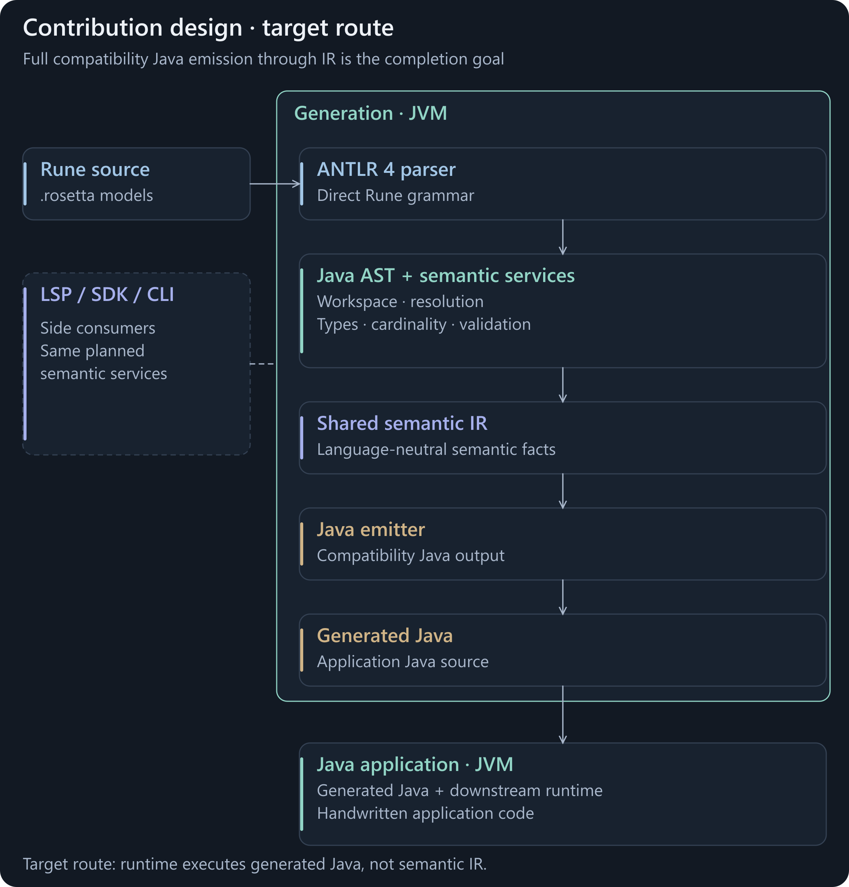

# Contribution design

The contribution takes ownership of the compiler services and makes them reusable. A source **abstract syntax tree (AST)** feeds a semantic **intermediate representation (IR)** for generation. This connects the [goals](design-goals.md) to the changes in the code.

<picture>
  <source media="(prefers-reduced-motion: reduce) and (max-width: 800px)" srcset="assets/contribution-compiler-mobile.svg">
  <source media="(prefers-reduced-motion: reduce)" srcset="assets/contribution-compiler.svg">
  <source media="(max-width: 800px)" srcset="assets/contribution-compiler-mobile.png">
  
</picture>

**Target route for complete IR integration.** The intermediate representation (IR) separates prepared Rune meaning from target rendering. [Static diagram](assets/contribution-compiler.svg) · [Open animation](assets/contribution-compiler.png).

<strong>CONTRIBUTION</strong> · Code/Docs snapshot: 22 September 2026 · Compiler foundation implemented; complete IR integration in development

## Own the language services

Direct ANTLR 4 grammars replace Xtext's ANTLR 3 parser generation. A Java **abstract syntax tree (AST)** and workspace replace EMF source objects and resource relationships. Rune's resolution, types, cardinality, validation and diagnostics become explicit services. Parsing alone supplies none of those semantic guarantees.

Java generator services and StringTemplate 4 replace the Java/Xtend implementation route. The language and accepted generated-code contracts remain the compatibility target.

## Prepare once, emit through defined targets

The IR makes semantic facts and transformations explicit for emitters, analysis and future extensions. A reusable, target-neutral contract is the intended boundary; it still needs a defined mapping for each language and runtime. It does not automatically provide Python, C# or Rust coverage.

The snapshot already has direct compatibility Java generation and IR adapters/emitters. Its compatibility IR route still uses existing writers for some complete files; optimised Java also retains substantial AST-hosted rendering. [Planning](phasing-progress.md) separates that implemented foundation from the remaining integration work.

## Reuse the same services in development

A standalone **software development kit (SDK)** is planned for model inspection and language maintenance. Command-line, Language Server Protocol (LSP), Studio and agent interfaces should consume that shared boundary. Reusable workspace/query services could avoid preparing a whole model for each request and return task-specific context; warm-request costs and AI quality still need measurement. Editor recovery, incremental updates, cancellation and workflow parity need their own acceptance tests.

Generated applications continue to use their target runtime and companion libraries. The compiler IR is not traversed for every trade at application runtime. ANTLR 4, StringTemplate, Maven/JVM and companion dependencies remain part of the design.

## Example: bring another model into the workflow

**Proposed extension:** an adapter maps an external model's names, types, cardinalities and rules into the supported Rune contract. Shared validation identifies missing or unsupported meaning before a target emitter or model bridge consumes it.

**Map → validate → generate or bridge → test.** Each bridge needs mapping tests; each new generated language needs its own emitter and runtime contract. The reusable part is the semantic boundary, not an assumption that different models mean the same thing. See [DSL maintenance](sdk-preview.md) for the proposed developer workflow.

Implementation anchors and boundaries

| Responsibility | Snapshot foundation | Intended completion |
|---|---|---|
| Syntax and source representation | [Parser grammars and AST](https://github.com/nicholas-moger/rune_dsl_update/tree/main/rune-parser/src/main/) | Maintain syntax plus useful partial-input behaviour; retain source locations. |
| Workspace and semantics | [RWorkspace](https://github.com/nicholas-moger/rune_dsl_update/blob/main/rune-parser/src/main/java/com/regnosys/rosetta/symbols/RWorkspace.java) | Stable lifecycle and query contracts, beyond batch-generation tests. |
| Intermediate representation | [IR module](https://github.com/nicholas-moger/rune_dsl_update/tree/main/rune-ir/) | Complete the Java compatibility emission boundary, with explicit declines and attributable writes. |
| Generation | [Java generator](https://github.com/nicholas-moger/rune_dsl_update/tree/main/rune-java-generator/) and [IR Java](https://github.com/nicholas-moger/rune_dsl_update/tree/main/rune-ir-java/) | Complete production routing and default enablement; preserve accepted output and behaviour. |
| Tooling and extensions | [Current provider SPI](https://github.com/nicholas-moger/rune_dsl_update/tree/main/rune-java-generator/src/main/) | A supported SDK contract. The current Java-specific SPI is not already that public SDK. |
| Applications | [Adapted Java runtime](https://github.com/nicholas-moger/rune_dsl_update/tree/main/rune-runtime/) | Target-specific runtime/API contracts stay explicit. |

See the retained [architecture detail](ARCHITECTURE.md), [mode contracts](MODES.md) and [design rationale](DESIGN-CONTEXT.md). Framework replacement transfers responsibilities to the project; it does not remove them. Future backends, profiles, bridges and editor services remain separately scoped work.

[Previous: Goals](design-goals.md) · [Guide index](../README.md) · [Next: Current and future state](current-future-state.md)
