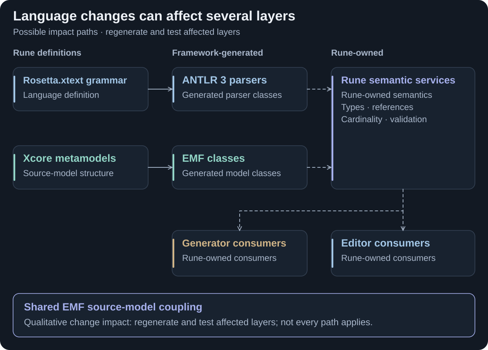
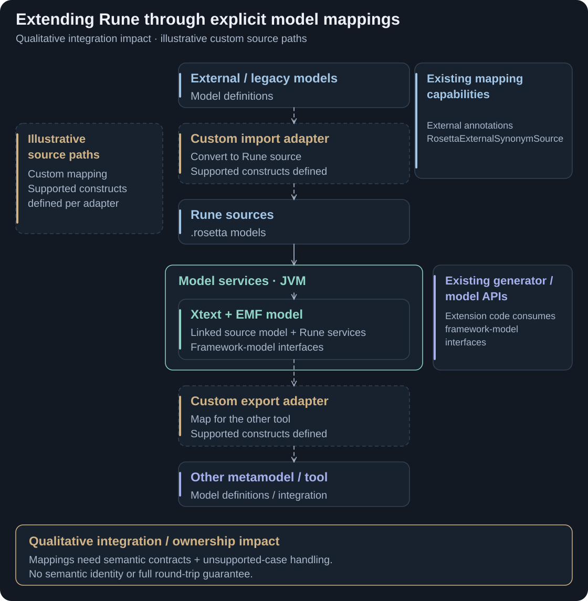
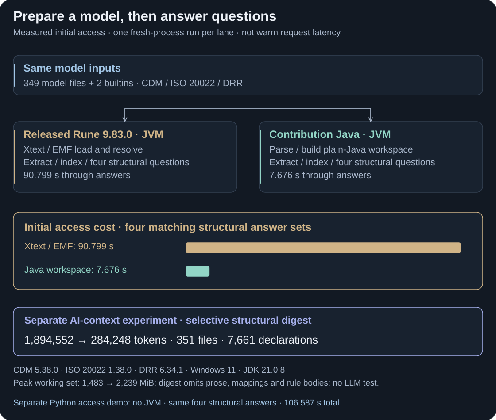
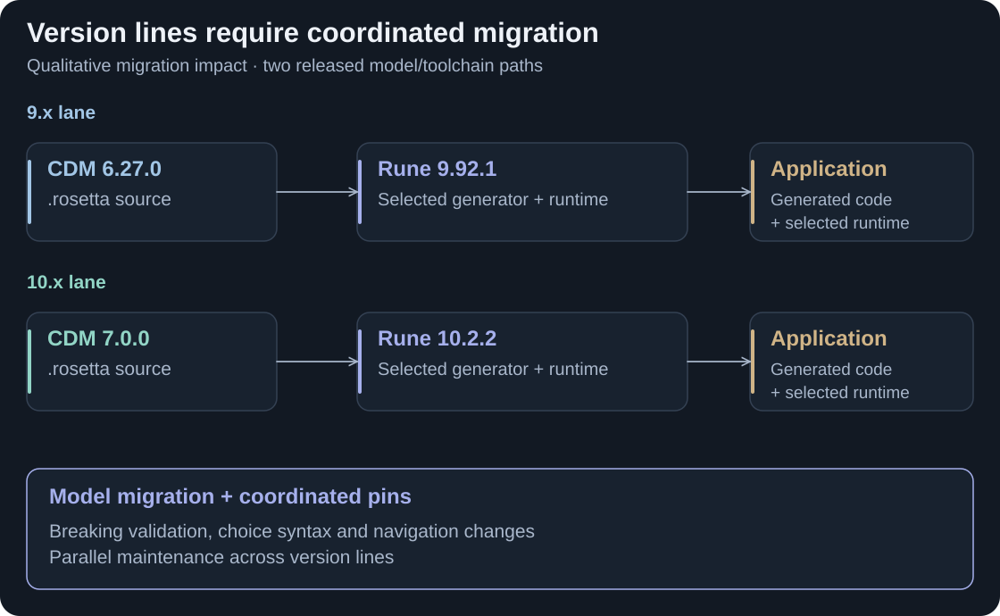
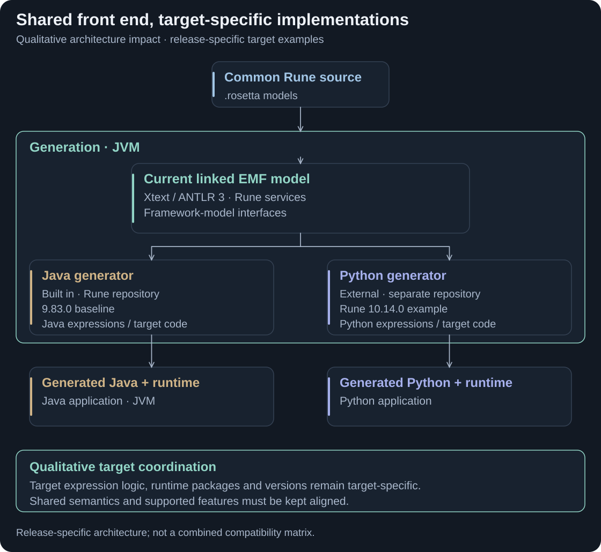
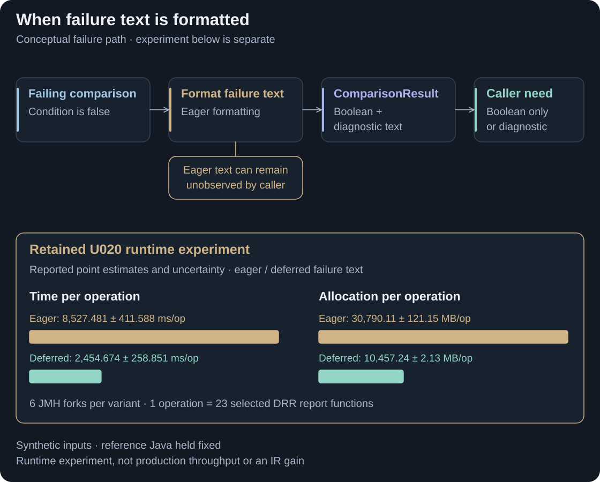

# Drawbacks

Rune's value extends beyond CDM/DRR: managing machine-readable definitions, connecting models, generating implementations and exposing meaning to tools. These constraints in the [current architecture](rune-architecture.md) motivate the contribution's goals.

<strong>BACKGROUND</strong> · Constraints and supporting evidence · Rune DSL 9.83.0 architecture baseline

[Foundations](#maintain-the-language) · [Extensibility](#connect-and-manage-other-models) · [Model access](#query-models-and-supply-ai-context) · [Versions](#manage-model-and-language-versions) · [Targets](#maintain-multiple-language-targets) · [Performance](#control-execution-and-generation-costs)

## Maintain the language

<picture>
  <source media="(max-width: 800px)" srcset="assets/drawbacks-maintenance-mobile.svg">
  
</picture>

**Framework coupling and maintenance ownership.** The 9.83 toolchain spans Xtext, EMF/Xcore and Xtend, alongside Rune-owned services. Changes can cross those boundaries. Xtext's maintainers published a warning about declining contributions and future maintenance risk. This supports a sustainability concern; it does not establish that Xtext or EMF is abandoned. [Framework responsibilities](rune-architecture.md#what-the-frameworks-do) · [Official maintenance warning](https://eclipse.dev/Xtext/releasenotes/2024/05/28/version-2-35-0.html#call-to-action-secure-the-future-maintenance-of-xtext). [Full-size diagram](assets/drawbacks-maintenance.svg).

## Connect and manage other models

<picture>
  <source media="(max-width: 800px)" srcset="assets/drawbacks-extension-mobile.svg">
  
</picture>

**Custom mapping and extension work.** Existing imports and generator hooks can be reused, but metamodel bridges still need explicit semantic mappings and target tests. Extensions consume versioned Rune/EMF interfaces; model dependencies, identifiers and unsupported constructs need consistent handling across boundaries. [Generator interface](https://github.com/finos/rune-dsl/blob/5fb8d697911d2ca62532d1801265b67752d03ef9/rune-lang/src/main/java/com/regnosys/rosetta/generator/external/ExternalGenerator.java#L29-L46) · [Existing import example](https://github.com/finos/common-domain-model/issues/3364). [Full-size diagram](assets/drawbacks-extension.svg).

## Query models and supply AI context

<picture>
  <source media="(max-width: 800px)" srcset="assets/drawbacks-inspection-mobile.svg">
  
</picture>

**JVM access, preparation and tokens.** An AI tool using existing model semantics needs JVM-backed services and an adapter; reading source text is a different path. The access comparison measures fresh-process preparation through answers. The token comparison contrasts complete source with selected structural facts. Warm LSP requests and AI quality were not measured. [Access experiment](EXPERIMENTS.md#6-model-access-the-three-analytics-lanes) · [AI-context evidence](EVIDENCE.md#ai-context-experiment-what-changed-and-why). [Full-size diagram](assets/drawbacks-inspection.svg).

## Manage model and language versions

<picture>
  <source media="(max-width: 800px)" srcset="assets/drawbacks-versions-mobile.svg">
  
</picture>

**Coordinated releases and migration.** Rune 9 and 10 are toolchain major-version lines. CDM 7's migration includes stricter validation and changed choice-type rules; the earlier Rune line receives backports. Consumers must manage compatible model, generator and runtime selections alongside migration tests. These two examples are not a universal compatibility matrix. [CDM migration](https://github.com/finos/common-domain-model/releases/tag/7.0.0#8-rune-dsl-10-migration) · [9.x backports](https://github.com/finos/rune-dsl/releases/tag/9.96.0). [Full-size diagram](assets/drawbacks-versions.svg).

## Maintain multiple language targets

<picture>
  <source media="(max-width: 800px)" srcset="assets/drawbacks-targets-mobile.svg">
  
</picture>

**Target-specific implementation and coordination.** Python shares Rune's JVM/EMF front end, with a separately released backend and Python runtime. Source-model APIs, generator versions and feature coverage must be coordinated per target. Repository separation itself is not the drawback; the constraint is maintaining different target implementations and contracts. [Python release policy](https://github.com/finos/rune-python-generator/blob/7d8f695aa9ef749254aa59ad70dcf577c4147d13/README.md#L12-L26) · [Target coverage](rune-cdm-drr.md#run-cdm-and-drr-logic). [Full-size diagram](assets/drawbacks-targets.svg).

## Control execution and generation costs

<picture>
  <source media="(max-width: 800px)" srcset="assets/drawbacks-runtime-mobile.svg">
  
</picture>

**Avoidable work in generated-code execution.** Failure text and mapper paths can be constructed before callers need them. The targeted runtime experiments expose that overhead; they do not measure production trade throughput. Generation is a separate development cost: the direct comparison improved from **91.263 to 14.492 seconds**. [Runtime results](EVIDENCE.md#runtime-changes) · [Generation comparison](EVIDENCE.md#source-to-java-generation). [Full-size diagram](assets/drawbacks-runtime.svg).

Evidence, scope and the link to the contribution

**Foundations.** The architecture visual describes pinned Rune 9.83.0 code. ANTLR 3 supplies source/content-assist parsing inside Xtext, not the entire toolchain. Xtext still has releases and supports headless generation, incremental infrastructure and LSP. Its 2024 warning is specific to Xtext, not EMF. Later 9.x releases also backport Java migration and Eclipse-element removal; the historical baseline does not describe every maintained 9.x release.

**Model access.** One fresh JVM run per lane on Windows 11, the same Intel CPU and JDK 21.0.8: CDM 5.38.0, ISO 20022 1.38.0 and DRR 6.34.1; 349 counted model files plus two loaded builtins. Time runs from JVM start through loading, deliberately completed semantic preparation, extraction, indexing and four structural answer sets. The old driver calls <code>EcoreUtil.resolveAll</code>; the new driver builds its Java workspace. These questions use extracted declared-name facts and a simple-name index, not full semantic equivalence. They need not force global resolution in every integration. Peak Windows working set increased from 1,483 to 2,239 MiB. No repeated distribution, warm LSP/MCP request or network round trip is measured. [Old access receipt](evidence/analytics.legacy-emf.json) · [New access receipt](evidence/analytics.plus-jvm.json).

**AI context.** The separate ANTLR4 Python prototype compares complete source with a selected digest over 351 files and 7,661 declarations, using <code>o200k_base</code> and tiktoken 0.14.0. It omits prose, mappings and expression/rule bodies. The reduction is not preservation of all meaning, LLM quality or a completed SDK capability. Equivalent context extraction is possible over Xtext. A separate no-JVM Python access run returns the same four structural answers in 106.587 seconds; it demonstrates another integration option, not a speed improvement or full semantic parity. Both measured Java access paths still use a JVM. [Context receipt](evidence/ai.context.json) · [No-JVM access receipt](evidence/analytics.nojvm.json).

**Versions and targets.** CDM 6.27.0 selects Rune 9.92.1; CDM 7.0.0 selects 10.2.2. The Python example selects Rune 10.14.0 at its fixed generator revision. These examples are separate from the snapshot's 9.83.0 validation matrix. Backports and breaking migration changes support the compatibility rationale; no formal branch-support policy is claimed. Neither Xtext nor repository organisation inherently prevents another backend. [CDM 6.27 pins](https://github.com/finos/common-domain-model/blob/3d2ea87b19970e2b0dcea0858b212e586d5e22ec/pom.xml#L84-L87) · [CDM 7 pins](https://github.com/finos/common-domain-model/blob/a6ffe777bc12ef3d289579cb3a86d1cbffea63d2/pom.xml#L84-L87) · [Python dependencies](https://github.com/finos/rune-python-generator/blob/7d8f695aa9ef749254aa59ad70dcf577c4147d13/pom.xml#L75-L91).

**Runtime and generation.** U020 compares eager and deferred failure text: six JMH forks per variant; one operation invokes 23 selected DRR report functions over synthetic populated inputs with reference-generated Java fixed. Its reported uncertainty is in the visual. Mapper-path experiments have different baselines; their ratios are not combined. Direct generation uses medians of three fresh JVM runs per variant over CDM 5.38.0/ISO 20022 1.38.0/DRR 6.34.1: 351 source files; all 19,219 generated Java files match after line-ending normalisation. Dependencies were warm; javac/tests are excluded. Driver time includes counting/reporting after generation; the released compiler uses an EMF-common 2.44.0 override. Peak working set increased from 1,531 to 2,112 MiB. [U020 extract](evidence/runtime-U020-source.txt) · [Old generation](evidence/codegen.legacy.json) · [New generation](evidence/codegen.m1.json) · [Output comparison](evidence/diff.legacy-vs-m1.json).

**Extensibility.** The import/export arrows are illustrative integrations, not shipped universal model bridges. Rune already has model/generator APIs and external mapping vocabulary; supported imports can be reused. Each bridge needs a semantic mapping, policies for unsupported constructs and target-contract tests; an intermediate representation does not make all models interchangeable. [Source annotations](https://github.com/finos/rune-dsl/blob/5fb8d697911d2ca62532d1801265b67752d03ef9/rune-lang/src/main/java/com/regnosys/rosetta/Rosetta.xtext#L814-L868) · [Model loading API](https://github.com/finos/rune-dsl/blob/5fb8d697911d2ca62532d1801265b67752d03ef9/rune-lang/src/main/java/com/regnosys/rosetta/transgest/ModelLoader.java#L29-L50).

**What follows.** Goals turn these constraints into requirements for ownership, extensibility, reusable model services, controlled compatibility and target boundaries. Project profiles, a shared intermediate representation (IR) and SDK interfaces are proposed directions, not completed remedies. They do not automatically remove breaking changes, target runtimes or independent releases. Detailed methods and retained results belong in Measured outcomes.

[Previous: Rune in CDM and DRR](rune-cdm-drr.md) · [Guide index](../README.md) · [Next: Goals](design-goals.md)
