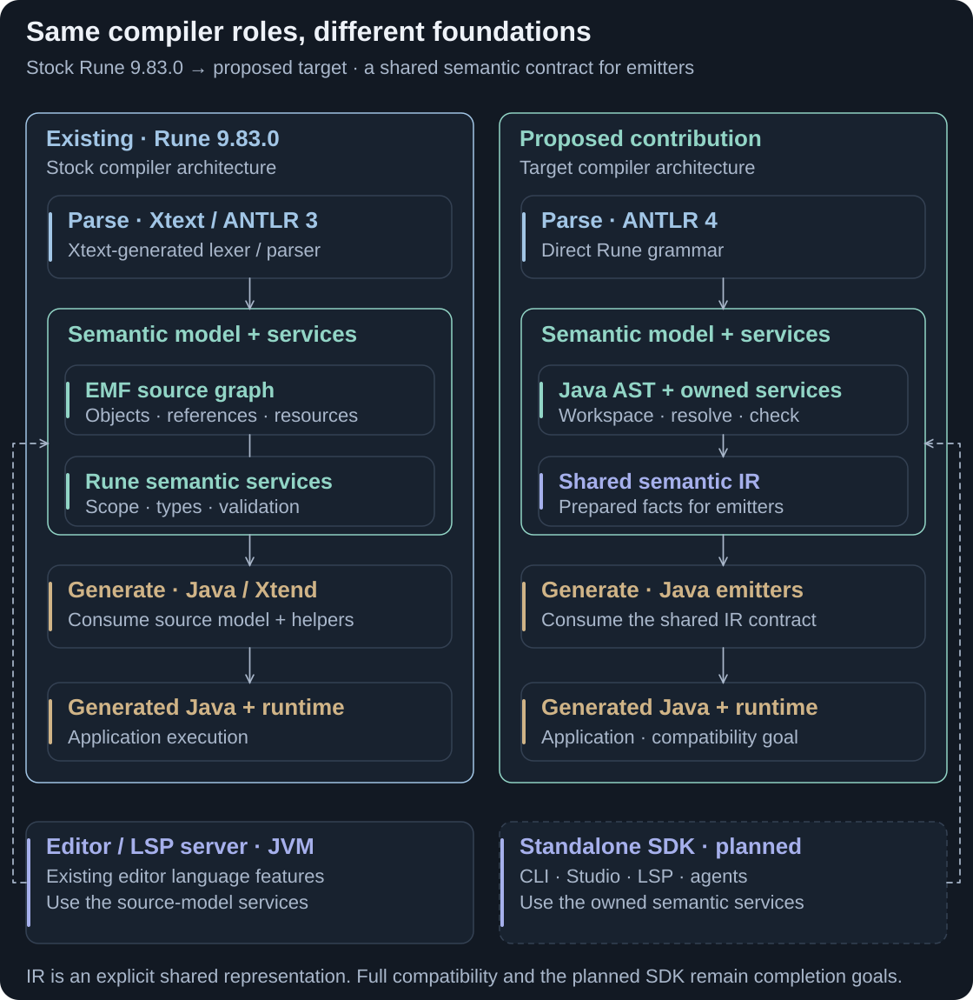

# Current and future state

The contribution reduces framework-specific integration points and gives generators and tools a shared semantic contract. Parsing, semantic analysis and target-specific generation still have to happen; the change is who owns them and how they connect.

<picture>
  <source media="(max-width: 800px)" srcset="assets/contribution-comparison-mobile.svg">
  
</picture>

**The same responsibilities, a shared boundary for reuse.** The IR makes prepared meaning explicit; it adds a representation rather than removing semantic work. The right side is the completed design target. [Full-size comparison](assets/contribution-comparison.svg).

<strong>CONTRIBUTION</strong> · Established 9.83 architecture versus proposed completed contribution

## What replaces, collapses or remains

| Today | Contribution design | Status in the snapshot |
|---|---|---|
| Xtext grammar generation with ANTLR 3 | Direct ANTLR 4 grammar/parser ownership | Implemented compiler foundation. |
| EMF/Xcore objects, resources and cross-references | Java AST, workspace and explicit relationships | Implemented; semantic services remain essential. |
| Framework integration plus Rune semantic services | Project-owned resolution, types, cardinality, checks and diagnostics | Batch compiler implemented; full editor lifecycle still planned. |
| Java/Xtend generators inspect the source model | Java/ST4 services; AST-to-IR adaptation and IR emitters | Direct route works; complete IR integration remains in development. |
| JVM language infrastructure accessed by integrations | Shared SDK service facade and client adapters | SDK, replacement LSP and agent interfaces proposed. |
| Generated code and target runtime | Generated code and selected target runtime | Retained separation; Java runtime has independent improvements. |

## What this enables

Language maintainers get explicit compiler boundaries to inspect and test. Model users and tools can share semantic queries. New backends and model bridges can build on a documented representation instead of each integration depending on framework objects.

Those are extension opportunities, not automatic compatibility. Existing Python CDM generation already uses a separate generator and runtime. A shared IR would reduce repeated interpretation only where its contract captures the required semantics; each target still needs implementation and verification.

Read the comparison accurately

The existing linked EMF graph is a source-model/AST representation, not an additional unexplained IR. The new AST and semantic IR serve different purposes. The snapshot also has a direct Java route outside the desired full IR path and an AST-hosted optimised route; neither is hidden by the future-state visual.

This comparison follows the [established architecture](rune-architecture.md), [contribution architecture](ARCHITECTURE.md#what-changed-and-what-remains) and [mode contracts](MODES.md). Python generation/runtime boundaries and Rune 9/10 release coordination are explained on [Rune in CDM and DRR](rune-cdm-drr.md). Project profiles and model bridges remain proposals requiring their own version and semantic contracts.

[Previous: Contribution design](contribution-design.md) · [Guide index](../README.md) · [Next: Planning](phasing-progress.md)
