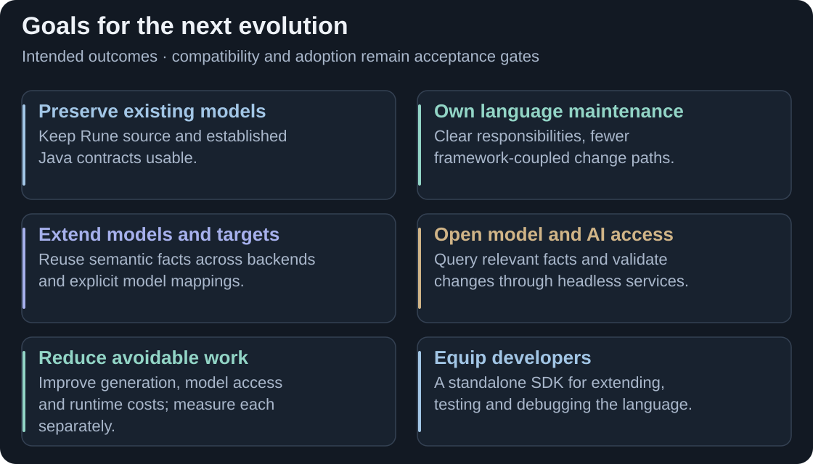

# Goals

Keep Rune DSL's model-driven value while making it easier to **maintain, extend and use**. The contribution addresses the constraints on the [previous page](current-drawbacks.md) for existing CDM/DRR projects and uses beyond them.

<picture>
  <source media="(max-width: 800px)" srcset="assets/goals-overview-mobile.svg">
  
</picture>

**One language, more ways to use it.** Compatibility and reliable adoption underpin the changes. [Full-size diagram](assets/goals-overview.svg).

<strong>CONTRIBUTION</strong> · Intended outcomes · Compatibility baseline: Rune DSL 9.83.0

## Preserve the investment in existing models

Keep supported Rune definitions, generated Java contracts and application behaviour dependable. Bring language support forward through explicit migration and regression tests. Project profiles are an approach to investigate for managing version differences; each supported profile needs a defined contract.

## Make development accessible

A standalone **software development kit (SDK)** should support inspecting, extending, testing and debugging the language. APIs and a command-line interface should share model queries, diagnostics, validation and generation services with editor and agent interfaces. Rune DSL Studio would be one consumer of those services.

For AI, retrieve the relevant facts, rule bodies and source provenance for a task, then validate proposed changes. Useful context and lower access costs are goals; better AI answers need their own evaluation.

## Extend with explicit contracts

Support new model domains, legacy imports, metamodel bridges and language targets through defined extension boundaries. Each target still needs generation, runtime support and tests; each bridge needs a semantic mapping. Additional backends and bridges are further work, with Java the current implementation focus.

## Measure the improvement

Assess generation, model preparation and generated-code execution separately, including correctness, time and memory. The [retained experiments](EVIDENCE.md) provide scoped evidence; they are not universal performance promises.

Source basis and acceptance boundaries

The goals follow the contribution's recorded rationale and proposed development plan. Current delivery and detailed architecture are separate questions.

| Goal | Source and what must be established |
|---|---|
| Preserve established behaviour | [Compatibility checks](TESTING.md) and [pinned corpus](CORPUS-9.83.md). The present evidence uses 9.83.0; it does not certify every Rune release or model/toolchain combination. |
| Own language maintenance | [Architecture responsibilities](ARCHITECTURE.md#what-changed-and-what-remains) and [simplification plan](ROADMAP.md#later-acceptance-and-exploratory-work). Direct ownership also means maintaining services previously supplied by frameworks. |
| Reuse models and targets | [Design rationale](DESIGN-CONTEXT.md#why-a-shared-ir-matters-strategically). Existing Python generation is already available; future backend and bridge work is separately scoped. |
| Open model and AI access | [Model-access methods](EXPERIMENTS.md#6-model-access-the-three-analytics-lanes) and [context experiment](EVIDENCE.md#ai-context-experiment-what-changed-and-why). Initial preparation, warm requests, context size and AI answer quality are different measures. |
| Reduce avoidable work | [Generation and runtime evidence](EVIDENCE.md). Memory increased in retained generation/access comparisons; speed and memory outcomes must be reported independently. |
| Equip developers | [SDK and tooling plan](ROADMAP.md#later-acceptance-and-exploratory-work). Language changes after 9.83 are intended as concrete SDK maintenance exercises. API availability alone does not prove editor or development-workflow parity. |

Complete core intermediate representation (IR) integration before SDK delivery. SDK, editor/Language Server Protocol (LSP) and agent interfaces remain planned work in this snapshot. Additional targets, bridges and project profiles need their own acceptance criteria. Detailed sequencing belongs on [Planning](phasing-progress.md); the next page explains the [Contribution design](contribution-design.md).

[Previous: Drawbacks](current-drawbacks.md) · [Guide index](../README.md) · [Next: Contribution design](contribution-design.md)
