# Features Index

Topic-organised catalogue of consumer-visible features added in rune-dsl-plus
on top of the upstream rune-dsl baseline. Each entry carries a one-line
description, status (NEW vs IMPROVED vs upstream), the PR it landed in, and
which backward-compatibility layer locks it.

For chronological status / since-version / migration-depth / risk, see
[`../upgrades/README.md`](../upgrades/README.md). For the machine-readable
index, see [`../upgrades/index.json`](../upgrades/index.json). For BC layer
details, see [`../bc-verification.md`](../bc-verification.md).

## Topic map

```mermaid
flowchart LR
  subgraph AF ["AST Foundation"]
    U002["U002 Frozen AST"]
    U003["U003 Metadata slot"]
    U004["U004 Visitor registry"]
  end
  subgraph SM ["Source Mapping"]
    U001["U001 SourceRange"]
  end
  subgraph SR ["Symbol Resolution"]
    U005["U005 SymbolId"]
    U007["U007 LSP SymbolKind"]
  end
  subgraph DG ["Diagnostics"]
    U006["U006 RUNE-NNN codes"]
  end
  subgraph GR ["Grammar Surface"]
    U008["U008 @ annotations"]
    U009["U009 File header"]
    U010["U010 Named-args"]
    U011["U011 Rule annotations"]
  end
  subgraph IR ["IR & Code Generation"]
    U012["U012 IR model + adapters (rune-ir)"]
    U013["U013 IR-mediated Java codegen"]
    U015["U015 Choice POJO codegen + resolver hardening"]
    U016["U016 Rule/Report/LabelProvider scaffolding"]
    U017["U017 Drop-in Maven plugin"]
    U018["U018 Fork-owned runtime"]
    U019["U019 Optimised IR-routed Java codegen"]
    U020["U020 Lazy failure text (runtime)"]
    U021["U021 Deferred MapperPath lineage (runtime)"]
    U022["U022 Seed-deferred MapperPath construction (runtime)"]
    U023["U023 Value-typed alias seams (optimised route)"]
  end
  subgraph DS ["Document Structure"]
    U014["U014 First-class document structure STUB"]
  end

  AF --> SM
  AF --> SR
  AF --> DG
  GR --> SR
  GR --> AF
  GR --> DG
  AF --> IR
  SM --> IR

  classDef new fill:#dcfce7,stroke:#16a34a
  classDef improved fill:#fef3c7,stroke:#d97706
  class U001,U002,U003,U005,U006,U007,U008,U010,U012,U013,U014,U015,U016,U017,U018,U019,U020,U021,U022,U023 new
  class U004,U009,U011 improved
```

**Green** = NEW (no upstream equivalent). **Yellow** = IMPROVED (upstream had a partial / informal version).

## AST Foundation

- **[U002 — Frozen AST after linker](../upgrades/U002-frozen-ast-after-linker.md)** — *NEW, P1.4.1a (PR #34)*
  AST nodes become immutable after the linker phase completes. Catches mutation-after-publish bugs in downstream consumers.
  *Locked by:* `RNodeFreezeTest` + `BindFreezeResolveLifecycleTest` (rune-parser unit). BC layers do not run linker freeze across the corpus.

- **[U003 — RNode metadata immutable slot](../upgrades/U003-rnode-metadata-slot.md)** — *NEW, P1.4.1a (PR #34)*
  Every AST node carries a typed metadata bag (`Metadata` + `MetadataKey<T>`) for downstream tools to attach annotations without modifying the node class hierarchy.
  *Locked by:* `RNodeMetadataImmutabilityTest` (rune-parser unit). BC layers do not check metadata immutability across the corpus.

- **[U004 — AstInterfaceRegistry visitor pattern](../upgrades/U004-ast-interface-registry.md)** — *IMPROVED, P1.4.1a (PR #34)*
  Formalises AST traversal under a registered visitor pattern; replaces upstream's ad-hoc visit hooks.
  *Locked by:* `AstInterfaceRegistryTest` + `AstTraversalTest` (rune-parser unit). BC layers 1-5 do not exercise the visitor surface today (`AstInterfaceRegistry` lives in `ast.util`, outside Layer 3 scope). See `docs/bc-verification.md` per-feature locks.

## Source Mapping

- **[U001 — SourceRange byte offsets](../upgrades/U001-bytewise-source-range.md)** — *NEW, P1.4.1a (PR #34)*
  Every AST node exposes byte-precise start/end offsets via `sourceRange()`. Enables source-map emission, IDE diagnostics, and surgical refactors.
  *Locked by:* `SourceRangeByteOffsetTest` + `SourceRangePropertyTest` + `AstBuilderSourceRangesTest` + `AstCorpusByteOffsetTest` + `CharToByteOffsetsTest` (rune-parser unit). BC layers do not directly assert on byte-offset correctness across the corpus.

## Symbol Resolution

- **[U005 — SymbolId opaque cross-references](../upgrades/U005-symbolid-cross-references.md)** — *NEW, P1.4.1b (PR #35)*
  Cross-references resolved to opaque `SymbolId` handles instead of brittle string keys. Stable across rename refactors.
  *Locked by:* `SymbolIdTest` + `SymbolIdPropertyTest` + `StaleSymbolIdExceptionTest` (rune-parser unit). Layers 1/2 partially exercise SymbolId references in parsed AST (defence-in-depth) but don't run the linker/resolution machinery that produces SymbolIds. Layer 3 partially covers via `RScope` (in `ast.model`); the `SymbolId` type itself lives in `com.regnosys.rosetta.symbols` (outside Layer 3 scope). See `docs/bc-verification.md` per-feature locks.

- **[U007 — LSP SymbolKind projection](../upgrades/U007-lsp-symbol-kinds.md)** — *NEW, P1.4.1c (PR #36)*
  Projects rune declaration kinds onto the LSP SymbolKind enum. Foundation for IDE outline / breadcrumb / quick-symbol surfaces (P4 scope).
  *Locked by:* `RuneSymbolKindTest` (rune-parser unit). BC layers do not exercise this LSP-facing projection (`RuneSymbolKind` lives in `com.regnosys.rosetta.lsp`, outside Layer 3 scope; doesn't appear in `.rosetta` source so Layer 1/2 don't see it).

## Diagnostics

- **[U006 — Structured parser diagnostics (RUNE-NNN)](../upgrades/U006-structured-diagnostics.md)** — *NEW, P1.4.1c (PR #36)*
  Replaces opaque ANTLR error spew with a registered codepoint system (RUNE-001 through RUNE-019). Each code has a `docs/diagnostics/RUNE-NNN.md` page describing trigger, severity, and remediation.
  *Locked by:* `DiagnosticTest` + `RDiagnosticDefaultCodeTest` + `ParserDiagnosticTest` + `RuneDiagnosticListenerTest` + `RosettaParseResultDiagnosticsTest` (rune-parser unit) — these assert the actual diagnostic codes / formatting / listener wiring. Layer 1 (`CorpusParseTest`) asserts `errors().isEmpty()` per fixture across the corpus — defence-in-depth on the empty-errors invariant, but does NOT validate diagnostic codes/formatting. Layer 5 smoke `legacyFormatPreservedOnMalformedInput` asserts the legacy `errors(): List<String>` surface that U006 backward-compatibly preserves. Layer 3 not in scope.

## Grammar Surface

- **[U008 — Rune annotations (`@-prefix`)](../upgrades/U008-rune-annotations.md)** — *NEW, P1.4.2 (PR #37)*
  Adds `@experimental`, `@deprecated`, `@since` style annotations to top-level declarations. Co-exists with the legacy bracket-style; 5 of 18 RRootElement kinds attached today (extension plan in D22).
  *Locked by:* `RRuneAnnotationContractTest` + `RuneAnnotationDataTypeAttachTest` + `RuneAnnotationOtherSitesAttachTest` (rune-parser unit). Layer 1 + Layer 2 additionally exercise the grammar surface across the corpus. Layer 3 not in scope (`ast.annotations` package, not `ast.model`).

- **[U009 — File-level header block](../upgrades/U009-file-header.md)** — *IMPROVED, P1.4.2 (PR #37)*
  Promotes the file-header concept to a first-class grammar element. Pre-existing usage was informal-by-convention.
  *Locked by:* `FileHeaderE2eTest` (rune-parser unit). Layer 1 + Layer 2 additionally exercise the grammar surface. Layer 3 ✓ — `RModel.fileHeader()` IS in `ast.model` scope, so japicmp catches API regressions to that method.

- **[U010 — `regulatoryReference` named-arg list](../upgrades/U010-regulatory-reference-named-args.md)** — *NEW, P1.4.2 (PR #37)*
  Allows named arguments on `regulatoryReference` (positional-only upstream).
  *Locked by:* `RegulatoryNodeTest` + `BackCompatCorpusOrthogonalityTest` (rune-parser unit). Layer 1 + Layer 2 additionally exercise the grammar surface. Layer 3 not in scope.

- **[U011 — Rule-level rune annotations](../upgrades/U011-rule-annotations.md)** — *IMPROVED, P1.4.2 (PR #37)*
  Free reuse of U008 infrastructure on `reporting rule` and `eligibility rule` declarations. Same AST surface as U008; H11 grammar attaches the parser-side collection into the existing slot.
  *Locked by:* `RuneAnnotationRuleAttachTest` + `RRootElementRuneAnnotationsContractTest` (rune-parser unit). Layer 1 + Layer 2 additionally exercise the grammar surface. Layer 3 not in scope.

## IR & Code Generation

- **[U012 — IR (Intermediate Representation): model, adapters, serialization contract + emitter SPI](../upgrades/U012-ir-scaffolding.md)** — *NEW, P1.4.3 (PR #39) scaffolding → graduated + relocated to the `rune-ir` module at PR #464 (the D43 IR train PR-1)*
  The IR model (`.core` 29 + `.rune` 4 — 125 main files in `rune-ir` at PR #644; `.core` 23 and 118 at PR #643), a MODEL-level node since PR #644 (`IRKind` 22 values — `MODEL`, the first model-level container: the namespace definition, the model version, the qualifiable configs, the qualification functions, every function's DECLARED signature and every with-meta use), the concrete declaration adapter (data → STRUCT, choice → CHOICE, enum → ENUM, and since PR #643 typeAlias → TYPE_ALIAS, every alias reference carrying its collapsed effective base), the expression IR + ANF (`.expr`/`.expr.anf`/`.expr.adapter`, whose `ExpressionToIRAdapter` since PR #477 also exposes the read-only `declineReason` mirror channel — the first-failing-gate token per declining node, *empty ⟺ lowers* by construction, consumed by U013's blocker probe for the per-ARM gate decode), the off-JVM contract (`irFormatVersion` 1: dependency-free JSON serializer/reader + Draft 2020-12 schema + MLIR-style printer) and the target-neutral emitter SPI with the first Python declaration emitter — 125 main files in `rune-ir` at PR #644, 75 at PR #492 when the emitter SPI landed (`org.finos.rune:rune-ir`, depends on `rune-parser` only; since PR #492 the `.expr` roster carries `IRPointFreeApply`, the 14th `IRExprKind` — the L-109 point-free application, deliberately NOT an `IRApply` so the four IRApply-keyed gates stay byte-frozen). Ported from the frozen IR lab at its HEAD `8c14592`; lab figures stay pin-relative — re-baselined on today's engine at PR #467 (the byte gate) + PR #468 (the decline-census re-run: 1,118/5,510 seam-roots adapt, 732 lower to Python, `reference:ALIAS` 365 = the top buildable verb slice). The Java route over this substrate is U013 (`rune-ir-java`, live since PR #466 behind `-Drosetta.generator.ir=true`).
  *Locked by:* the rune-ir module suite — 41 classes / 813 tests at PR #644 (READ from `c5-ir-install.log`; 408 tests over 34 classes at PR #492, where this accretion ledger stops: 390 through PR #476; +3 `declineReason` mirror locks at PR #477 — the enum-channel tokens, the symbol/call/feature-call gate tokens, and the noAdaptArm + empty-⟺-lowers equivalence sweep with the `unattributed` residue asserted absent; +1 at PR #478 — the disguised-input-nav arm's defer gates + composed `inputFeatureNav.<gate>` tokens; +1 at PR #479 — the filter/extract synthetic-item retype arm on a PARSED fixture, the outside-binder residue keeping its token; +1 at PR #480 — the bare-attr + chain item-nav arms on PARSED fixtures (both claims adapt whole through the taught base with the raw node's range stamped on the spine; empty ⟺ lowers on both twins; the outside-lambda residue naming the composed `attrOutsideFunction.noFilterExtractBinder` token, the two standing mirror locks recut to the composed channel tokens); +1 at PR #481 — the elidedImplicit widening on a PARSED `legs then filter rate exists` fixture (`resolveElidedPipedSource` resolves the grammar-elided piped source to the enclosing then's argument — the bare read adapts whole with the base retyped off the RESOLVED argument; the hand-built extract-bound elided face keeps the `receiverSyntheticItem` token); +1 at PR #482 — the nested-thenPipe widening on a PARSED `legs then filter rate exists then filter qty exists` fixture (the `RThenExpr` arms prove and derive through the nested pipe's BODY result — the bare read adapts whole with the base retyped off the then node's own cached type; the parsed extract-bodied nested pipe stays declined with the composed `attrOutsideFunction.sourceElementUnresolved` token); +1 at PR #483 — the extract-bodied widening on PARSED Trade/Leg fixtures (the `RExtractExpr` arms prove and derive through the extract's BODY result — implicit-or-paramless binders only; the bare `qty` adapts whole on both the flat `trades extract leg then filter qty exists` carrier [the base retyped off the EXTRACT node's cached type] and the nested `trades then extract leg then filter qty exists` carrier [the then descent composing with the extract descent]; the parsed named-binder carrier stays declined — the scope-live walk-out class); +1 at PR #484 — the callable-output widening on PARSED Trade/Leg/ToLeg fixtures (the `RSymbolReference`→`RFunction` legs prove and derive on the callee's OUTPUT attribute — the L-109 point-free application's value IS the output, the aliasShadow precedence declining first; the bare `qty` adapts whole on the flat `trades extract ToLeg then filter qty exists`, the nested and the MULTI-output `ToLegs (0..*)` carriers with the base retyped off the seat's cached type = the callee's output; the META-output `ToRef [metadata reference]` carrier stays declined with the composed `attrOutsideFunction.receiverSyntheticItem` token); +1 at PR #485 — the rule-input widening on PARSED reporting-rule fixtures (`provableRuleInputElementType` proves and derives a TRUE-noBinder rule-top elided implicit as the RULE INPUT — legacy's `isElidedOperandTopLevel` → `MapperS.of(input)` route + the checker's `inferRuleFromType` leg, the declaration read; the `ruleInputNav` precedence gate refined to the TOP-LEVEL slice per legacy's own receiver split; the bare `leg` adapts whole on the flat `reporting rule RuleTopFilter from Trade: filter leg exists` carrier [the base retyped with the RULE's declared FROM-type] and the composed `filter leg exists then extract leg` carrier [the filter arm's element-preserving recursion composing with the rule-input arm]; the hand-built FUNCTION-top fixture stays declined with the `receiverSyntheticItem` token); +1 at PR #486 — the symbolUnresolved DECODE's 13-pin facet lock on a PARSED model with a REAL name index (the flat reason token refined IN PLACE to `symbolUnresolved.[synthetic.]<facet>` — the child-linkage mechanism split first [an UP-only parented ref is a render-time synthesis, legacy `synthesizeFeatureCall`'s disguised-nav receiver shape], then the head-name ladder; the hand-parented orphan probes pin the `synthetic.` faces, the parentless probes the plain absent/nameMissing/dottedName faces, the child-linked equality-sibling probe the plain `siblingEnumValue` path; the standing #477-era unattached-ref pin recut to `symbolUnresolved.absent`); +1 at PR #487 — the conditional JOIN-law widening on PARSED fixtures (the `RConditionalExpr` branches in the allowlist — the shape law: the THEN arm provable, an EMPTY else admitting on the then proof alone per `hasGenuineElse`'s structural-emptiness discriminator, a genuine else proving too — and the derivation — the same-instance JOIN, the list-literal laws lifted to the two-armed choice; the bare `leg`/`qty` adapt whole on the DIRECT `(if useMain then trades else fallback) then filter leg exists`, EXTRACT-BODIED `trades extract (if useAlt then altLeg else leg) then filter qty exists` and elseEmpty carriers with the bases retyped off the cached join; the MIXED-form `ExtLeg`-vs-`Leg` carrier stays declined at the same-instance derivation — the mixed-list law, zero corpus mass at the decode); +1 at PR #488 — the argNav facet DECODE's 6-pin lock on a PARSED Sub/Leg/Trade model with per-case callees (the flat argument-position reason token refined IN PLACE to `argNav.[meta.|typeMissing.]<root>.<depth>[.multi]` — every argNav occurrence a navigation the nav arms ALREADY LOWER, the ROOT naming the render family an L-042-class admission would compose, the DEPTH sizing the chain, `.multi` the accumulated cardinality, the prefixes + the `alias` root drift/future detectors; the 6 pins `param.hop1/.hop2/.deep/.hop1.multi` + `item.hop1` + `synItem.hop1` every predicted spelling correct FIRST RUN; the standing hand-built flat pin recut TWICE by the two-step run-first disclosure — the clean first read exposed the type engine's NON-NULL MISSING sentinel (`getInferredType` = `getOrDefault(expr, MISSING)`), and the Seat-1 MF-1 recut made the `typeMissing.` detector LIVE via `isMissing()` with the pin locking that face on the exact shape that disclosed it); +1 at PR #491 — the argNav ROOT-TYPE BELT pin (the #489 Seat-1 OBS-2 landing: the facet walk read hop RESULT types only, a meta/missing-typed ROOT under an otherwise-ADMITTING root kind excluded only INDIRECTLY by `adaptSymbolReference`'s meta-input decline; the belt joins the root's OWN type to the drift flags, gated on admission so no decline face re-spells, locked by the hand-CONSTRUCTED three-way contrast in `argNavRootTypeBeltDeclinesMetaAndMissingRoots` — meta root → `meta.param.hop1`, MISSING root → `typeMissing.param.hop1`, clean root → the belt does not fire, the face falling through to the type-agreement gate's `typeGap.`); +1 at PR #491 — the alias-operand REVIVAL lock (the L-035 law extended to the EQUALITY + EXISTENCE gates — the flat `operandAlias` token refined IN PLACE to `operandAlias.<clean|bodyMeta|bodyMissing|rawUnresolved>[.enumSibling]` with the admission the SAME classifier; locked on a PARSED six-function fixture: the equality-clean claim lowers WHOLE with the ALIAS lowered in place, the existence claim lowers, the enum-value sibling declines on the decoded face, comparison keeps declining every alias face [the #372 comparisonIntWiden body-walk lever], logical keeps the FLAT face [the ofNullSafe coercion family], an unresolvable body declines bodyMissing); +1 at PR #492 — the alias-nav teach's 5-leg parsed pin (the L-032 disguised alias-head arm `adaptAliasHeadNav`: single-hop FieldAccess over the BODY-retyped `IRReference{ALIAS}` — admit single + admit MULTI via the FAITHFUL `getRuleBodyCardinality` channel [the global `compute()` reads every disguised chain as conservative SINGLE] + the usesOutput/featureOffBody declines + the bound-receiver form at the #479 retype slot); +1 at PR #492 — the point-free kind's seats (`IRPointFreeApply` joined `IRSamples` and the kind-coverage locks; the adapter arm `adaptPointFree` with the callee-output channels and the aliasCollision decline face)) (4 opt-in regen skips; the 2 corpus censuses run since their PR #468 retarget onto `test-corpus/`, the lab calibration figures reproduced byte-for-byte with all collision invariants 0): the relocated contract locks (`IRContractSurfaceTest` — 29 rows at the relocation, 53 since PR #641, 58 since PR #642 (61 since PR #643, the three `IRType` type-gate defaults) with a COMPLETENESS leg that reflects every pinned interface's public methods and holds the set EQUAL to the rows, so an unpinned method fails by name, and a PACKAGE leg that loads every source file of `ir.core` / `ir.rune` by name and holds every public interface pinned, so a NEW interface cannot stay invisible; `IRSealednessTest`, `IRKindCoverageTest`, `RRootElementToIRKindMappingTest` corpus walk) + adapter/serialization/print/python suites with byte-locked, LF-pinned goldens. The relocation was proven generation-inert by the PR #464 ringfence chain (cp 55/55 byte-identical to the SOT; gensuite/parsersuite/plugin tuples held). **Since PR #641 the declaration IR carries the declaration FACTS as named fields** (eight value records in `ir.core` — ten value records since PR #643, `IREffectiveBase` and `IRTypeParameter` — 24 default methods on the four declaration interfaces — 27 default methods since PR #643 and 29 since PR #644 (`conditionKinds()` and `aliasChain()`), the three `IRType` type-gate defaults — pinned on `IRContractSurfaceTest` (70 rows since PR #644) 29 → 53 rows (58 since PR #642: `Metadata` / `MetadataKey` pinned, the completeness leg and the package leg; 61 since PR #643), old-arity constructors kept, every fact an OPTIONAL JSON member with `irFormatVersion` still 1 — `IRJsonDeclarationFactsRoundTripTest`, `IRPrinterDeclarationFactsTest`, and since PR #643 `AstToIRAdapterTypeAliasTest` (13) for the `typeAlias` declaration and the alias chain collapsed at the use site).

- **[U013 — IR-mediated Java codegen: the flag-gated Path-2 route](../upgrades/U013-ir-mediated-java-codegen.md)** — *NEW, stub P2.0.1 → REAL at PR #466 (the D43 IR train PR-2)*
  The opt-in second generation route (AST → IR → the legacy render oracles → Java) in the NEW `rune-ir-java` module (`org.finos.rune:rune-ir-java`, depends on rune-ir + rune-java-generator BY DESIGN): the lab's 21 IR-routed generator/compiler/renderer classes ported byte-identically at lab HEAD `8c14592`, activated through a ServiceLoader seam (`IRGenerationProvider`/`IRGeneration` in the generator's new `spi` package — ZERO IR imports in the shipping generator) behind `-Drosetta.generator.ir=true` (default OFF ⇒ Path-1 byte-identical by construction). The full-population ON gate is GREEN since the PR-3 drift wave (PR #467): 55/55 kind-cells, **34,686/34,686 byte-identical** against the same frozen manifest, population lines ≡ the cp SOT — the 34-file first reading (PR #466, one pin-era drift family) closed by the fork-authored post-pin coercion guard in `IRExpressionCompiler` (the subtree-wide decline scan, since PR #469 arm-attributed — the per-arm decline meter). The PR #469 share-growth wave taught the route three of the guard's arm families with the ring held green (dep-receiver collision numbering via source-range-correlated resolver precedence · implicit-item bindings via the `ImplicitItemRenderer` legacy-oracle seam · root-position item-nav chains/meta receivers via the `ItemNavRenderer` — nested ones keep declining, the composition boundary), and PR #470 taught the meter's biggest arm — the dispatch-variant context (524 declines → explicit ZERO): alias-call arg lists forward the dispatch BASE's declared inputs (the same `dispatchBaseOf` oracle legacy uses, #369) and the nested-divide witness classifies NUMBER before the engine arm (legacy's post-pin `earlyDiv` order), the wholesale context decline retired. PR #471 taught the meta evaluate-arg families at the CLAIM ROOT — the per-decline witness channel (`-Drosetta.generator.ir.postpinWitness`, the wave's decode vehicle at the guard seat itself) censused 67 of the 80 meta declines as calls that ARE the whole claim, and the claim-root delegation seat now renders those via `super.visitSymbolReference` (the decline's own render — provably identical, the #469 claim-root law; the hoist family's five legacy route facets stay single-sourced), the nested trip sites (13) keeping their honest decline. PR #472 widened the delegation PER-CLASS — the guard seat became a ROUTER: a tripped claim rooted at one of the six proven composition classes (feature-call / existence / equality / logical / list-op / count — zero subclasses, each caller's decline fallback exactly the reproduced `super.visitX` call, both exits at the guard) delegates the WHOLE claim, so a legacy-rendered subtree is never wrapped in IR-rendered parents (the cpON4 mixed-composition class stays impossible either way) and the decline set is the honest residue; the cdm firing locks retensed onto the delegation channel. PR #473 closed the FUNCTION-seam ENDGAME — the claim-root seat's accepted-arm set widened by ONE membership (`SINGLETON_LIST_ARG` joins the meta pair, the seat renamed `claimRootDelegationArm`), the frozen corpus's last FUNCTION guard decline (the drr `IsActionTypeMODI` singletonList root call) delegates at the seat, and **the FUNCTION-seam decline meter reads ALL-ZEROS on every cell** with `declined == 0` pinned on all three carrier cells; the NEW RULE-seam witness decode sized the un-metered rule/report seam (23 witness lines, all drr: 13 router delegations ALREADY firing seam-generically since #472 + 10 intLiteral decline events across 6 rule names, every one claim-root — the banked RULE-seam teach surface; the teach itself RULE-seam-inert, pre/post witness sets identical). PR #474 taught that banked surface AND mechanized the seam — `INT_LITERAL_ARG` became the seat's FOURTH accepted-arm membership (the 10 claim-root events delegate via the decline's own render, the arm-independent byte-identity; every arm the evaluate-arg probe can return today is now accepted, membership kept explicit so a future NEW arm still self-signals), **the RULE-seam decline meter reads ALL-ZEROS**, and the `pojo_comparison` pass gained the seam's OWN reader block on its funcGen (the RULE share line + both per-arm meters + `declined == 0` pinned EVERY cell + `delegated > 0` on drr) — the seam's first share reading: drr 45.37% (11,394/25,108 attempted; every other cell 0 attempted, the seam's whole activity drr). PR #475 made the whole not-IR-driven population measurable — the census meters: per-family + per-site breakdowns of the counted declines at the single `recordDecline` seat (conserving to the scalar by construction; the first reading splits adapterGap 34,365 vs leafEmitter 9,338 with ruleDelegation/aliasResolution at zero by absence on the ranked lines — conservation-proven) and count-then-super meters on the 21 `visit*` families with no IR attempt (byte-inert by construction; the untargeted population's first reading 21,682 — led by the adapter-READY `RImplicitVariable` 9,339 + `RConditionalExpr` 1,133 and the missing-arm `RConstructorExpr` 3,501 · `RExtractExpr` 3,140 · `RFilterExpr` 2,014 · `RConversionExpr` 956), both reader blocks printing the three ranked census lines per cell — the lines ARE the emitter-teach worklist (the first reading: 65,385 not-IR-driven vs 59,763 driven). PR #476–#477 decoded that worklist (the blocker probe + the per-ARM gate decode), PR #478 landed the first navigation arm those gates named (the disguised-input-nav teach — the taught gate ZERO at population, −3,483 claims, the walk series' first event-absorption re-base), and PR #479 claimed the implicit-ROOT cluster's first slice — the filter/extract synthetic-item receiver (the implicit-root witness decoded the whole cluster to the untyped synthetic item; the arm retypes it at the boundary with the binder source's Cat-8 element type and renders via the legacy `handle(RImplicitVariable)` oracle with range-collision poisoning; `receiverSyntheticItem` sole 4,643 → 3,577, driven +1,042, the second absorption re-base and the first to reach the untargeted meter — the walk headline 47.99% on 107,272 events). PR #480 claimed the pre-sized continuation — the bare-attr + chain item-nav arms off the taught base (the witness extension restated the PLANNED arms' admissions per blocker and the pre-teach reading matched the #479 pre-sizing EXACTLY: bareAttrArm:claims 336 + chainArm:claims 370 with zero admission residue; the NEW source decode sized the #481 widening — the grammar-elided PIPED implicit dominates every unprovable channel, 5,363 nodes, synItem 93.4%; the arms build legacy's EXACT synthesizeImplicitItemNavigation/-Chain equivalents, delegate through the #479 retype and rebuild at the cache boundary with the raw node's type + range, the widened synthetic-item oracle serving the raw claim nodes by range; THE FIRST RING WAS CLEAN — the wave's first first-try-clean arm ring, zero mismatches; probed 29,499 ≡ the new adapterGap, −325 claims unlocked whole, the sole ranking inverted an eleventh time with symbolUnresolved 3,921 leading; the third absorption re-base — the vanished 962 events are the L-113 relabel-driven re-entrant visits under now-claimed parents — the walk headline 47.83% on 106,310 events with real coverage GROWN). PR #481 widened the base itself — the elidedImplicit widening (the pipe-decode witness restated the planned widening BEFORE the arm per the #480 law: every elidedImplicit binding source on the four #480 channels decoded by the resolver's faces + the resolved then-argument's provability, the pre-teach claimable slice `thenArg.provable.typeOk` 298 nodes conserving to the flat elidedImplicit counts on all 13 cell-channel pairs; `resolveElidedPipedSource` then resolves the grammar-elided PIPED source to the enclosing then's ARGUMENT — legacy's thenBody face, the value identity — at the retype's source/type reads, the allowlist and the #480 arms' structural derivation at once; THE SECOND CONSECUTIVE FIRST-TRY-CLEAN ARM RING; post-teach the claimable facet reads ZERO with every residue byte-identical, probed 29,265 ≡ the new adapterGap, receiverSyntheticItem sole −180 ≡ the synItem claims, and the residue map names the successors — nested thenPipe 2,109 · the rule-input faces 1,356 · extractPipe 753 · call 247; the fourth absorption re-base, RImplicitVariable untargeted 8,602 → 8,464 — the walk headline 48.03% on 106,013 events, THE FIRST 48% CROSSING). PR #482 taught the widened base's dominant residue class — the nested-thenPipe widening (the body-decode witness refined the #481 flat `thenPipe` token IN PLACE per the PLANNED RThenExpr arm's admission BEFORE the arm existed, Σ thenPipe.* ≡ the flat count by construction; the pre-teach reading proved the claim honest-small — `thenPipe.provable.typeOk` 97 of the 2,109 occurrences [synItem 50 · bareAttr 41 · chainBase 6] with the body-shape residue map naming the TRUE successor, extract-bodied pipes 1,435; the arm adds the `RThenExpr` descent to the allowlist + the structural derivation — the element form of `A then B` is B's BODY result, the type read staying on the then node's own cached type; THE THIRD CONSECUTIVE FIRST-TRY-CLEAN ARM RING; post-teach `thenPipe.provable.typeOk` reads ZERO with every residue byte-identical, probed 29,193 ≡ the new adapterGap, receiverSyntheticItem sole −50 ≡ the synItem claims; the fifth absorption re-base, RImplicitVariable untargeted 8,464 → 8,418 — the walk headline 48.08% on 105,897 events). PR #483 claimed the #482 residue map's dominant class — the extract-bodied pipe widening (the extract-body facet refined BOTH flat `extractPipe` tokens IN PLACE per the PLANNED RExtractExpr arm's admission — the flat then-argument face 753 + the nested then-body face 1,435, Σ facets ≡ each flat count by construction; the pre-teach reading sized the direct claim at `extractPipe.provable.typeOk` 351 of 2,188 [synItem 181 · chainBase 88 · bareAttr 82] with the residue map naming the successor — bare function-application bodies 1,080, the standing bareFunctionReference class; the arm adds the `RExtractExpr` body descent to the allowlist + the structural derivation — the element form of `A extract B` is B's OWN result per element, implicit-or-paramless binders only, named/identity faces declining; THE FOURTH CONSECUTIVE FIRST-TRY-CLEAN ARM RING; post-teach `extractPipe.provable.typeOk` reads ZERO at both seats, probed 28,814 ≡ the new adapterGap, receiverSyntheticItem sole −252 ≡ the synItem claims, and the claims exceeded the direct pre-sizing HONESTLY — a 135-occurrence recursive composition class [filter-wrapped elided arguments resolving to now-provable extracts] claimed through the same recursion, the falls closing per channel to the digit; the sixth absorption re-base, RImplicitVariable untargeted 8,418 → 8,241 — the walk headline 48.37% on 105,410 events). PR #484 claimed the #483 residue map's dominant class — the bare-function-application pipe widening (a NEW law, the CALLABLE-OUTPUT identity: a bare no-arg function reference in element-source position is the L-109 point-free application whose value IS the callee's OUTPUT — legacy `renderImplicitFunctionInvocation`'s own render + the checker's `fn.output()` type leg; the witness refined the flat `symbol:RFunction` shape token IN PLACE to `symbol:RFunction.<facet>` at its unprovableSourceShapeToken seat — every composing channel at once, Σ facets ≡ each flat count by construction — and the facet decode proved the WHOLE 1,125-occurrence population ADMITS [outputData 1,070 + outputDataMulti 55, the decline faces aliasShadow/outputMissing/outputMeta/outputNonData* ALL ZERO] while the PLANNED 3-arg tier pre-read the claimable slice at `provable.typeOk` 1,127 [extractPipe 1,088 = nested 795 + flat 293 · bare thenArg 12 · thenPipe 27 — the recursive filter class PRE-composed]; the arm adds the `RSymbolReference`→`RFunction` legs to the allowlist + the structural derivation — the aliasShadow precedence declining first per legacy's `isAliasReference`, cardinality-agnostic like the bare-attribute leg, recursion-free; THE FIFTH CONSECUTIVE FIRST-TRY-CLEAN ARM RING; post-teach every pipe-channel `symbol:RFunction` token reads ZERO with the falls ≡ the pre-read 1,127 TO THE DIGIT + all 25 source-channel occurrences claimed, probed 27,945 ≡ the new adapterGap, receiverSyntheticItem sole −528, the bareFunctionReference DIRECT-seat gate 2,143 EXACTLY unmoved — the render-seat class, as decoded; the seventh absorption re-base, RImplicitVariable untargeted 8,241 → 7,956 — the walk headline 49.03% on 104,523 events, THE FIRST 49% CROSSING). PR #485 claimed the #484 residue map's dominant remaining pipe class — the rule-input widening (the RULE-INPUT identity: the elided implicit at RULE top level takes the RULE INPUT's value — legacy `handle(RImplicitVariable)`'s `isElidedOperandTopLevel` route renders `MapperS.of(input)`, the fromRule-synthesized input typed by the rule's `from` clause, and the checker types the same face off the rule's from-type [`computeImplicitItemType` → `inferRuleFromType`, always withNoMeta]; the witness refined the flat `noBinder` + `elidedImplicit` tokens IN PLACE at their seats — every composing channel at once, Σ facets ≡ each flat count by construction — and the facet decode proved the WHOLE 1,038-occurrence direct population ADMITS [noBinder.fromData, every decline face ZERO — the second consecutive all-admit decode] while the PLANNED 3-arg ruleTopWidened tier pre-read the claimable slice at 1,336 channel events [the direct 1,038 + 294 flat filter compositions + 4 nested]; the arm adds `provableRuleInputElementType` — synthetic + the isElidedOperandTopLevel slot gate + a CLEAN walk to the RRule root + fromType→RDataType, recursion-free — consumed at the allowlist's unresolved-implicit branch, the derivation leg and the #479 retype's type read, PLUS the `ruleInputNav` precedence gate REFINED to the top-level slice [legacy's own `buildImplicitInputReceiver` split: the in-lambda receiver is a synthetic implicit — the item ≡ input value identity]; THE SIXTH CONSECUTIVE FIRST-TRY-CLEAN ARM RING; post-teach every claim face reads ZERO with the falls ≡ the pre-read 1,336 TO THE DIGIT [the ruleInputLambda channel EMPTIED 518 → 0 whole; zero recursive-disclosure excess — the tier pre-composed everything], probed 27,123 ≡ the new adapterGap, receiverSyntheticItem sole −818, ruleInputNav 432 → 80 with ruleInputChain 674 EXACTLY unmoved — the enum-chain seat, out of scope as decoded; the eighth absorption re-base, RImplicitVariable untargeted 7,956 → 7,361 — the walk headline 50.01% on 103,722 events, THE FIRST 50% CROSSING, THE HALFWAY MARK). PR #486 decoded the standing top gate probe-only (the symbolUnresolved facet refinement — 99.71% render-time synthesized disguised-nav receivers, the shadow of the standing alias/nav-arm families; the walk unchanged). PR #487 claimed the residue map's dominant DECODED pipe face — the conditional JOIN-law widening (a NEW law: the element form of `if c then A else B` is the arms' COMMON form — the runtime elements are the EXECUTED arm's, the checker types the node `withNoMeta(typeJoin.join(thenT, elseT))` with the empty-else face typing as the THEN arm alone [`join(thenT, NOTHING) = thenT`], and the `withNoMeta` wrap strips arm meta from the cache so the per-arm allowlist proofs are the ONLY meta protection: the list-literal all-provable/all-identical laws lifted to the two-armed choice, `DefaultElseRule`'s synthetic else read structurally empty; the witness refined the flat `conditional` shape token IN PLACE to `conditional.<facet>` with the three pipe seats carrier-typed — the decode read the claimable slice at 201 of 507 pipe events [sameType.typeOk 135 + elseEmpty.typeOk 52 + formGap.typeOk 14] and DISSOLVED the anticipated join-meet question — typeDiffers ZERO at population, no mixed-form conditional exists in the corpus — with the dominant residue named thenUnprovable.call 266; THE SEVENTH CONSECUTIVE FIRST-TRY-CLEAN ARM RING; post-teach every claim face FELL to ZERO with every decline face unmoved to the digit — 236 fallen channel events ≡ the pre-read EXACTLY — probed 26,952 ≡ the new adapterGap, receiverSyntheticItem sole −109 + both sourceElementUnresolved gates cut −53/−37, ONE symbolUnresolved event re-prefixed `lambdaSrcUnprovable.absent` → `lambda.absent` [its lambda source — a conditional — now provable, the #486 facet grammar moving as designed]; the ninth absorption re-base, RImplicitVariable untargeted 7,361 → 7,275 with RConditionalExpr untargeted UNCHANGED at 1,133 [the claims are the INNER navs] — the walk headline 50.14% on 103,490 events; the #489 L-042 REVIVAL ARM then claimed the argNav population whole — nav call args lower under the three ring-decoded gates (the per-call range-correlated accessor resolver, the type-agreement gate, the guarded-item-family mirrors), every #488 clean face fell to ZERO with the 124-event residue reading only the arm's decline faces; the TENTH re-base — the walk 50.78% on 99,639 events (the first sub-100k denominator), rune-ir 404/0/0/4 with the decode pins RETENSED to admission locks, rune-ir-java 72/0/0/0 (+2: the nav-arg chain-render and expectation-neutrality locks), the ON ring 55/55 with the identical= line-set ≡ the #437 SOT). PR #488 decoded the argument-position gate probe-only (the argNav facet refinement at the adapter's `argToken` seat — every occurrence a navigation the nav arms ALREADY LOWER; the reading: 72.9% param-rooted input navs vs 22.7% synthetic-item-rooted riding the RULE seam's rule-input elided navs vs 3.4% IRApply-rooted composing the #484 callable-output law, every meta/alias-root drift detector ZERO; conservation exact on all 8 channels with the full probe-surface diff argNav-only; the walk unchanged). PR #491 landed THE COMPOSED WAVE — two disjoint teaches, one ring: the RImplicitVariable teach (the biggest untargeted family, 7,274, moved WHOLE to the targeted set via the one-seat visit-claim — the render oracle-closed at both exits, driven +5,666 ≡ the probe's typed faces with the 1,608 typeMissing render-time mints declining honestly at the emitter type gates; the RULE dial 52.81 → 58.71) + the alias-operand teach (the L-035 law at the EQUALITY + EXISTENCE gates — existence 402 + equality 228 clean sole claimed; the ring-decoded FunctionAliasHelper-retype subset — the #326 META byte-divergent class union the #334 byte-inert basic scalars — delegates WHOLE at the guard's new aliasEqualityOperandMeta arm, keyed on legacy's own tryAliasReceiverMapperType retype lever) — the walk 50.78% → 56.88% on the eleventh-re-based 99,188-event denominator, the wave's biggest single-PR jump. PR #492 landed THE SECOND COMPOSED WAVE — the alias-nav claim (the L-032 teach: the disguised alias-head arm `adaptAliasHeadNav` — single-hop FieldAccess over the BODY-retyped `IRReference{ALIAS}` — + the bound-receiver retype slot + the FAITHFUL `getRuleBodyCardinality` channel + the `ALIAS_NAV_RECEIVER_META` guard arm on legacy's exact `tryAliasReceiverMapperType` lever at BOTH raw shapes) + the point-free teach (the L-109 deferral resolved: `IRPointFreeApply`, the 14th `IRExprKind` — deliberately NOT an `IRApply`, the four IRApply-keyed gates stay byte-frozen — + the range-correlated `PointFreeRenderer` serving legacy's `renderImplicitFunctionInvocation` VERBATIM + the RAW-arg law healing the 151-carrier `.get()` class + the nested hoist-leak guard) + the STEP-B metaGate refinement (the renderer's own face meter decoded the guard's over-decline and `elementTerminalMeta` widened toward FALSE-provable against BOTH oracle typing channels — the rule-body recursion mirroring the recovery's case (c), the fn-output/alias-body/enum-constant/value-producing/rule-top-input arms; metaGate exits 1,178 → 81 = 93% recovered, 778 claims back to rendered) — THE LOAD-BEARING DISCOVERY: both target families were ALREADY banked as driven by the relabel (L-111) and belt (L-109) seams, so the teaches flip claims +1 while the seam visits absorb −1 — net-driven −1,042 with real native-IR coverage GROWN; the walk 56.88% → 58.05% on the twelfth-re-based 95,398-event denominator (−3,790 re-entrant events absorbed), the honest reading that opens the #493 driven-metric split. PR #493 landed that split MEASURED (counting-only, zero render movement — every dial, walk pair and census figure byte-identical to the #492 receipts): the driven counter decomposes at its ten increment seats into IR-LOWERED (the adapter lowered the claim and the leaf emitter emitted it — the two emitter-path seats) vs relabel/belt-DELEGATED (wholesale legacy fallback/oracle renders counted driven at the eight seats: the L-111/L-109d/L-109e/L-112/L-113 relabel channels, the L-109 point-free residue belt — reading its predicted post-#492 zero — and the #471 claim-root + #472 composition delegations, the claim-root seat gaining its first dedicated sub-counter), with two hard conservation gates in the D11 ring (delegated ≡ the eight sub-counters' Σ; lowered + delegated ≡ driven — both EXACT on the first measured read: lowered 43,228 = 45.31% of the walk vs the 58.05% total-driven headline, delegated 12,157 led by L-111 4,690 · metaNav 2,962 · implicitAttr 2,773) and the walk chart carrying the dashed IR-lowered sibling series from #493 on (never fabricating pre-split history) — the sizing law's standing census: subtract the banked mass from every future wave's sole-claim upside. The ported main tree's lab divergence reads 3 ported diverged + 3 fork-only files. **Coverage as measured 2026-09-11 (the #632 honesty pass), the rule-body half re-measured 2026-09-16 at PR #638 (the five-cell 100% above is history):** on the 25-cell corpus 99.9% of function-body expression claims and 99.6% of rule-body claims are lowered through the IR (DRR 7.x carries adapter gaps: 99.65% / 98.97% since PR #640, 99.63% / 98.87% before its heal), 18.6% / 20.5% of the lowered claims are rendered by the legacy handlers as oracle roots, declarations are modelled in the IR, the enum files emitted from it by a new IR emitter since PR #642, every data type's six files by the type unit's IR emitters since PR #645 and every choice's six files by the same unit since PR #646 (v3.3 seat 10), data-rule conditions compile through the IR compiler under the IR-share gate since PR #639 (v3.3 seat 3) and were first healed at PR #640 (v3.3 seat 4: 98.42&ndash;100.0% of claims handled per vendored cell, 43.44&ndash;100.0% before the heal; 63.6% of the handled claims written by the old code), and the validators' and metafields' INPUT FACTS are in the IR and reconciled since PR #644 (the property gate), the data types' validators, `*Meta` and deep-path utils written from them since PR #645 and the choices' derived files by the same unit since PR #646 (the metafield wrappers and package-info not yet); under the strict file meter ratified 2026-09-17 (PR #641, decision D55: a kind counts only when 100% of its claims are handled by the IR, none is written by the old code, and a new IR emitter writes the file) the ENUM files count since PR #642 (v3.3 seat 6: a NEW IR emitter writes every one of them from `IREnumNode` alone, byte-identical, the register's ENUM rows at zero), and the DATA-TYPE files and the data types' DERIVED files since PR #645 (v3.3 seat 9: the type unit writes a data type's six files TOGETHER from the IR alone or refuses the type WHOLE, and the register's vendored DATA_TYPE rows stand at zero), and the CHOICE files and the choices' DERIVED files since PR #646 (v3.3 seat 10: THE SAME UNIT generalised to the choice kind writes a choice's six files TOGETHER from the IR alone or refuses the choice WHOLE, and the register's CHOICE rows stand at zero on every cell) &mdash; the meter reads 53.8% of files (93,703 of 174,141; it read 53.5% of files &mdash; 93,223 of 174,141 &mdash; from PR #645 until PR #646, 2.6% of files &mdash; 4,542 of 174,141 &mdash; from PR #642 until PR #645, 0% of files from PR #641 until PR #642, and the 32.4% of files read at PR #640 under the withdrawn 98% threshold is WITHDRAWN) &mdash; IR coverage — measured; the closure is v3.3 (the legacy route) and v3.4 (the optimised route). **The declaration route since PR #641 (v3.3 seat 5, decision D55 (local)):** the three IR-routed declaration generators reconcile EVERY fact of the enriched declaration IR per declaration through one `IRDeclarationReconciler` — it re-reads the source itself, never the adapter, and holds a type reference against `GeneratorModel.resolveTypeCall`, the oracle the emitted bytes already agree with — and the ON-route D11 prints `IR declaration reconcile: declarations / expected / factsAsserted / mismatches` per cell and kind before its gate, holding `mismatches == 0` AND `declarations == expected` (its own count of the cell's declarations — a declaration is counted before its adapter runs and a throw is a mismatch, never a silent drop) (22,207 declarations / 2,438,198 facts / 0 mismatches over the 25 vendored cells at PR #642; 23,240 declarations / 2,692,395 facts / 0 mismatches there since PR #643, the type gate — the three standing kinds' 22,207 declarations UNMOVED with their facts grown to 2,673,389, plus the fourth line's 1,033 `typeAlias` declarations / 19,006 facts — the adversarial cell's 2,441 / 101,985 / 0 beside them); the files the OLD generator still writes are rows of the shrink-only fallback register `d11-ir-fallbacks.txt` (0 vendored rows since PR #646: the CHOICE rows 80 &rarr; 0 at PR #646 after the ENUM rows 4,542 &rarr; 0 at PR #642 and the DATA_TYPE rows 17,585 &rarr; 0 at PR #645; 12 rows in all &mdash; 249 rows from PR #645 until PR #646, 19,553 rows before that &mdash; all twelve on the adversarial cell), asserted EQUAL per cell and sub-kind (`IR file writers`), the seam an emitter PR overrides being `IREmittableGenerator.filesWrittenByIrEmitter()`, first overridden at PR #642 by the enum generator. Flag-off both channels print nothing; not one byte moved. *Locked by* `IRDeclarationFactsReconcileTest` (rune-ir-java: every fact witnessed and reconciled through the three wired generators; a THROWING declaration fed through each one is counted and is a mismatch) and the corpus-free `D11IrFallbackRegisterTest` (rune-java-generator: the register's grammar refusals and every verdict direction). **The ENUM emitter (PR #642, v3.3 seat 6):** `IREnumEmitter` + `IREnumIndex` in `rune-ir-java` write every enum file from `IREnumNode` alone, *locked by* `IREnumEmitterTest` (9 tests since PR #643 — 7 at PR #642: byte-identical to the old generator on every arm; a parent outside the generated set; an absent or unresolved parent refused; a name outside its namespace refused; the caret stripped; a mismatched declaration refused with no file written; and since PR #643 the parent refusal's two arms — a parent whose IR disagrees with its source refuses every child across two passes, reconciled once, and a throwing parent is a mismatch carrying its cause) and by `D11IrFallbackRegisterTest`'s ENUM clause, now `assertEquals(0, ...)`; on the corpus by the ON-route `D11CorpusRegressionTest`'s `IR file writers` line, `newEmitter=N oldGenerator=0 declaredFallbacks=0` on every ENUM line of all 26 cells. **The TYPE GATE (PR #643, v3.3 seat 7 &mdash; gate A of the strict path to the data-type emitter, zero bytes):** the reconciler asserts, per TYPE REFERENCE, three new families &mdash; `.resolution` (WHICH leg answered: the declaration, the builtin registry, or unresolved; the old generator's three UNLINKED fallbacks — the alias table, the workspace simple-name scan and the alias search — read `workspace-fallback` and are RED by name; its post-resolution bypass answers a name the linker DID resolve, so it reads `declaration` on both halves and is caught on `.kind` / `.legacyDeclaration` and `.javaType` instead), `.javaType` (`IRJavaTypeNames.of` in `rune-ir-java` derives the canonical Java reference type from the IR facts ALONE &mdash; no AST, no `GeneratorModel`, no `JavaTypeTranslator` &mdash; and it is held EQUAL to `JavaTypeTranslator.toJavaReferenceType(resolveTypeCall(…))`, a refusal on either side reading `REFUSED:<reason>` — the reason token since PR #644, so two refusals for different reasons never read EQUAL) and, on an alias reference, `.effectiveBase.*` against the reconciler's OWN independent walk with a number belt over the parser's own evaluation &mdash; plus `reconcileTypeAlias` for the DECLARATION and a FOURTH per-cell line, `TYPE_ALIAS IR declaration reconcile`, on its own population (1,033 declarations / 19,006 facts / 0 mismatches over the 25 vendored cells, 151 / 2,796 / 0 on the adversarial one; 81,494 vendored type references and 4,433 on the adversarial cell carry the Java-type and resolution facts). *Locked by* `IRTypeGateTest` (rune-ir-java, 19 tests since PR #644 commit 2 — 15 at PR #643 round 1, 14 at its commit 3: every rung of the digits ladder, every builtin and record, every refusal by name and, since PR #644, by its REASON (`REFUSED:<reason>` — the two halves share one vocabulary, the old generator's classed from its own throw sites), the escape refusal, a parameter's own type arguments carried and red twice when dropped, the paired `pattern` refusal, the alias table, the simple-name scan and the alias search RED by the leg's own name, a lying effective base RED on the arguments AND on the Java type, the alias declaration's reconcile) beside `IRDeclarationFactsReconcileTest`; the rune-ir-java suite read 244 tests, 0 failures at PR #644 - 366 over 25 classes since PR #646 commit 5 (365 at commit 4, 354 over 25 at PR #646 commit 3, 351 over 25 at PR #645 commit 18), the ladder in the PROPERTY GATE segment below - (PR #644 commit 5, the pre-review's fixes with their witnesses - the per-property javadoc rendered from the IR alone, the qualifiable root over the workspace-wide `IRModelIndex`, the `*Meta` condition-ref seam, the two-unnamed-conditions fixture, lane P06's doc reference; 229 at PR #644 commit 4, the property gate's index, property model and derived-fact reconcilers with their gate witnesses; 159 at PR #644 commit 2, 155 at PR #643 round 1's L4 witness, 154 at its commit 3). NOT in this PR: an emitter, a byte, a register row &mdash; the file meter is UNMOVED at 2.6% of files (it reads 53.5% of files since PR #645 and 53.8% of files since PR #646). **The PROPERTY GATE (PR #644, v3.3 seat 8 &mdash; gate B of the strict path, zero bytes):** `IRTypeIndex` (the `IREnumIndex` shape over data types, choices and aliases: one node per declaration, an ABSENT or AMBIGUOUS name REFUSED and never first-wins, a parent adapted and reconciled ONCE through a second reconciler whose refusal is memoised for every descendant) and `IRPropertyModel` (the `RJavaPojoInterface` law reproduced PURELY over `IRTypeNode` + the index: the two `LinkedHashMap`s, the parent seed, Case 0's absence, the re-put position, the four compat-name arms, `isPojoSubtype`'s walk, the meta wrap, both parent-first unions, the synthetic `meta` last, the 0..1 inherited choice option, two named refusals) are reconciled property-for-property against the old generator's own POJO, and `IRDerivedFactsReconciler` / `IRModelReconciler` / `IRWrapperReconciler` / `IRJavaLangCollision` hold the per-type DERIVED files' input facts against the four validator generators, `ModelMetaGenerator`, `MetaFieldGenerator`, `JavaPackageInfoGenerator` and `DeepPathScan` (the validator seams in `rune-java-generator` are VISIBILITY ONLY). FIVE new ON-route D11 lines per cell, four asserting ITS OWN population and the parent line a FLOOR (parents &ge; the host's own count of the elements' transitive supertypes, printed as `supertypes=`; the index's reach beyond the floor &mdash; the item types of specialized properties &mdash; is READ): `PROPERTY IR declaration reconcile` (17,665 declarations / 2,435,739 facts / 0 mismatches over the 25 vendored cells, 1,888 / 105,573 / 0 on the adversarial one), `PROPERTY IR parent reconcile` (1,776 parents / 318,645 facts / 0), `DERIVED IR declaration reconcile` (17,665 / 1,667,296 / 0), `MODEL IR declaration reconcile` (3,952 models / 202,502 / 0) and `WRAPPER IR spec reconcile` (1,079 specs = the host's own `collectSpecs().size()` / 6,549 / 0), plus the DERIVED TWO-READS third read (the literal tokens the validators WROTE against the IR walk, the refused elements subtracted by their own target paths, `-> AGREE` on all 26 cells). *Locked by* `IRTypeIndexTest` (10), `IRPropertyModelTest` (26), `IRPropertyGateTest` (12), `IRDerivedFactsReconcileTest` (9), `IRDerivedGateTest` (14), `IRModelReconcileTest` (8) and `IRWrapperReconcileTest` (6) beside `IRTypeGateTest` and `IRDeclarationFactsReconcileTest`; the rune-ir-java suite reads 366 tests, 0 failures over 25 classes since PR #646 commit 5 (365 at commit 4: the choice arm's six and the kind switch's five; 354 over 25 at PR #646 commit 3 - the memo's three arms; 351 over 25 at PR #645 commit 18 - the sharing lint's new AST / workspace witness; 350 at commit 15) (the type unit's own non-data-type split held against `ModelObjectGenerator.streamObjects`, both failure arms witnessed; 349 over 25 at commit 14, whose deep-path util member byte-equal to `DeepPathUtilGenerator` on the seat-9 injection fixture's 11 eligible data types - the two injected sibling utils, the deeper arm, the meta unwrap, a multi feature, the #306 law, the keyword escape and the empty class - and its NO-FILE answer held both ways on the 39 data types of the nine hold-out groups that carry a deep-path golden, NOT ONE of which is eligible; beside the `*Meta` member, the three validator members, the derived facts relocated, the member contract, the five derived seams, the sharing law's lint; 341 over 24 at commit 13, 334 over 23 at commit 12, 318 over 20 at commit 10, 305 over 19 at commit 9, 295 at commit 8, 287 at commit 7, 275 at commit 6, 270 at commit 5, 266 at commit 4, 244 over 17 at PR #644). NOT in this PR: an emitter, a byte, a register row, a fact on any standing reconcile line &mdash; the file meter is UNMOVED at 2.6% of files (4,542 of 174,141), the fallback register at 19,553 rows (ENUM 0 / CHOICE 237 / DATA_TYPE 19,316) and the decline register at 363 rows &mdash; the meter reads 53.5% of files (93,223 of 174,141) and the register 249 rows (ENUM 0 / CHOICE 237 / DATA_TYPE 12) since PR #645, and 53.8% of files (93,703 of 174,141) with the register at 12 rows (ENUM 0 / CHOICE 0 / DATA_TYPE 12) since PR #646. **THE DATA-TYPE EMITTER (PR #645, v3.3 seat 9 &mdash; the ONE all-or-nothing emitter PR of the strict path, NO per-file fallback: the maintainer's decision of 2026-09-18 and its amendment, the `type` file AND its per-type derived files as ONE unit):** THE TYPE UNIT (`IRTypeUnit` in `rune-ir-java`; ONE declaration of its six members and their construction, `IRTypeUnitWiring`, read by all six callers; the five derived passes routed through `IRUnitPass`) writes a data type's SIX files TOGETHER from `IRTypeNode`, `IRPropertyModel`, `IRDerivedFacts` and the workspace-wide indexes ALONE, or REFUSES the type BY NAME and leaves all six to the old generator: the POJO (`IRDataTypeEmitter` &mdash; every section of the file a pure function of the type's reconciled facts, the compat arms included), the three validators (`IRTypeFormatValidatorEmitter`, `IRCardinalityValidatorEmitter`, `IROnlyExistsValidatorEmitter`), the `*Meta` (`IRModelMetaEmitter`) and the deep-path util (`IRDeepPathUtilEmitter`, whose NO FILE for a type the eligibility fact refuses is the ONE lawful empty answer of the six; every other empty answer, and any throw, refuses the WHOLE unit &mdash; a partial map is never returned). The verdict is memoised per node, so every kind's ask gets the same answer within a pass, and the six passes' ATTEMPTED and REFUSED name sets are held EQUAL by the D11 host (`TYPE UNIT VERDICTS`; the DEEP_PATH pass a NARROWER population by construction &mdash; the old generator streams the eligible types alone &mdash; so its set is held a SUBSET of the others', a contract erratum of commit 15; the other erratum: run A read SIX healed lines per cell, the derived kinds' owner-row projections healing with the DATA_TYPE line). The switch `IRTypeUnitWiring.AVAILABLE` (commit 14's second declaration, ON since commit 15) is the whole-route kill switch: off, every data type goes back to the old generator byte-identically, but the register is shrink-only, so the way back is a revert of the commit, register and all. The POJO pass's non-data-type half is EMPTY BY CONSTRUCTION (`ModelObjectGenerator.streamObjects` yields the data types alone) and is replaced by a POPULATION ASSERTION holding the unit's walk equal, element for element and in order, to the inherited generator's own (a hole, a double writer or an order disagreement throws by name). The Maven plugin is routed through every seam site for site as the D11 host is (commit 14b: `RunePluginRunner`'s twelve routable construction sites, the route header a pure function, one observability line per kind). THE RUNS OF RECORD at commit 15 (`e17daf61d`: the chain s9c15, the offload box run s9c15 and the overlay, pinned by the head-run receipt): `UNIT READY` 26 / 0 with `members 6 of 6 ; AVAILABLE=true`; `TYPE UNIT VERDICTS` attempted == the cell's data types on every line, 19,316 over the 26 cells, one line naming refused types (the adversarial cell); the writer lines &mdash; DATA_TYPE `newEmitter` 19,304 over the 26 cells with `oldGenerator` 0 on every vendored line and 12 on the adversarial one, ONLY_EXISTS / CARDINALITY / TYPE_FORMAT / XMETA 19,304 each, DEEP_PATH 773 (the `WRITERS CROSS-CHECK`: the four validator / meta kinds read the DATA_TYPE line cell for cell, `oldGenerator == declaredFallbacks` on every DATA_TYPE line); the six `UNIT SHADOW` gates &mdash; their oracle the LEGACY generator's own render of the same cell, built directly from the legacy class beside the unit's pass on the same run (commit 18; from commit 15 to commit 17 the pass's own output at a written key was the unit's own text, so the compare was the unit against itself and could not fail &mdash; round 1 cq MF-1; a `differing == 0` assertion by name now stands beside the sum law, the two proved independent in both directions by the lanes) &mdash; (TYPE_FORMAT identical 19,304 + refusedExpected 12; CARDINALITY, ONLY_EXISTS and META 19,316; DEEP_PATH 773 + 18,543 notEligible; the POJO 19,300 + 16 noGolden &mdash; the `POJO MEMBER GATE` 0 / 26); `DERIVED SPLIT` the six fact families EXACT (1,753,950 / 116,802 / 116,802 / 19,553 / 19,553 / 19,553); the register 19,553 &rarr; 249 rows FROM THE PRINT (run A's dump: ENUM 0 / CHOICE 237 EXACT / DATA_TYPE 12 &mdash; and 249 &rarr; 12 rows at PR #646 commit 5, the CHOICE rows 237 &rarr; 0 &mdash; every one on the adversarial cell, the eleven `C27Holder` and the one `C99Holder` `BOILERPLATE_NAME_COLLISION` types the unit refuses whole; the vendored DATA_TYPE rows 0), all 78 (cell, sub-kind) keys judged; BOTH RINGS `9062fc14` = 34,685 / 0 / 1 on both routes, MATRIX-FULL `5aa6bbb0`, matrix25 `d47fa88f`, identical25 174,129, ROUTE ROW DIFF NONE &mdash; with the unit ON, not one generated byte moved: the 88,681 files the unit writes on the 25 vendored cells (17,585 &times; 5 + 756) are the old generator's bytes; the file meter COMPUTED by the chart regenerator from the register and the print-typed constants reads 53.5% of files (93,223 of 174,141 &mdash; the enums 4,542, the data types 17,585 and the data types' derived files 71,096) &mdash; and 53.8% of files (93,703 of 174,141) since PR #646, the 80 choices and their 400 derived files joining. *Locked by* `IRTypeUnitTest` (rune-ir-java, 17: the six output keys, a six-stub unit available and writing six files, every partially-ready unit from none to five refusing and naming what is missing, a throwing member and a no-text member refusing the whole unit, the wiring's six of six with the switch ON, the unit loop held against the inherited generator's own population on both failure arms, the real deep-path and meta members' present-text law, the one lawful no-file answer, the memo's once-per-member law, a refused node staying refused, two units disagreeing and the inspection path), `IRDataTypeEmitterTest` (48: every section of the POJO byte-equal to the old generator on every decidable type, the setter matrix, the collision pair, the hold-out fixtures, a choice refused by name), `IRValidatorEmittersTest` (4: the seat fixtures and all twelve hold-out groups byte-equal, every refusal at a site the old generator also refuses at, no validator member ever answering no file), `IRModelMetaEmitterTest` (4: the seat fixtures and every hold-out group with a meta golden byte-equal, the meta member never answering no file, the `java.lang` collision law), `IRDeepPathUtilEmitterTest` (4: byte-equal on every validated data type and every hold-out group with a deep-path golden, the injection fixture's two dependencies, the deeper arm and the meta unwrap, the only empty answer for a type the old generator writes no file for) and `RunePluginRunnerRouteTest` (rune-maven-plugin, 5: the route header's three arms by exact text, flag-off running the legacy classes and writing the 47 goldens byte for byte, the reference route ON selecting the IR-routed classes and moving not one byte, the optimised flag keeping the provider's declines, both flags loud through the runner); on the corpus by the ON-route `D11CorpusRegressionTest`'s `UNIT READY`, `TYPE UNIT VERDICTS`, the six `UNIT SHADOW[<member>]` gates, the `POJO MEMBER GATE`, the five derived kinds' `IR file writers` lines with the `WRITERS CROSS-CHECK` and `DERIVED SPLIT`. NOT in this PR: the choices (the register's 237 CHOICE rows and their derived files &mdash; the next unit, PR #646 below), the metafield wrappers and package-info (units of their own, after it). **THE CHOICE UNIT (PR #646, v3.3 seat 10 &mdash; THE TYPE UNIT GENERALISED to the CHOICE kind, the strictest option: ONE `IRTypeUnit`, ONE `IRUnitPass`, ONE wiring, the same six members and six output keys, no second unit class and no per-file fallback):** the POJO member (`IRDataTypeEmitter`) admits a CHOICE `IRTypeNode` through a `node.kind()` arm at each of the legacy `ModelObjectGenerator`'s `type == null` sites (the `RuneChoiceType` import as a claim, no `choiceSuperType`, the javadoc from the definition with an EMPTY doc-reference list, the bare `@RuneChoiceType` line after `@RuneDataType`; the meta-class symbol needs no arm; a SIXTH difference the fixture found &mdash; the choice javadoc's `@version` is the DECLARING model's &mdash; is pinned and inert on every route), and the five derived members render a choice UNCHANGED from the choice-aware `IRDerivedFacts` / `IRPropertyModel` of PR #644; a SECOND, kind-scoped switch `IRTypeUnitWiring.CHOICE_AVAILABLE` beside `AVAILABLE` (`IRTypeUnit.available(kind)`) split the landing into TWO commits with their own runs of record, the #645 commit 14 &rarr; 15 shape: commit 4 the arm and the CHOICE SHADOW (six `... CHOICES` lines per cell, each gated against a SECOND REAL PRODUCER &mdash; the legacy `ChoiceObjectGenerator` rendered beside the pass as `LEGACY ORACLE[POJO-CHOICE]`, and the legacy derived generators &mdash; with a SURPLUS arm naming a shadow key no population claims: 237 of 237 choices IDENTICAL to the legacy render on the five derived members and 235 identical + 2 no-golden on the POJO member over the 26 cells, 0 differing, 0 refused, NOT ONE chaos choice refused; the routing law UNCHANGED, `TYPE UNIT VERDICTS` proving BY NAME that no pass's attempted set carried a choice), commit 5 THE ROUTE ON (the routing law ONE declaration for seven callers &mdash; `IRUnitPass.routeWith` admits `RChoice`, `IRChoiceObjectGenerator` routing ITS population through the same loop with the population assertion over its own `streamObjects`; `attempted == dataTypes + choices` per full pass; the register's 237 CHOICE rows to ZERO FROM RUN A's DUMP by `make-fallbacks-s10.py` &mdash; the vendored rows asserted zero before a byte was written, the eight CDM cells DISAPPEARED from the register, 12 rows since: ENUM 0 / CHOICE 0 / DATA_TYPE 12, all on the adversarial cell; the chart regenerator's choice legs gated on the CHOICE rows reading zero) &mdash; the meter reads 53.8% of files since (93,703 of 174,141: the 4,542 enum files, the 17,585 data-type files with their 71,096 derived files, and the 80 choice files with their 400 derived files, every one written by a NEW IR emitter from the IR alone); both rings `9062fc14` on both routes, matrix25 `d47fa88f`, identical25 174,129, ROUTE ROW DIFF NONE at every commit's runs of record &mdash; not one generated byte moved. NOT in this PR: the metafield wrappers and package-info (their own units), the label providers.
  *Locked by:* `IRGenerationSeamTest` (flag-property agreement · exactly-one registration · the OFF contract · construction/dispatch seams) + the ported `IRExpressionCompilerTest` (58 locks — the count went stale at 53 through the #482 wave, caught + recut at #483; the #484 lock item below went missing in the #484 wave while its count landed — caught + appended at #485, the same Rule-2 stale-catch class; the 3 PR #475 census locks joined: the count-then-super twin-render inertness proof, the family/site conservation-and-ranking lock, the fresh-compiler `none` form; the 3 PR #476 blocker-probe locks joined: the nested-family attribution proof, the multi-family-vs-sole split, the off-by-default + read-only twin; the PR #477 same-family multi-reason conservation lock joined — one family, two gates: sole-FAMILY counts it, sole-REASON does not, the residue closes soleFamily == Σ soleReason + multiReason — with the `Family:reason` pair assertions extended onto all three sibling probe locks; the PR #478 nav-gate shape-witness lock joined — the head-class × equivalent-verdict taxonomy over the two disguised-navigation gates, the pinned sample sites, the chain-receiver position facet and the probe-off `none` contract; the 2 PR #479 locks joined — the implicit-root shape-witness lock [the three cluster channels, the #478-channel additive contract, the probe-off `none` form] and the synthetic-item arm's end-to-end lock [oracle render + hop compose ≡ the legacy bytes with the DRIVEN meter witness]; the 2 PR #480 locks joined — the source-decode & arm-restatement lock [a META itemNav fixture declining on both channels at the node-occurrence unit, the synItem unprovable-source sub-decode with its pinned sample, the probe-off `none` contract] and the bare-attr + chain arms' e2e DRIVEN lock [both parsed claims IR-driven via the widened oracle renderer with bytes ≡ legacy under a finalized real scope; the outside-lambda claim declining with the inner bare attr on the standing L-113 relabel]; the PR #481 elided-pipe decode lock joined — the parsed then-pipe carrier IR-DRIVEN byte-identically post-teach with the pipe facet reading `none` [the conservation in miniature; the pre-teach typeOk reading lives in the commit-2 receipts] plus the hand-built `nonThenBinder.RExtractExpr` still-declining face and the probe-off `none` contract; the PR #482 nested-thenPipe body-decode lock joined — the parsed nested-pipe carrier IR-DRIVEN byte-identically post-teach with the pipe facet reading `none` [pre-teach it read `thenPipe.provable.typeOk=1` on both channels — the commit-2 receipts carry that reading] plus the parsed extract-bodied residue carrier pinning the extract-bodied face on both channels [since #483 the refined `thenPipe.unprovable.extractPipe.literalItem` identity-face token] and the probe-off `none` contract; the PR #483 extract-body decode lock joined — the parsed flat + nested Trade/Leg carriers IR-DRIVEN byte-identically post-teach with the pipe facets reading `none` [pre-teach both read `extractPipe.provable.typeOk=1` at their seats on both channels — the commit-2 receipts carry that reading] plus the parsed named-binder residue carrier pinning `thenArg.unprovable.extractPipe.namedBinder` on both channels and the probe-off `none` contract; the PR #484 bare-function pipe-body decode lock joined — the parsed flat + nested Trade/Leg/ToLeg carriers IR-DRIVEN byte-identically post-teach with the pipe facets reading `none` [pre-teach they read the `extractPipe.provable.typeOk`/`symbol:RFunction.outputData` facets — the commit-2 receipts carry those readings] plus the META-output residue carrier pinning the refined `symbol:RFunction.outputMeta` decline face on both channels, the MULTI-output carrier IR-DRIVEN under the cardinality-agnostic leg, and the probe-off `none` contract; the PR #485 rule-top decode lock joined — the parsed flat `reporting rule RuleTopFilter from Trade: filter leg exists` + composed `filter leg exists then extract leg` carriers IR-DRIVEN byte-identically post-teach with the pipe facets reading `none` [pre-teach the flat carrier read `noBinder.fromData=1` on BOTH decode channels and the composed carrier read the tier's `thenArg.provable.typeOk=1` — the commit-2 receipts carry the two-stage reading] plus the hand-built function-top fixture pinning `noBinder.functionTop` — legacy's `isElidedOperandTopLevel` RFunction stop, stays post-teach — and the probe-off `none` contract; the PR #487 conditional JOIN decode lock joined — the parsed DIRECT `(if useMain then trades else fallback) then filter leg exists`, EXTRACT-BODIED `trades extract (if useAlt then altLeg else leg) then filter qty exists` and elseEmpty carriers IR-DRIVEN byte-identically post-teach with the pipe AND sources breakdowns emptied [pre-teach they read `conditional.sameType.typeOk` / `…extractPipe.unprovable.conditional.sameType.typeOk` / `….elseEmpty.typeOk` on both channels — the commit-2 receipts carry those readings] plus the MIXED-form carrier's run-first disclosure pins [irDriven=2 through the retype/oracle route off the cached join, render byte-identical, shape `bareAttr:itemNav:lowers`, arm `bareAttrArm:declines:sourceElementUnresolved` — the standing mixed-list retype-vs-nav asymmetry] and the probe-off `none` contract) + the PR #468-retargeted `IRAdapterCoherenceTest`/`Wave6AnfSkeletonTest` (module suite 70/0/0/0 since PR #487 — 69/0/0/0 at #485/#486, 68/0/0/0 at #484, 67/0/0/0 at #483, 66/0/0/0 at #482, 65/0/0/0 at #481, 64/0/0/0 at #480, 62/0/0/0 at #479, 60/0/0/0 at #478, 59/0/0/0 at #477, 58/0/0/0 at #476, 55/0/0/0 at #475, 52/0/0/0 through #474; Wave6 §1.1's decl-type byte cross-check LIVE — the #447 typed-alias-nav wave resolved the pinned L-032-MISSING types); the OFF ring = the standing gensuite/cp/parsersuite/plugin chain; the ON + A/B rings = the same D11 harness under `-Pir-on` (the ON-gate reader set: the L-056 switch-closure reader on the cdm/6.20.6 carrier + the guard firing lock — PR #468 `postPinCoercionDeclinedCount > 0`, RETENSED at PR #472 onto the delegation channel: `postPinDelegatedCount > 0` on the three FUNCTION-bearing cells with `declined == 0` pinned on ALL THREE carrier cells since PR #473 (cdm at #472, drr at the endgame teach), and since PR #474 the RULE-seam edition on the pojo pass's own funcGen — `declined == 0` on EVERY cell + `delegated > 0` on drr; every run opens with the self-certifying `D11 IR route:` header, and the FUNCTION flow prints the per-cell §4.2 IR-share line + the PR #469 per-arm meter line + the PR #472 per-arm delegation-meter line — the post-#474 reading (byte-unchanged since #473) cdm5 58.22% · cdm6 63.05% · drr 61.76% with guard 0/0/0, next to the byte count, never the parity number — with the pojo flow printing the RULE-seam edition since PR #474 (drr 45.37%, guard 0, delegated 13), and BOTH flows printing the three ranked #475 census lines per cell, plus — since PR #476, ONLY when the property-gated blocker probe ran — the `IR adapterGap blockers`/`sole-blocker claims` lines (the first reading: probed 34,365 ≡ the adapterGap census exactly, anomalies 0; the sole-blocker unlock ranking led by REnumValueRef 13,395 · RSymbolReference 11,411 · RFeatureCall 5,426), joined at PR #477 by the three gate-decode lines (`blocker reasons (unattributed=…)` / `sole-reason claims` / `sole-family multi-reason claims` — the first gate reading: unattributed 0 on every cell, the conservation identity exact [33,028 + 222 ≡ 33,250], led by REnumValueRef:inputFeatureNav 9,008 · RFeatureCall:receiverSyntheticItem 4,643 · REnumValueRef:attributeChain 4,088 — the reference-family mass is disguised/implicit navigation, not render polish), and since PR #478 the three nav-gate shape-witness lines (`nav-gate shapes` / `nav-gate positions` / `nav-gate witness` — each REnumValueRef minimal blocker on the two navigation gates classified by head/root class × the adapter's verdict on the EXACT legacy-synthesized equivalent, with one pinned corpus site per bucket; the post-teach re-read: the taught `inputFeatureNav:headInput` gate reads ZERO on every cell — the arm ≡ witness ≡ legacy conservation signature), and since PR #479 the two implicit-root shape-witness lines (`implicit-root shapes` / `implicit-root witness` — the three cluster gates classified by the legacy binding/synthesizer machinery that renders each blocker's implicit root, the #478 channel's buckets byte-unchanged; the post-teach re-read: `retypeSourceOk` ZERO on every cell, probed 29,824 ≡ the post-teach adapterGap, sole 28,774 = 96.47% led by RSymbolReference 13,366 · REnumValueRef 6,022 · RFeatureCall 5,106, with the #480 pre-sizing live — `bareAttr:itemNav:lowers` 336 + `chainFall:itemChain:lowers` 370), and since PR #480 the three source-decode/arm lines (`implicit-root sources` / `implicit-root sources witness` / `implicit-root arm` — the unprovableSource residue + the still-declining equivalents' bases decoded by binding-source shape, the widening map; the arms' admissions restated per blocker — the post-teach re-read: both `claims` and both `lowers` buckets ZERO on every cell, probed 29,499 ≡ the post-teach adapterGap, sole 28,474 = 96.52% with the ranking inverted an eleventh time — symbolUnresolved 3,921 leads), and since PR #481 the two elided-pipe lines (`implicit-root pipe` / `implicit-root pipe witness` — every elidedImplicit binding source decoded by the widening's admission with Σ per channel ≡ the flat token count; the post-teach re-read: `thenArg.provable.*` ZERO on every cell-channel with every residue bucket byte-identical, probed 29,265 ≡ the post-teach adapterGap, sole 28,241 = 96.50%; since PR #482 the nested `thenPipe` shape refines IN PLACE to `thenPipe.<bodyFacet>` — the post-teach re-read: `thenPipe.provable.typeOk` ZERO everywhere, probed 29,193 ≡ the post-teach adapterGap, sole 28,171 = 96.49%; since PR #483 BOTH flat `extractPipe` shapes refine the same way to `extractPipe.<bodyFacet>` at their seats — the post-teach re-read: `extractPipe.provable.typeOk` ZERO everywhere at both seats, probed 28,814 ≡ the post-teach adapterGap, sole 27,798 = 96.47%; since PR #484 the `symbol:RFunction` shape token refines IN PLACE to `symbol:RFunction.<facet>` on every composing channel — the post-teach re-read: every pipe-channel token ZERO with the falls ≡ the pre-read 1,127 to the digit, probed 27,945 ≡ the post-teach adapterGap, sole 26,940 = 96.40%; since PR #485 the `noBinder` + `elidedImplicit` tokens refine IN PLACE by the rule-input arm's admission [`noBinder.<facet>` at the pipe seat, `elidedImplicit.<stopFacet>` at the shape-token seat] — the post-teach re-read: every claim face ZERO with the falls ≡ the pre-read 1,336 to the digit, the ruleInputLambda channel emptied whole, probed 27,123 ≡ the post-teach adapterGap, sole 26,118 = 96.29%; since PR #487 the flat `conditional` shape token refines IN PLACE to `conditional.<facet>` by the JOIN-law arm's admission on every composing channel [the three pipe seats intercepting with the carrier-typed variant] — the post-teach re-read: every claim face FELL to ZERO with 236 fallen channel events ≡ the pre-read exactly and every decline face unmoved to the digit, probed 26,952 ≡ the post-teach adapterGap, sole 25,947 = 96.27%; since PR #488 the flat `RSymbolReference:argNav` REASON token refines IN PLACE to `argNav.[meta.|typeMissing.]<root>.<depth>[.multi]` at its `argToken` seat — the decode read: Σ facets ≡ 2,300 sole / 2,438 participation to the digit on all 8 channels, param-rooted 72.9%, every drift detector ZERO, probed 26,952 and the census/walk UNCHANGED)) + `SwapTreeDumpProbe` both-flag dumps (the receipts: `target-467-cpON3.log` + `target-467-ab-rediff.txt` + `target-468-cpON1.log` + `target-469-cpON5.log` + `target-470-cpON2.log` + `target-471-cpON1.log` + `target-472-cpON1.log` + `target-473-cpON1.log` + `target-474-cpON1.log` + `target-475-cpON1.log` + `target-476-cpON1.log` + `target-476-cpONprobe1.log` + `target-477-cpON1.log` + `target-477-cpONprobe1.log` + `target-478-cpON6.log` + `target-478-cpONprobe1.log`/`target-478-cpONprobe2.log` + `target-479-cpON3.log` + `target-479-cpONprobe2.log`/`target-479-cpONprobe3.log` + `target-480-cpON2.log` + `target-480-cpONprobe1.log`/`target-480-cpONprobe2.log` + `target-481-cpON2.log` + `target-481-cpONprobe1.log`/`target-481-cpONprobe3.log` + `target-482-cpON2.log` + `target-482-cpONprobe1.log`/`target-482-cpONprobe2.log` + `target-483-cpON2.log` + `target-483-cpONprobe1.log`/`target-483-cpONprobe2.log` + `target-484-cpON3.log` + `target-484-cpONprobe1.log`/`target-484-cpONprobe2.log` + `target-485-cpON3.log` + `target-485-cpONprobe1.log`/`target-485-cpONprobe2.log` + `target-487-cpON2.log` + `target-487-cpONprobe1.log`/`target-487-cpONprobe2.log` + `target-488-cpON1.log` + `target-488-cpONprobe1.log` [the #469–#488 waves' green loops, with the #469 `cpON4` the kept drift receipt and the #479 first ring's three-class decode (`target-479-cpON2.log`) the kept mismatch trail; the #480–#487 first rings CLEAN first-try — zero mismatches, no trail; the probe-only #486/#488 decodes' receipts cited in U013] + the `target-471-witness{1,2}.log` / `target-472-witness{1,2}.log` / `target-473-witness1.log` / `target-473-rulewitness{1,2}.log` / `target-474-rulewitness1.log` decode censuses; the #466 first-reading receipts remain the historical record).

- **[U014 — First-class document-structure constructs (paragraph / page / appendix / footnote / docCorpus)](../upgrades/U014-first-class-document-structure.md)** — *NEW STUB, P2.0.2 (this PR); full body content lands at P2.1.4 alongside W36 implementation*

- **[U016 — Rule / Report / LabelProvider Java codegen (Phase X scaffolding → Phase X1 emission + typing milestone)](../upgrades/U016-rule-report-labelprovider-codegen.md)** — *Phase X scaffolding (PR #72); Phase X1 emission + typing milestone (PR #79)*
  Ports three generator surfaces (`RuleGenerator` + `ReportGenerator` + `LabelProviderGenerator`) from upstream Xtend to native Java, plus shared `DeepFeatureCallUtil` and `RFunction.Origin` enum + `fromRule`/`fromReport` static factories. **Scope at Phase X: scaffolding only.** Generator classes emit class skeletons (`@ImplementedBy` + interface clause + stub `evaluate`/`doEvaluate`/`assignOutput` signatures). **Phase X1 emission + typing milestone closed at PR #79** — rules now emit and type far more correctly; un-typable DRR rules across the 4 POJO cells went 130 + 234 + 188 + 188 = 740 → 87 + 25 + 6 + 6 = 124 (88% reduction). The 4,787 `CODEGEN_MISSING`-classified D11 waiver entries in the `TRANSITIVE_CDM_GAP` section remain reclassified as `CODEGEN_BODY_GAP`; the 124 tolerated rule-family generation failures are the engine-phase byte-flip burn-down target (M7b-3 typed pipeline). Main waiver count unchanged.
  *Locked by:* `RuleGeneratorTest` (7 tests) + `ReportGeneratorTest` (8 tests) + `LabelProviderGeneratorTest` (19 tests) + `DeepFeatureCallUtilTest` (8 tests) + `RFunctionFactoryTest` (17 tests; covers Origin enum + fromRule/fromReport + fail-fast invariants). **Layer 4 (D11 byte-identity)** unchanged at Phase X — body-emission deferred. Layer 1 + Layer 2 unchanged — no grammar surface change. **Layer 3 (japicmp)** sees the new generator classes + `RFunction.Origin` + factories + `JavaTypeTranslator` extensions as ADDED entries (non-breaking under D5 budget; REPORT-ONLY through P2.1.5).

- **[U017 — Drop-in Maven plugin (`rune-maven-plugin`)](../upgrades/U017-drop-in-maven-plugin.md)** — *NEW, PR #458 (Leg P of the drop-in parity program)*
  A standalone `maven-plugin` module exposing the released 9.83.0 `rosetta-maven-plugin`'s `generate`/`testGenerate` goal surface (goal names, all consumer-configurable parameter names/types/defaults, the `languages`/`outputConfigurations` bean shapes, the `rosetta-config.yml` namespace/doNotPrune contract, the `classPathLookupFilter` builtin-model channel) executed on the fork pipeline — parse → link + validate → the released issue-line diagnostic stream → the eleven D11-proven generator passes. The swap into a CDM/DRR build is a plugin-GAV pom change; proven LIVE on both mission corpora (trees byte-identical to the committed released-plugin output; diagnostic streams byte-identical to the banked V0 oracles, columns included; DRR builds green after the seam-measured #458 heal waves) — and at PR #461 on the remaining two: iso20022 1.38.0 + rune-fpml 2.0.0 measured with released-stack control pairs, trees byte-perfect under both stacks and suite tuples identical (rune-fpml 2.0.0 already consumes upstream's renamed `org.finos.rune:rune-maven-plugin` GAV, so its swap is version-only — the swap-seam measure covers ALL FOUR corpora; U017 § Coverage). The released `format` goal is deliberately not exposed (no fork formatter surface; opt-in profile only in every measured consumer).
  *Locked by:* `NamespaceFilterTest` (6) + `RosettaConfigFileTest` (5 — incl the YAML global-tag rejection pin) + `IssueFormatterTest` (2 — payload byte-locked against a banked V0 line) + `RunePluginRunnerTest` (5 — end-to-end with the real builtins through a temp jar, incl the sibling-prefix scope-boundary negative) in `rune-maven-plugin`; the corpus-scale lock is the swap re-proof pair recorded in the PR #458 CHANGELOG entry (byte-identity on trees + streams for CDM and DRR). Layers 1-3 unchanged — new artifact, no fork API or grammar change; **Layer 4** unchanged (the plugin reuses the D11-proven generators verbatim).

- **[U018 — Fork-owned runtime (`rune-runtime`)](../upgrades/U018-fork-owned-runtime.md)** — *NEW, PR #459 (Leg R / R2 of the drop-in parity program)*
  A standalone jar module rebuilding the released 9.83.0 `org.finos.rune:rune-runtime` (the library all generated code links against + the carrier of the builtin `model/*.rosetta` the U017 plugin's `classPathLookupFilter` channel reads) from the RELEASED sources jar (Central, SHA-1-verified) on the fork toolchain — 146 source files verbatim at `release=8` with the dependency pins tracking the released set (guice 6.0.0 at the released value; security-patch deviations since PR #490: commons-lang3 3.18.0 · jackson 2.18.9), except one deliberate deviation: `MapperMaths` (upstream's only xtend-built class) ships de-xtended (StringBuilder for message building, `@XbaseGenerated` markers dropped), removing the xtend runtime dependency. ABI-identical to the released jar: 227/227 class entries, 2,454/2,454 `javap -p` declaration lines both directions, resources byte-identical. The consumer swap is a dependency-GAV edit, the same literal form as the U017 plugin swap.
  *Locked by:* `RuntimeSurfaceLockTest` (9 — resource SHA-256 byte-pins, the no-`org/eclipse` contract pin on the compiled `MapperMaths` bytes, released message-byte pins on the de-xtended error paths, the 19-package representative census) + the 6 ported upstream test classes (83 tests) in `rune-runtime`; the ABI receipt is the banked `target-459-r2-abi-javap.log` (re-derivable against the released jar). Layers 1-3 unchanged — new artifact, no fork API or grammar change; **Layer 4** unchanged (the runtime does not participate in generation; the builtin channel serves byte-identical model files, control-proven live).

- **[U019 — Optimised IR-routed Java codegen (`rune-ir-java-optimised`)](../upgrades/U019-optimised-ir-java-codegen.md)** — *NEW, specced PR #536 (the v3 phase plan), skeleton landed at v3 PR-3 (PR #538), the FIRST EMISSION FAMILY landed at v3 PR-4 (PR #539); tranche 2 (terminal-multi) landed at v3 PR-5 (PR #540); family 2 (meta chains) landed at v3 PR-6 (PR #541); the member-injection seam landed + the § 9d stream re-price measured out (census § 11) at v3 PR-7 (PR #542); family 3 (the rule face, census § 12 — user-picked) landed at v3 PR-8 (PR #544)*. **As measured 2026-09-11:** this route's compiler is the AST `ExpressionCompiler`; the IR is consulted by the navigation-chain classifier to select and plan the 13,881 converted sites, every other expression renders through the inherited reference compiler, and no declaration IR is built &mdash; "a direct emitter over the IR" is the v3.4 target, the optimised route (IR coverage — measured).
  Route 3 — the optimised route (the TARGET: one IR, three backends; as measured 2026-09-11 the emitter is hosted on the AST compiler and consults the IR to select its families — the line above): AST → the optimised emitter → Java, opt-in via `-Drosetta.generator.ir.optimised=true` with the module's jar on the classpath. Intentionally NOT fully backward-compatible (requirement 1 as revised at P3.1): functional parity is the hard gate — results, validation outcomes with byte-for-byte message text, thrown behaviour, qualification, post-processed identity — while the API delta vs the reference output is measured and REPORTED per family PR. Since PR #539 the FUNCTION construction seam is FLIPPED (`OptimisedFunctionGenerator` — the navigation-chain family: tranche 1's pure all-single input-rooted operation-body chains as null-guarded direct ladders, 10,186 conversions, plus tranche 2's TERMINAL_MULTI chains since PR #540 — the same ladder at a witnessed `MapperC` boundary, +544 conversions — plus family 2's META/reference-semantics chains since PR #541 — `FieldWithMetaX`/`ReferenceWithMetaX` wrapper hops riding the SAME forms with interior derefs baked as `getValue` getter runs and meta tops witnessed with the wrapper class, +182 conversions = 10,912 events priced by `research/p3-navigation-family-census.md` § 4/§ 9b/§ 10b; the STREAM sub-shape is TWICE measured out and now a PERMANENT decline at this runtime's boundary contract — the § 9d stream pipeline, then the § 11 loop-form re-price at PR #542 (built through the new member-injection seam, gate-proven equivalent, +494.7 MB/op on the same-day 6-fork A/B: the materialize-then-rewrap structure escapes where the reference chain's intermediates die young, consistent with the fork-EA evidence) — carried to the meta pool's stream rows at § 10a — plus family 3's RULE FACE since PR #544 (census § 12, user-picked over the alias default): the same generator's `buildClassWithBaseInterface` override brackets the rule/report renders in the window with the synthetic-owner bridge, ITEM-rooted chains land at the same forms over a render-harvested root (`item.get()` — the render-idiom channel, with the unprovable-wrapper refusal and the `MapperS` refs belt both caught compile-loud by the gate), +2,509 conversions = 13,421 events per census § 12e, the paired A/B −581.2 MB/op = −1.89% fully disjoint — the phase's largest single-family reduction (§ 12f)), differentially gated GREEN with zero divergence + zero API delta; the other four construction seams + both dispatch seams keep the decline-by-default contract, so un-flipped kinds stay Path-1 byte-identical behind the flag. Further families land one per PR, each behind the `rune-equivalence` differential gate. The seam mirrors the U013 #466 pattern with its own service file — invisible to the reference lookup, both-flags-set a loud exclusivity error.
  *Locked by:* `OptimisedGenerationSeamTest` (9; rune-ir-java-optimised) — property-name agreement, registration + reference-lookup invisibility, flag-off/flag-on resolution through `IRGeneration` itself, both-flags loudness, EXACT-CLASS pins on all five construction seams (four decline pins + the PR-4 FUNCTION flip pin asserting `OptimisedFunctionGenerator` — the un-pin-deliberately contract), dispatch declines, end-to-end Path-1 under the flag for un-flipped kinds; plus `OptimisedNavigationEmissionTest` (the conversion conservation laws; since PR #542 also the § 11 decline decomposition annotations, the both-forms decline-negative witness — `_nav0`/FQN-collect + `_navStream` — the per-site shortfall forensics, the `-Doptnav.reportOnly` diagnostic mode and, since PR #629, the `-Doptnav.dump-sites` per-site instrument (every converted site of every cell dumped as a sorted multiset; two contents diffed row for row name the sites whose conversion verdict moved); since PR #544 the RULE-body walk through the `fromRule` owner bridge, the family-3 item pins incl. the rootTypeMissing refusal, the REPORT-face zero tuple and the rule-face witnesses) and the `rune-equivalence` differential gate (`OptimisedNavigationPairGateTest` — the fn leg widened at PR #544 to every `*.reports.*` class: 10,752 drr pairs, O5 zero on 3,743 classes; since PR #607 both gates run over every function-bearing catalogue cell — the ten CDM + ten DRR cells, cell list and closures read from `test-corpus/corpus-cells.tsv`, cdm 6.20.x compiled whole against rune-fpml 1.5.3's own-toolchain goldens). The generation-level inertness lock is the standing OFF/ON D11 ring-sha pair, re-derived at every v3 PR; the PR #542 member-injection seam's inertness lock is the OFF-probe sha itself (an empty block renders zero bytes). Layers 1-3 unchanged (new opt-in artifact; the two `spi` additions to `rune-java-generator` plus the two protected PR #542 `FunctionGenerator` hooks are ADDED entries). **Layer 4** unchanged by construction with the flag off — and with it on, the FUNCTION kind is functional-equivalence-gated (zero divergence, PR #539) — the RULE face likewise since PR #544 — while every un-flipped kind stays byte-identical.

- **[U020 — Lazy comparison-failure text (`rune-runtime`)](../upgrades/U020-lazy-failure-text-runtime.md)** — *NEW, censused + designed at v3 PR-10 (PR #546, census § 14 — the user's pick C at the three-way menu), the runtime edit landed at v3 PR-11 (PR #547) — the phase's FIRST runtime-lane change, benefiting BOTH generation routes*
  The deferred error channel in `ComparisonResult`: the carrier becomes dual-field (memoized `String error` + final `Supplier<String> errorSupplier`; at most one non-null at construction, materialized-null ⟺ no-channel preserved), `getError()` materializes-and-memoizes on first read (the benign-race `String.hashCode` pattern), and three PACKAGE-PRIVATE lazy factories (`failureLazy` + the emptyOperand twins) let the 68 formatter-backed producer seats (EqualityUtil 16 + NullSafe 14 · CompareUtil 3 + NullSafe 3 · Operators 16 + NullSafe 16) move their message expressions VERBATIM into lambdas — `String.format` over `getPaths()`, the `ErrorHelper` renders, the join/choice builders all defer until the text is actually observed. The five combinators compose lazily (child texts materialize first via the private `errorText()` accessor, then the existing building code runs verbatim — the passing-`and` stored-`""` quirk, the `orNullSafe` `"null"` rendering and the deprecated trio reproduced); the boolean/emptyOperand logic stays eager; the 8 fixed-literal seats and `checkCardinality` (its text read unconditionally by every cardinality validator) deliberately stay eager per the census § 14b plain-string class. Motivation + safety are both census-proven (§ 14): the report-run path reads NO failure text anywhere (the load-bearing zero, all five cells), every live reader forces same-thread immediately adjacent to creation (§ 14d) — so lazy text is byte-identical BY CONSTRUCTION — and every formatter seat lives in the carrier's own package, so the public API surface does not change at all. The measured payoff (the PR #547 paired same-session 6-fork A/B, OLD vs NEW runtime on the reference tree): the DRR report run **3.47× faster** — time −71.2% (8,527.481 → 2,454.674 ms/op), allocation −66.0% (30,790.11 → 10,457.24 MB/op) — ~3× the census § 13d prediction, benefiting BOTH generation routes (census § 14g).
  *Locked by:* the § 14f BEFORE/AFTER text-capture instrument (`PairHarness` `-Dequiv.textCapture` — the PR #547 receipts: all 8 capture files sha-identical across the pre-edit/post-edit runtimes, five cells, 60,328 failure lines across the 8 files — 41,246 across the five distinct cells — non-vacuous) + `ComparisonResultLazyChannelTest` (7 — the lazy channel's own contract: deferral, memoize-once, eager-twin equivalence, unforced composition, both quirks) + the 10 standing text pins in `ExpressionOperatorsNullSafeTest`/`ExpressionOperatorsNullSafeParameterizedTest` (exact message bytes) + the `rune-runtime` suite (99 at #547) + the `rune-equivalence` differential gate (O2 validation text byte-compared over the full pair surface, 22/0/0/0 ×2 on the edited runtime). Layers 1-3 unchanged — zero public-API delta by construction (`javap -p` receipt: every new member non-public; the U018 ABI posture undisturbed); **Layer 4** unchanged (zero emitter edits — the OFF/ON D11 ring shas held EXACT at PR #547).

- **[U021 — Deferred `MapperPath` lineage (`rune-runtime`)](../upgrades/U021-deferred-mapper-path-lineage.md)** — *NEW, censused + designed at v3 PR-13 (PR #549, census § 16 — the user's pick A at the post-§ 15 menu), the runtime edit landed at v3 PR-14 (PR #550, PR-B = B2 — the user's pick at the PR-B menu) — the phase's SECOND runtime-lane change, benefiting BOTH generation routes*
  The mapper's path lineage defers to the observation seam: `MapperPath` becomes a parent-linked immutable cons node (`parent` + `element` + `size`, every `add*` O(1) — the per-hop O(depth) `ArrayList` copy is gone; the flat element view materializes on first read, benign-race memoized), `PathElement` stores `getter` + `listIndex` and memoizes its display derivations (`name`, `getterAndContext`) on first read, and `toAttributeName` serves the IDENTICAL guava CaseFormat conversion through a `ConcurrentHashMap` cache keyed by the getter literal (a corpus-bounded vocabulary; no eviction). Safety is census-proven (§ 16): ZERO golden call sites on every lineage channel across all five cells (both call syntaxes), the one evaluation-time path reader — the deprecated legacy `onlyExists(List)` — is corpus-dead (all 219 golden `onlyExists` occurrences are the modern 3-arg reflective overload), and every runtime-main path read left sits inside the U020 lazy failure suppliers, so deferred lineage renders byte-identical wherever it is observed; the whole representation is package-encapsulated, so the public API surface does not change at all (the one dormant behavior corner — builder-reuse aliasing — documented with zero possible callers). The measured payoff (the PR #550 paired same-session 6-fork A/B, OLD vs NEW runtime on the reference tree): the DRR report run **1.29× faster** — time −22.4% (2,617.369 → 2,031.881 ms/op = −585.488 ms/op), allocation −18.1% (10,096.20 → 8,271.87 MB/op = −1,824.32 MB/op), CI-disjoint on BOTH channels — below the § 16d floor band with the gap arbitrated by the § 16g JFR re-composition (the lineage family's charge 33.5% → 22.7%; the copy machinery collapsed while the residual per-hop cons construction remains — the replace-shape residual lesson).
  *Locked by:* the § 14f/§ 16f BEFORE/AFTER text-capture instrument (`PairHarness` `-Dequiv.textCapture` — the PR #550 receipts: all 8 capture files sha-identical across the pre-edit/post-edit runtimes ×3 runs, five cells; 478,846 capture lines, the failure subset 60,328 across the 8 files / 41,246 across the five distinct cells, non-vacuous) + `MapperPathDeferredLineageTest` (11 — per-field deferral-until-read, memoize-once identity, the eager-twin battery incl the exact three-term hash replay, the cache-vs-guava witnesses, the convergence smoke, the through-`Mapper.Path` observation pin, the builder-independence corner) + `MapperTest` (13, untouched-green — the standing rendered-path pin battery) + the `rune-runtime` suite (110) + the `rune-equivalence` differential gate (O2 validation text byte-compared over the full pair surface; 22/0/0/0 ×3 this session) + the leg-jar digestdiff (EXACTLY the 3 MapperPath class files across 6,462 shade-jar entries). Layers 1-3 unchanged — zero public-API delta by construction (the full-jar javap sweep's 3 rows are all package-private-family members; the API-scope diff over 195 public-reachable classes EMPTY; `RuntimeSurfaceLockTest` green — the U018 ABI posture undisturbed); **Layer 4** unchanged (zero emitter edits — the OFF/ON D11 ring shas `e1815d1e`/`bd0287c3` held EXACT at PR #550).

- **[U022 — Seed-deferred `MapperPath` construction (`rune-runtime`)](../upgrades/U022-seed-deferred-mapper-path-construction.md)** — *NEW, censused + designed at v3 PR-16 (PR #552, census § 18 — the user's pick A at the post-§ 17 menu), the runtime edit landed at v3 PR-17 (PR #553 — the user's pick A at the post-§ 18 menu) — the phase's THIRD runtime-lane change, benefiting BOTH generation routes*
  Path CONSTRUCTION itself defers to the observation seam (U021 deferred the node's derivations; U022 defers the node): the mapper item stores a package-private path SEED in place of the built `MapperPath` — root seats keep the `Class` ref (the `getSimpleName` call leaves the hot path) or the Null marker; hop seats keep the `NamedFunction` name literal + the int list index, riding the public `parentItem` channel; the error-share and `upcast()` seats keep a ref to the item whose node they share (materializing the SAME node instance on observation — today's object graph exactly); the empty-list corner carries a two-field `ChildHopSeed` holder (the one disclosed deviation — its public parent channel is empty by contract). `getPath()` (unchanged signature) builds the chain on first call, memoized benign-race; chain identity is preserved (children build via the parent item's memoized node). Safety is census-proven (§ 18): THE OBSERVED FRACTION IS ZERO on both trees — per report-evaluation op the runtime constructed 18,041,785 (ref) / 17,911,767 (opt) cons nodes and the observed closure was 0 on both (all sixteen observation seats zero, positive-control-verified, arithmetically exact), so deferral is DELETE-shape for the lane workload's entire construction population, and the § 18e proof set keeps every text-rendering channel byte-identical at ANY observed fraction. The measured payoff (the PR #553 paired same-session 6-fork A/B, OLD = U021/B2 runtime vs NEW = seed runtime on the reference tree): the DRR report run **1.56× faster** — time −36.05% (1,970.522 → 1,260.064 ms/op = −710.458 ms/op), CI-disjoint AND iteration-disjoint (B2's was CI-disjoint only); allocation −11.57% (8,224.56 → 7,272.61 MB/op = −951.95 MB/op), CI-disjoint — the law-40 delete-shape floor confirmed in overshoot (2.28×/2.39× the § 17b charged residual; census § 18f).
  *Locked by:* the § 14f/§ 16f BEFORE/AFTER text-capture instrument (`PairHarness` `-Dequiv.textCapture` — the PR #553 receipts: all 8 capture files sha-identical across the pre-edit/post-edit runtimes ×3 runs, five cells, AND equal to the #550-era five-cell shas exactly; 478,846 capture lines per leg, the failure subset 60,328 / 41,246 distinct-cell, non-vacuous) + `MapperPathSeedDeferralTest` (10 — never-observed-builds-nothing across every producer seat, eager-twin rendering per channel, the TWO sharing shapes, the upcast share, memoize-once identity, the compareTo forcing pin, the benign-race convergence smoke, the qualification-channel pin over a path-bearing `successEmptyOperandLazy` carrier, the pre-built legacy-channel pin) + `MapperPathDeferredLineageTest` (11, untouched-green) + `MapperTest` (13, untouched-green) + the `rune-runtime` suite (120) + the `rune-equivalence` differential gate (22/0/0/0 ×4 this session, the fourth the post-hardening after3 witness) + the jar digestdiffs (EXACTLY the six touched mapper classes + the nested seed class across 227→228 runtime-jar / 6,462→6,463 shade-jar entries). Layers 1-3 unchanged — zero public-API delta by construction (every touched constructor package-private; the one new type a package-private nested class; the API-scope diff over 195 public-reachable classes / 1,859 surface lines EMPTY; `RuntimeSurfaceLockTest` green — the U018 ABI posture undisturbed); **Layer 4** unchanged (zero emitter edits — the OFF/ON D11 ring shas `e1815d1e`/`bd0287c3` held EXACT at PR #553).

- **[U023 — Value-typed alias seams (optimised route)](../upgrades/U023-value-typed-alias-seams.md)** — *NEW, the § 6.3 alias re-typing program's emitter tranches (the census at PR #554 § 19; the plan at PR #556 — the user's pick A at the post-§ 20 menu; the T0 instruments at PR #557; T1 landed at v3 PR-22 = PR #558; T2 landed at v3 PR-23 = PR #559; T3 landed at v3 PR-24; T4 — the careful classes, the LAST emitter tranche — landed at v3 PR-25: the landed tranches T1∪T2∪T3∪T4 = 1,758 of 1,820 = the FULL flip population, the 62 D1/D1T/D3 exclusions the entire residue; T5 — the program close — landed at v3 PR-26: THE PROGRAM IS COMPLETE, the aggregate O5 report + the residual census + the migration notes published) — an API-QUALITY family: NO workload perf claim anywhere in the program*
  Eligible alias declarations re-type ON THE OPTIMISED ROUTE from the Mapper-typed protected-abstract seam (`protected abstract MapperS<? extends T> aliasName(<inputs>)`) to the VALUE seam (`T` / `List<? extends T>`), with the body emitted as a plain value expression and every in-file consumer seat re-emitted per the ratified consumption-form table (the program plan § 5): the invocation leaf wraps in the STRUCTURAL `MapperS.of(...)`/`MapperC.<X>of(...)` bridge whose unwrap channel restores the bare value at evaluate-arg/assignment strip seats (CALL_ARG/BODY_ROOT round-trips deleted), and operation-seat chains ROOTED at a flipped alias convert to the alias-rooted § 9a ladder (no `NamedFunctionImpl`, no Mapper hops — the census § 19c CHAIN_ROOT deliverable). T1 (PR #558) flips the whole-body-one-chain pool — 231 members (52/136/43), machine-derived from the T0 disposition map and reproduced per-row by the emitter's `AliasValueSeamPolicy` (the map test asserts policy ≡ map over all 1,820 rows); bodies land as null-guarded getter ladders (SINGLE), empty-list-coalescing ladders (TERMINAL_MULTI — the § 2 empty contract) or the DISCLOSED Mapper-bodied `getMulti()` fallback (STREAM, 7/12/1 members — no landed stream ladder). T2 (PR #559) extends the flip to the chain-headed + APPLY-headed pool — 587 members (173/269/145) on the SAME machinery (one predicate, one belt ≡ T1∪T2): the § 4 DIRECT call composition at EVERY APPLY-headed member (414 — the outer structural wrap stripped via the wrap channel's own `unwrapToBuilder` invariant), the disclosed boundary fallback at every chain-headed member (173 — `(…).get()/.getMulti()`) — 414 + 173 = 587 exactly, the 15 decl-led hoist bodies a SUBSET (9 DIRECT + 6 BOUNDARY) keeping their hoists through boundary-decorated renderer overloads, TWO element/cardinality strip guards (the #347-F5 wrapper-arg composition; the ADD-seat single→list `getMulti` lift — both ALIAS-WALK-gated: the wrapper-arg guard on the typed #347-F5 channel, guard ≡ arm by construction; the ADD-seat guard on the alias-seam channel (the typed `NavigationHandler.aliasSeamOrNull` since PR #612; the seam-STRING sibling deleted there) — reference-inert), and T2 chain-root seats on the BRIDGE never the ladder (the k+1 root-re-invocation analysis — the alias-root pins unchanged mechanise it). T3 (v3 PR-24) extends the flip to the CONDITIONAL-headed + tail-kind pool — 720 members (182/318/220) on the SAME machinery (the body-form leg now TOTAL over adapted bodies; one predicate, one belt ≡ T1∪T2∪T3): every conditional member on the DECORATED RETURN LADDER (256 = 75/107/74 — per-rung value decoration with the § 2 value empties; the conditions keep the Mapper composition), every switch member the decorated instanceof ladder (11), every PIPE member the decorated then-hoist (99, decls verbatim), DIRECT bare ctors (53) and only-element/count collapses, the disclosed per-kind boundary for the rest — ZERO `BOUNDARY:block`; THREE further gate-designed consumer guards (the ctor bridge-cardinality read on the non-counting `aliasValueSeamIsMultiOrNull` channel, the ADD-seat refs merge, the evaluate-arg single→list lift); the D2 condition-context members flipped under the MANDATORY § 14f capture, byte-identical ×2; T3 chain roots on the BRIDGE (the alias-root pins unchanged). T4 (v3 PR-25) completes the flip population with the 220 careful-class members (73/127/20) on the SAME machinery — ZERO new emission code, ZERO new guards (the five standing guards + bridge/strips served every seat; the differential gate green on the FIRST pass): the 112 dispatch-case rows flip ATOMICALLY BY CONSTRUCTION (one `AliasModel` renders the case unit's abstract seam AND its `Default` override; the variant's invocation args + escape belt thread the DISPATCH BASE exactly as the reference render does; per-case-unit O5p attribution through the nest-prefixed signatures; zero mangled names), the 29 D5 rows land RENDER-AUTHORITY (the seam string alone is the S/C bit — the § 3 shipped truth; the disagreeing IR bit recorded, never consulted; the belt's per-row render cross-check + the O5p pair are the reconciliation receipts), the 79 oracle-live D4 rows land with every enumerated seat on the standing forms (law 48 receipted per member) — the whole-chain subset's DISGUISED chains convert at operation seats (the alias-root pins re-derived 38/118/127 → 38/313/127, +195 cdm6, declines 4/8/5 — the getter-repeat economics under the T1 law), and the 9th D2 row (a T4/D5 member) re-armed the § 14f capture MANDATORY, byte-identical ×2 again. After T4 only D1 (only-exists, 61+0) and D3 (usesOutput) stay Mapper-typed verbatim per the plan § 6 dispositions — the 62-row residue. T5 (v3 PR-26) CLOSED the program: the aggregate O5 report — the census § 19b scope row restated as SHIPPED, 1,758 members × 2 = 3,516 protected signature-delta rows across 604 of the 651 seam files (47 zero-delta, 14 mixed) — the 62-row residual census per member with reasons and the consolidated migration notes, published at `docs/audits/2026-08-13-p3-63-alias-retyping-o5-report.md`, with the T4 generated-body witnesses folded into the emission gate (the #561 Rule-6 N1 follow-up).
  *Locked by:* the policy ≡ map belt in `AliasDispositionMapTest` (the LANDED-tranche partition — T1 at PR #558, T1∪T2 at PR #559, T1∪T2∪T3 at v3 PR-24, T1∪T2∪T3∪T4 since v3 PR-25 — the flip predicate TOTAL over the ¬EXCLUDED population, the per-row cross-checks re-keyed to the wholeChain⟺plan mirror + the render-channel S/C bit (the D5 render-authority proof per row) — over all 1,820 rows, every cell; the map TSVs byte-identical to the T0 receipts `326a3b78`/`a1dc5cc3`/`c4f7ebe2`/`cf0963d2` — the instrument provably undrifted while gaining the belt) + the `OptimisedNavigationEmissionTest` T1∪T2∪T3∪T4 pins (seams 480/850/428 + the body-form breakdown incl. the T4-marginal LIBRARY_APPLY/RECORD_FEATURE_NAV/DEEP_FEATURE_NAV keys and the grown LADDER 81/113/78 / LADDER:switch 0/13/0 + leaf wraps C=260 S=844 / C=384 S=1694 / C=266 S=1811 + alias-rooted ladders 38/313/127 — held at the T1 values through T2 AND T3, GROWN +195 cdm6 at T4 (the whole-chain careful rows' disguised chains under the T1 law) — with the ALIAS-ROOT COMPLETENESS law + STREAM declines 4/8/5 + the zero-belts incl. escape refusals; the landed family pins hold UNCHANGED and NAVCENSUS stays 605/605 ≡ the #554 SOT) + the cdm5 witnesses (the T1 set — `ConvertToAdjustableOrRelativeDate.relativeDate` seam/ladder/bridge/alias-rooted ladder + the D1-excluded `Qualify_Shaping.instruction` Mapper seam — plus the T2 set: `IsWeekend.dayOfWeek1` DIRECT, `IsHoliday.holidays` multi DIRECT on the bare `List<Date>` form, `Create_Exercise.underlier` BOUNDARY + its `execution` ADD-seat lift, `FxMarkToMarket.quotedQuantity` hoist decls + the wrapper-coerced `quantities` evaluate-arg — plus the T3 set: `Create_Exercise.optionPayout`, the D2 conditional member's decorated ladder with the Mapper-composed condition, a paren-boundary rung and the INVERTED `MapperS.of` lift at the only-element terminal; `CashPriceQuantityNoOfUnitsTriangulation.notional`, the PIPE member's thenArg decls verbatim + the boundary trailing return — plus the T4 set, folded in at T5 = v3 PR-26 per the #561 Rule-6 N1 follow-up: `YearFraction$YearFractionACT_360`, the dispatch case unit's abstract seam + `Default` override re-typed together with the bridge invocation reading the DISPATCH BASE's declared inputs, the Mapper seam proven GONE, and the ACT_ACT_ICMA golden's second `daysInPeriod` invocation surviving (call-by-name); `DetermineObservationPeriod.allBusinessDays`, the D5 render-authority `List<BusinessCenterEnum>` seam + the bare-List CALL_ARG strip; `Qualify_InterestRate_Option_DebtOption.optionPayout`, the D4-live wildcard seam + T1 empty-coalescing ladder + the oracle-enumerated DISGUISED invocation on the structural `MapperC` bridge) + the `rune-equivalence` differential gate (O1–O4/O6/O7 zero ×2; O5 public 0; the T0 `O5p` protected channel ≡ EXACTLY the LANDED tranches' signature pairs over the PAIRED population — at T4 the QUADRUPLE-UNION receipt ×2: 127/155/174 delta classes · 960/1,130/856 sigs = 2 per member, zero excess, the dispatch pairs attributed per CASE UNIT through the nest-prefixed signatures; the cdm6 `cdm/ingest/**` exclusion grows to 285 members — the fpml-dependency compile exclusion, retired at PR #607 (cdm 6.20.x compiles whole against rune-fpml 1.5.3's own-toolchain goldens) — proven at emission grain — the membership-reconciliation belt, never a delta gate per REQUIREMENT-1; the § 14f capture pair byte-identical vs the T0 baseline lineage ×2, MANDATORY-armed at T3 — 8 of the 9 D2 condition-context rows — AND at T4, the 9th row a T4/D5 member). **Layer 4** untouched — the reference route is byte-inert by construction (the shared seams default null/no-op; the T2 strip guards are alias-walk-gated — the typed #347-F5 channel and the alias-seam channel (`NavigationHandler.aliasSeamOrNull`, the seam's recorded facts since PR #612), two projections of the same `FunctionAliasHelper` walk — and the three T3 guards ride the same discipline (the evaluate-arg single→list lift on the same alias-seam channel, the ctor cardinality guard on the constant-null-base `aliasValueSeamIsMultiOrNull` channel, the ADD-seat refs merge vacuous pre-flip) — so wrap-present ∧ walk-resolves is the bridge exclusively; T4's diff sits ENTIRELY in `rune-ir-java-optimised` — zero ringed src, the module dependency direction the structural proof; the OFF/ON D11 ring shas `e1815d1e`/`bd0287c3` re-derived EXACT at PR #558, PR #559, v3 PR-24 and again at v3 PR-25).

- **[U015 — Top-level `choice` POJO codegen + resolver hardening (Cluster F final retirement)](../upgrades/U015-choice-pojo-codegen.md)** — *NEW, P2.1.3c (this PR)*
  Closes the sole `CODEGEN_DRIFT` cluster in the D11 byte-identity gate. Parallel `ChoiceObjectGenerator extends JavaClassGenerator<RChoice, RJavaPojoInterface>` wired alongside `ModelObjectGenerator` (top-level `choice X:` → POJO byte-match upstream) + three `GeneratorModel.resolveTypeCall` invariants closing `List<UserDataType>` / `List<TypeAlias>` / BasketConstituent `_index` builder sub-causes. 191/191 = 100% Cluster F retired (cumulative P2.1.3 + P2.1.3b + P2.1.3c).
  *Locked by:* `ChoiceObjectGeneratorTest` + `GeneratorModelTest` (2 new acceptance tests) + `ModelObjectGeneratorTest` (2 new T5b tests) + Guard tests + Layer 4 D11 byte-identity (canonical gate this U-NNN retires drift on). japicmp Layer 3 (`com.regnosys.rosetta.generator.java.object.ChoiceObjectGenerator`) registers ADDED entries non-breakingly under D5 budget; REPORT-ONLY at P2.1.1-P2.1.5.
