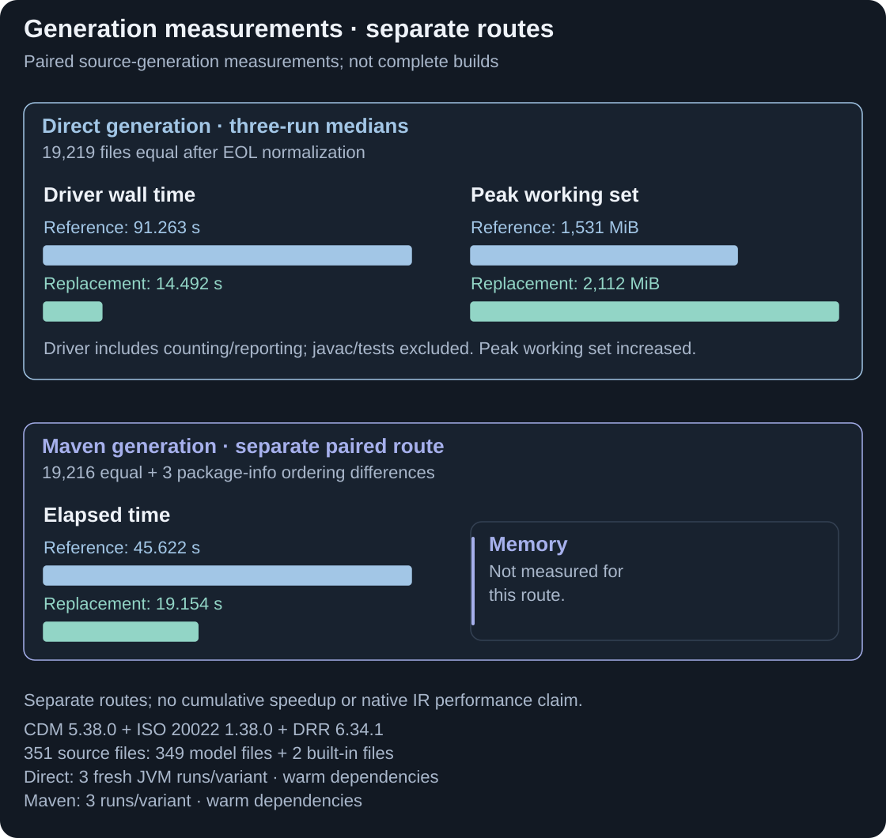
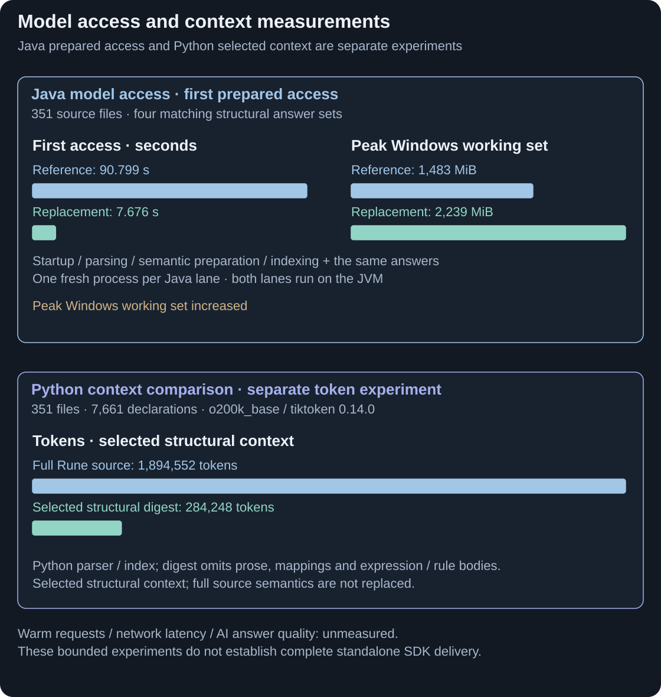
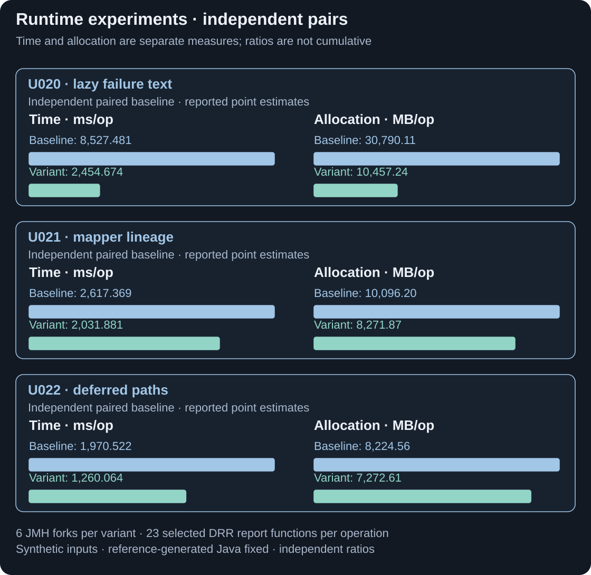

# Performance

Recorded experiments show gains in generation, model access and selected runtime work. These are separate workloads with different baselines; every result below retains its scope and trade-offs.

<picture>
  <source media="(max-width: 800px)" srcset="assets/contribution-performance-generation-mobile.svg">
  
</picture>

**Faster source generation in these measured tasks.** This is replacement toolchain performance, not a native-IR or full-build speed claim. [Full-size chart](assets/contribution-performance-generation.svg).

<strong>CONTRIBUTION</strong> · Retained experiments · Code/Docs snapshot: 22 September 2026

## Generate application code

The direct task generated **19,219 Java files**, all equal after line-ending normalisation. Maven generated the same paths: **19,216 equal plus three package-info ordering differences**. Both use **CDM 5.38.0, ISO 20022 1.38.0 and DRR 6.34.1: 349 model files plus two builtins**.

The charts show medians of three fresh JVM runs per variant, with warm dependencies. Downstream Java compilation and tests are excluded. Direct generation's peak Windows working set **increased from 1,531 to 2,112 MiB**; Maven memory was not recorded.

## Access model facts and prepare AI context

<picture>
  <source media="(max-width: 800px)" srcset="assets/contribution-performance-access-mobile.svg">
  
</picture>

**Faster first access and smaller selected context measure different things.** Both Java access paths use a JVM and memory increases. The token digest deliberately omits source content. [Full-size chart](assets/contribution-performance-access.svg).

These establish initial-access and context-size results. Warm request/network latency and AI answer quality were not measured. A separate no-JVM Python access demo took 106.587 seconds; it is not a speed win or a released SDK.

## Execute generated Java

<picture>
  <source media="(max-width: 800px)" srcset="assets/contribution-performance-runtime-mobile.svg">
  
</picture>

**Avoid unnecessary runtime construction.** Each pair uses its own baseline; this is not production trade throughput or an IR-emission gain. [Full-size chart](assets/contribution-performance-runtime.svg).

Exact measurements, uncertainty and receipts

| Independent change | Time, ms/op | Allocated MB/op |
|---|---:|---:|
| U020 · deferred failure text | 8,527.481 ± 411.588 → 2,454.674 ± 258.851 | 30,790.11 ± 121.15 → 10,457.24 ± 2.13 |
| U021 · deferred lineage | 2,617.369 ± 228.362 → 2,031.881 ± 127.596 | 10,096.20 ± 15.69 → 8,271.87 ± 2.11 |
| U022 · deferred mapper-path construction | 1,970.522 ± 90.017 → 1,260.064 ± 21.444 | 8,224.56 ± 31.21 → 7,272.61 ± 6.36 |

Each runtime leg has six JMH forks; one operation invokes 23 selected DRR report functions on synthetic populated inputs. Reference-generated Java is held fixed. These are three independent pairs, not a cumulative upgrade sequence. Reported uncertainties are retained in the compact [U020](evidence/runtime-U020-source.txt), [U021](evidence/runtime-U021-source.txt) and [U022](evidence/runtime-U022-source.txt) extracts; complete old/new runtime variants and inputs are needed to reproduce the exact experiments.

A separate optimised-emitter experiment reduced allocation 30,697.39 → 30,234.98 MB/op (1.51%). Time was 6,874.283 ± 379.189 → 7,030.323 ± 465.023 ms/op; it does not establish an overall speedup. See [experiment methods](EXPERIMENTS.md#4-optimised-generation-mode-3).

Generation/access were recorded on 20 August 2026, Windows 11 Pro Insider, Intel Core Ultra 9 285K, JDK 21.0.8. The direct driver includes its reporting endpoint, uses the recorded EMF-common override and contains an outlier; its median is not a universal promise. Windows memory here is sampled peak working set, not Java heap or portable RSS. Allocation per operation is another metric.

Primary receipts: [direct reference](evidence/codegen.legacy.json), [replacement](evidence/codegen.m1.json), [parity](evidence/diff.legacy-vs-m1.json), [Maven reference](evidence/build.legacy.clean.json), [replacement](evidence/build.plus.clean.json), [comparison](evidence/build.paritydiff.json), [model access](evidence/analytics.plus-jvm.json), [reference access](evidence/analytics.legacy-emf.json), [Python access](evidence/analytics.nojvm.json) and [context](evidence/ai.context.json). The context digest selects less information; equivalent structural queries could also be exposed through the existing framework. No LLM was called.

[Previous: Planning](phasing-progress.md) · [Guide index](../README.md) · [Next: DSL maintenance](sdk-preview.md)
