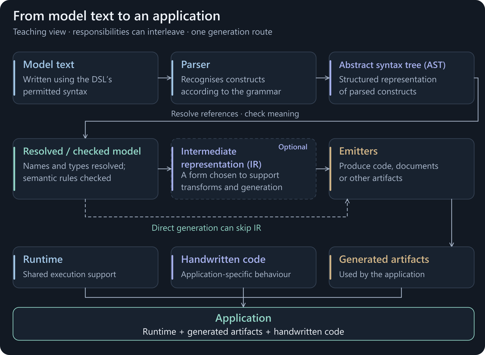
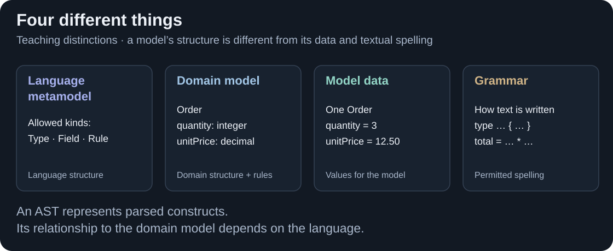
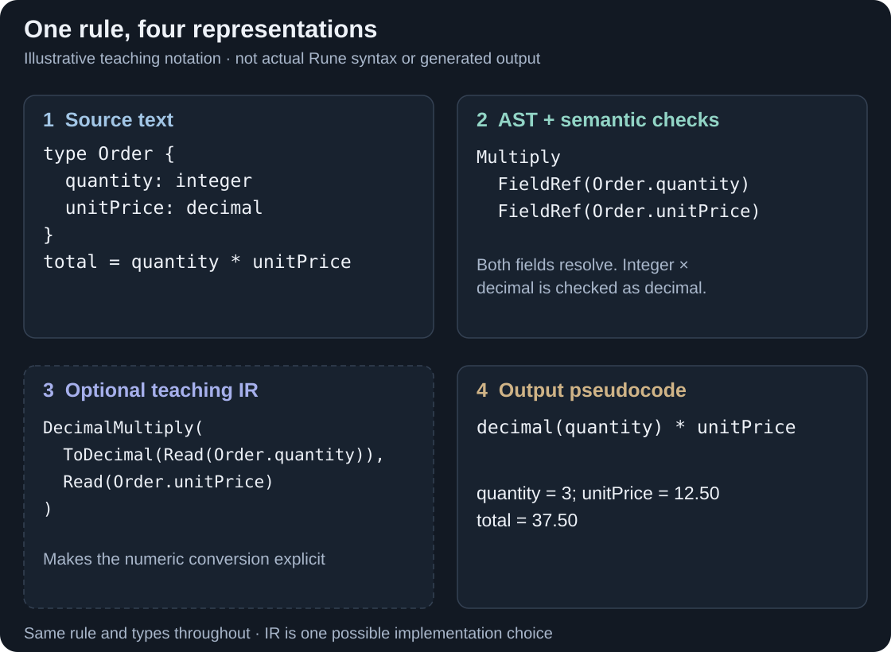
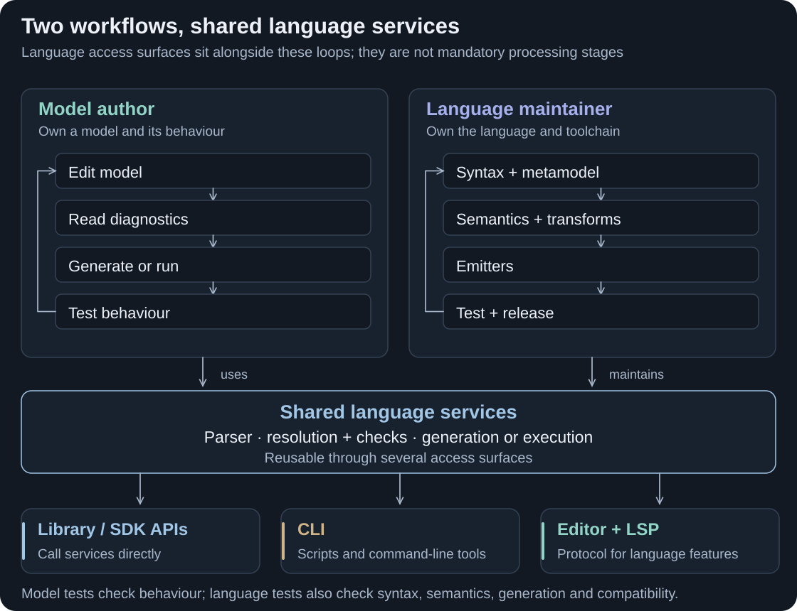

[← Back to the contribution guide](../README.md)

# Model-driven software development

Turn a shared description of a domain into something software tools can check, transform and use.

<picture>
  <source media="(max-width: 600px) and (prefers-reduced-motion: reduce)" srcset="assets/mdd-processing-mobile.svg">
  <source media="(max-width: 600px)" srcset="assets/mdd-processing-mobile.png">
  <source media="(prefers-reduced-motion: reduce)" srcset="assets/mdd-processing.svg">
  
</picture>

**Figure 1. From model text to an application.** The animation follows one route through an optional intermediate representation (IR). Responsibilities can interleave; motion does not represent measured time. [View the static diagram](assets/mdd-processing.svg).

<strong>BACKGROUND</strong> · Concept guide · Example notation is illustrative

[Purpose](#make-the-model-part-of-the-software) · [Concepts](#the-pieces-of-a-language) · [Processing](#from-source-to-software) · [Example](#one-rule-several-representations) · [Tooling](#tools-that-share-language-knowledge) · [Maintenance](#developing-models-and-maintaining-the-language)

## Make the model part of the software

Models describe domain **structure and behaviour**. Tools can check these descriptions, generate artifacts or interpret them to perform behaviour. [OMG overview](https://www.omg.org/mda/) · [Generation and interpretation](https://eclipse.dev/Xtext/documentation/303_runtime_concepts.html#code-generation).

- **Shared intent:** one domain vocabulary for developers and domain specialists.
- **Less repetition:** derive supported artifacts from shared definitions.
- **Consistent checks:** apply the same validation and transformation rules.
- **Traceable changes:** connect a model change to affected artifacts where the tools preserve that information.

These benefits depend on the language and tooling. Model validation complements integration and runtime testing. [OMG's MDA approach](https://www.omg.org/mda/) · [Language implementation](https://eclipse.dev/Xtext/documentation/303_runtime_concepts.html).

## The pieces of a language

<picture>
  <source media="(max-width: 600px)" srcset="assets/mdd-concepts-mobile.svg">
  
</picture>

**Figure 2. Different levels of description.** The language's metamodel describes the kinds of elements a model may contain. The domain model describes Order and its rules. An Order instance supplies particular values.

A **domain-specific language (DSL)** provides vocabulary and rules suited to a particular problem area. Its notation may be textual, graphical or a combination. This page follows a textual example because it makes the processing steps easy to see.

Definitions: model, metamodel, grammar and semantics

| Concept | What it contributes |
| --- | --- |
| **Model** | A structured description of something of interest: here, Order's fields and total rule. |
| **Metamodel** | The allowed element kinds, relationships and structural rules for such models: for example, Type contains Fields and Rules. |
| **Grammar** | The permitted textual forms and how those forms are recognised or mapped to structures. |
| **Semantics** | The meaning of the model's constructs: what a reference identifies, which operations are valid, and how behaviour is evaluated. |

A grammar and a metamodel address related concerns; some frameworks derive one from the other. Neither alone necessarily specifies all behaviour. Xtext provides a concrete example of grammar-to-model mapping and metamodel structure, while its separate implementation services handle further checks and reference resolution. [Grammar and metamodel](https://eclipse.dev/Xtext/documentation/301_grammarlanguage.html#ecore-model-inference) · [Language implementation](https://eclipse.dev/Xtext/documentation/303_runtime_concepts.html).

## From source to software

The diagram follows one common generation-oriented architecture. Its stages show responsibilities; implementations can combine them, perform them incrementally or revisit them as a model changes.

- **Parse:** recognise the text and build structured language elements.
- **Represent:** an **abstract syntax tree (AST)** records parsed constructs and their relationships.
- **Check:** resolve references and validate the model's meaning.
- **Transform:** an optional **intermediate representation (IR)** makes operations explicit for further processing.
- **Emit:** produce artifacts that work with runtime libraries and application code.

Follow the stages and inspect their source references

**Read the text.** A lexer recognises tokens such as names, numbers and operators. A parser applies grammar rules to assemble their structure. Some parsers first produce a detailed parse tree and a later step builds an AST; others create the required model structures directly. [Xtext grammar documentation](https://eclipse.dev/Xtext/documentation/301_grammarlanguage.html) · [LLVM parser tutorial](https://llvm.org/docs/tutorial/MyFirstLanguageFrontend/LangImpl02.html).

**Represent the structure.** An **abstract syntax tree (AST)** captures the relevant language constructs and their relationships. For `quantity * unitPrice`, a multiplication node can have two field-reference children. Formatting and punctuation need not become separate AST nodes. The AST describes the parsed expression; resolving its references and checking its types are further responsibilities. [LLVM's AST explanation](https://llvm.org/docs/tutorial/MyFirstLanguageFrontend/LangImpl02.html#the-abstract-syntax-tree-ast).

**Resolve and check meaning.** Language services identify what names refer to, check types and cardinalities, and enforce additional constraints. For example, a missing field reference can be reported even though its spelling follows the grammar. These services can also supply diagnostics to an editor. The inspected contribution's workspace illustrates separate resolution, inference and validation responsibilities. [Workspace processing](https://github.com/nicholas-moger/rune_dsl_update/blob/main/rune-parser/src/main/java/com/regnosys/rosetta/symbols/RWorkspace.java#L166).

**Transform when useful.** An **intermediate representation (IR)** is a representation used between processing stages. It can make resolved operations and facts explicit in a form suited to further transformation or output generation. A system may use several IRs, one IR or direct generation from its model structures. An IR does not by itself establish correct output or complete target support. [LLVM's AST-to-IR example](https://llvm.org/docs/tutorial/MyFirstLanguageFrontend/LangImpl03.html).

**Produce and use artifacts.** An **emitter** turns the chosen representation into a target artifact, such as source code, a schema or configuration. Generated source may then be compiled and combined with runtime libraries, infrastructure and handwritten application code. The application's runtime is distinct from the tools that process the model during development. The contribution provides examples of [emitting Java text](https://github.com/nicholas-moger/rune_dsl_update/blob/main/rune-ir-java/src/main/java/com/regnosys/rosetta/generator/java/ir/IREnumEmitter.java#L59) and [testing generated code with runtime types](https://github.com/nicholas-moger/rune_dsl_update/blob/main/examples/review/src/test/java/review/GeneratedModelTest.java#L18). Another architecture can interpret the model instead of generating source code. [Interpretation alternative](https://eclipse.dev/Xtext/documentation/303_runtime_concepts.html#code-generation).

## One rule, several representations

Consider an Order with an integer `quantity`, a decimal `unitPrice`, and a decimal `total` calculated from them. For quantity **3** and unit price **12.50**, the result is **37.50**.

<picture>
  <source media="(max-width: 600px)" srcset="assets/mdd-example-mobile.svg">
  
</picture>

**Figure 3. Preserve the meaning while changing representation.** These panels are teaching notation, rather than actual Rune syntax, Rune IR or generated output. The AST/IR distinction follows the staged compiler example in [LLVM's tutorial](https://llvm.org/docs/tutorial/MyFirstLanguageFrontend/).

The source expresses `total = quantity * unitPrice`. The AST records the operation and references. Semantic checks identify the fields and their types. The illustrative IR makes the integer-to-decimal conversion explicit, and the output expresses the same calculation for its target.

An IR can help a backend work from explicit facts rather than reconstructing them from source notation. Correctness still depends on the language's rules—for example, its numeric precision and conversion behaviour—and on the emitter preserving them. The small example omits currency, rounding, missing values and collections; a real language must define and test the cases it supports.

## Tools that share language knowledge

- **LSP — editor communication.** The Language Server Protocol connects development tools to language servers for capabilities such as completion, diagnostics and navigation. It does not define the language's grammar or semantics. [Official Microsoft overview](https://microsoft.github.io/language-server-protocol/).
- **SDK — reusable capabilities.** A software development kit packages tools, libraries and supported interfaces. A language SDK might expose parsing, checks, model inspection or generation to APIs, command-line tools and editor extensions. Capabilities depend on the SDK. [Official toolkit example](https://learn.microsoft.com/en-us/dotnet/core/sdk).

The editor presents the experience; language services provide model knowledge. LSP and SDK interfaces sit alongside the processing pipeline.

## Developing models and maintaining the language

There are two connected development activities, with different change surfaces.

<picture>
  <source media="(max-width: 600px)" srcset="assets/mdd-workflows-mobile.svg">
  
</picture>

**Figure 4. Two activities supported by language tooling.** The map shows possible service interfaces and change responsibilities, rather than a claim about a particular SDK's delivered features.

**A model author** changes domain types, relationships and rules using the existing language. Their loop includes feedback from diagnostics, generating or running results, and testing the resulting behaviour in an application.

**A language maintainer** evolves the language or its tools. A new construct may require changes to the grammar, model structures, reference handling, semantic checks, transformations, emitters and editor support. The affected surfaces depend on the architecture and the change. Xtext's documented grammar evolution and test facilities illustrate why such changes require more than accepting new text. [Grammar evolution](https://eclipse.dev/Xtext/documentation/301_grammarlanguage.html#grammar-annotations) · [Language testing](https://eclipse.dev/Xtext/documentation/303_runtime_concepts.html#unit-testing).

Testing, releases and reproducible version selection

Useful checks span several boundaries:

- **Input and meaning:** valid models are accepted; invalid syntax, references and operations receive appropriate diagnostics.
- **Transformation and output:** changed representations preserve supported meaning and generate the expected artifacts.
- **Application behaviour:** generated artifacts compile or load with their intended runtime dependencies, and relevant execution tests pass.
- **Evolution:** supported existing models, generated interfaces and tooling integrations behave as promised after a release.

Version selection therefore covers more than a model file. A reproducible project records the model sources and the language/compiler, generator configuration and runtime dependencies it uses. The CDM/DRR page will apply this general principle to its actual release and dependency arrangements.

## Sources and code references

The explanations above use official OMG, LLVM, Eclipse and Microsoft documentation. The following inspected code illustrates these concepts in the old/upstream and contribution implementations. It supports a conceptual comparison; it is not evidence of current production integration, performance or blanket compatibility.

Inspect the source versions and implementation references

- **Upstream reference:** Rune DSL **9.83.0**, commit `5fb8d697911d2ca62532d1801265b67752d03ef9`.
- **Contribution reference:** the **22 September 2026** code snapshot retained in this repository.

These are fixed source references. Later development work is outside this comparison.

| Concept | Upstream source | Contribution source |
| --- | --- | --- |
| Grammar and model structures | [Grammar](https://github.com/finos/rune-dsl/blob/5fb8d697911d2ca62532d1801265b67752d03ef9/rune-lang/src/main/java/com/regnosys/rosetta/Rosetta.xtext#L1), [semantic metamodel](https://github.com/finos/rune-dsl/blob/5fb8d697911d2ca62532d1801265b67752d03ef9/rune-lang/model/Rosetta.xcore#L20), [ANTLR 3 parser generation](https://github.com/finos/rune-dsl/blob/5fb8d697911d2ca62532d1801265b67752d03ef9/rune-lang/src/main/java/com/regnosys/rosetta/GenerateRosetta.mwe2#L67) | [ANTLR 4 grammar](https://github.com/nicholas-moger/rune_dsl_update/blob/main/rune-parser/src/main/antlr4/com/regnosys/rosetta/parser/RosettaParser.g4#L9), [parse-tree-to-AST builder](https://github.com/nicholas-moger/rune_dsl_update/blob/main/rune-parser/src/main/java/com/regnosys/rosetta/ast/builder/AstBuilder.java#L168) |
| Resolution and semantic checks | [Scope provider](https://github.com/finos/rune-dsl/blob/5fb8d697911d2ca62532d1801265b67752d03ef9/rune-lang/src/main/java/com/regnosys/rosetta/scoping/RosettaScopeProvider.java#L79), [type provider](https://github.com/finos/rune-dsl/blob/5fb8d697911d2ca62532d1801265b67752d03ef9/rune-lang/src/main/java/com/regnosys/rosetta/types/RosettaTypeProvider.java#L42) | [Workspace processing responsibilities](https://github.com/nicholas-moger/rune_dsl_update/blob/main/rune-parser/src/main/java/com/regnosys/rosetta/symbols/RWorkspace.java#L166) |
| Generation and optional IR | [Generator dispatch](https://github.com/finos/rune-dsl/blob/5fb8d697911d2ca62532d1801265b67752d03ef9/rune-lang/src/main/java/com/regnosys/rosetta/generator/RosettaGenerator.java#L50) | [IR/direct-generation dispatch](https://github.com/nicholas-moger/rune_dsl_update/blob/main/rune-java-generator/src/main/java/com/regnosys/rosetta/generator/java/spi/IRGeneration.java#L281), [enum emitter](https://github.com/nicholas-moger/rune_dsl_update/blob/main/rune-ir-java/src/main/java/com/regnosys/rosetta/generator/java/ir/IREnumEmitter.java#L59) |
| Generated code and runtime use | [Runtime mapper](https://github.com/finos/rune-dsl/blob/5fb8d697911d2ca62532d1801265b67752d03ef9/rune-runtime/src/main/java/com/rosetta/model/lib/mapper/MapperS.java#L35) | [Generated-model execution tests](https://github.com/nicholas-moger/rune_dsl_update/blob/main/examples/review/src/test/java/review/GeneratedModelTest.java#L18) |

The next page applies these concepts to Rune DSL's established architecture and explains the roles of its actual frameworks and services.

[← Contribution guide](../README.md) · [Next: Rune DSL architecture](rune-architecture.md)
