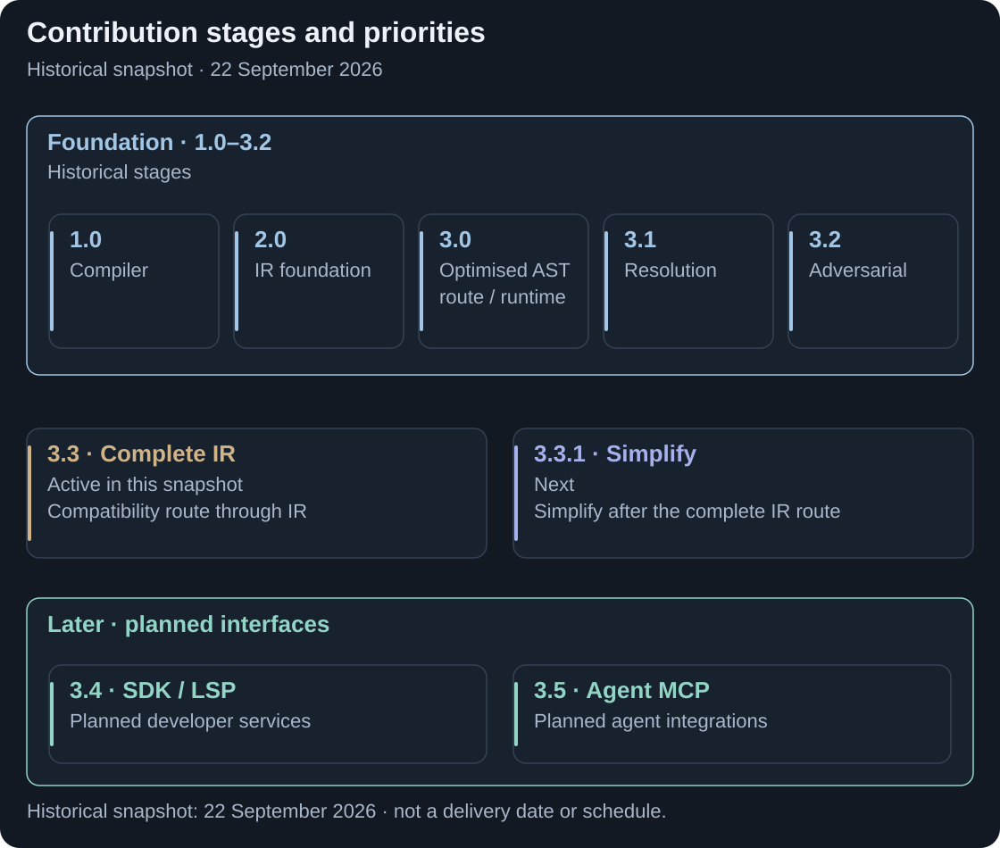

# Planning

Build on the alternative compiler, complete the IR generation boundary, then expose reusable development services. The code here is a fixed snapshot of that programme, not a live progress dashboard.

<picture>
  <source media="(max-width: 800px)" srcset="assets/contribution-planning-mobile.svg">
  
</picture>

**Core IR closure comes before SDK delivery.** [Full-size plan](assets/contribution-planning.svg).

<strong>CONTRIBUTION</strong> · Code/Docs snapshot: 22 September 2026 · Active work: phase 3.3

## Delivery sequence

| Stage | Scope |
|---|---|
| 1.0–3.2 · Foundation | Alternative compiler and direct compatibility Java; IR infrastructure; optimised/runtime experiments; broader resolution and pinned models; adversarial infrastructure. These are scoped milestones. |
| 3.3 · Active | Complete native compatibility Java emission and integration, including whole-file writers, shared routing and explicit accounting of unsupported cases. |
| 3.3.1 · Next | Simplify and consolidate accepted behaviour and remove superseded implementation paths where the contract permits. |
| 3.4 · Planned | Standalone SDK, replacement LSP/editor services and current-language maintenance exercises; investigate project profiles. |
| 3.5 · Planned | Agent/MCP access through shared semantic services. Additional targets and model bridges need separate scope and acceptance. |

## Progress means three different things

### What closes phase 3.3

- **Complete files:** all compatibility Java file families use the production IR route, including bodies and derived files; fallback output earns no IR credit.
- **Normal use:** the completed route is enabled by default within the replacement compiler, with remaining preparation dependencies explicitly identified.
- **Accepted behaviour:** output and consumer checks pass over the declared pinned scope, with every decline, missing file and adversarial exception accounted for against the agreed exit conditions.

These are the phase exit requirements, not claims about this snapshot. Independent-emission certification is reported separately. [Detailed acceptance](ROADMAP.md#what-closes-the-active-phase).

### Reading the progress measures

**Functional emission:** which complete files the IR route actually writes. **Default enablement:** which route the normal build selects. **Isolation/certification:** what evidence proves the route's independence and accepted contract. None can stand in for the others.

At this snapshot, declaration writers account for **93,703 of 174,141 Java files (53.8%)** across **25 pinned Rune 9.83 release cells × 11 file kinds on the compatibility IR route**, excluding chaos. This is historical file ownership, not overall completion or certified end-to-end independence. Function/rule/data-rule files and the remaining support-file categories still need writer integration.

Snapshot file accounting and testing approach

| File population | Snapshot count |
|---|---:|
| Enums | 4,542 |
| Data types and their derived files | 17,585 + 71,096 |
| Choices and their derived files | 80 + 400 |
| Wrappers, package-info and label providers still on existing writers | 2,505 |
| Functions, rule/report classes and data-rule files still on existing writers | 77,933 |

The [writer receipt](evidence/ir-writers-32f8c9ec4.txt) and [shadow/acceptance extract](evidence/ir-unit-shadows-32f8c9ec4.txt) bind these populations. Later production-route migration and stricter certification meters are different records and are not included in this code snapshot.

Testing follows the boundary being changed: parser/semantic fixtures, independent generated-output goldens, compilation and execution, route/writer accounting, and adversarial controls. Output fidelity does not by itself prove native ownership; a provider label does not prove every writer used it. See [Verify and reproduce](EVIDENCE.md), [Testing](TESTING.md), [Corpus](CORPUS-9.83.md) and [Chaos gate](CHAOS-GATE.md).

The retained [roadmap](ROADMAP.md) provides detailed acceptance. SDK maintenance exercises use language changes after 9.83 to test how developers make changes through the new services; this is broader than checking compatibility with those releases. There is no shipped SDK, replacement LSP or MCP server in this snapshot.

[Previous: Current and future state](current-future-state.md) · [Guide index](../README.md) · [Next: Performance](measured-outcomes.md)
