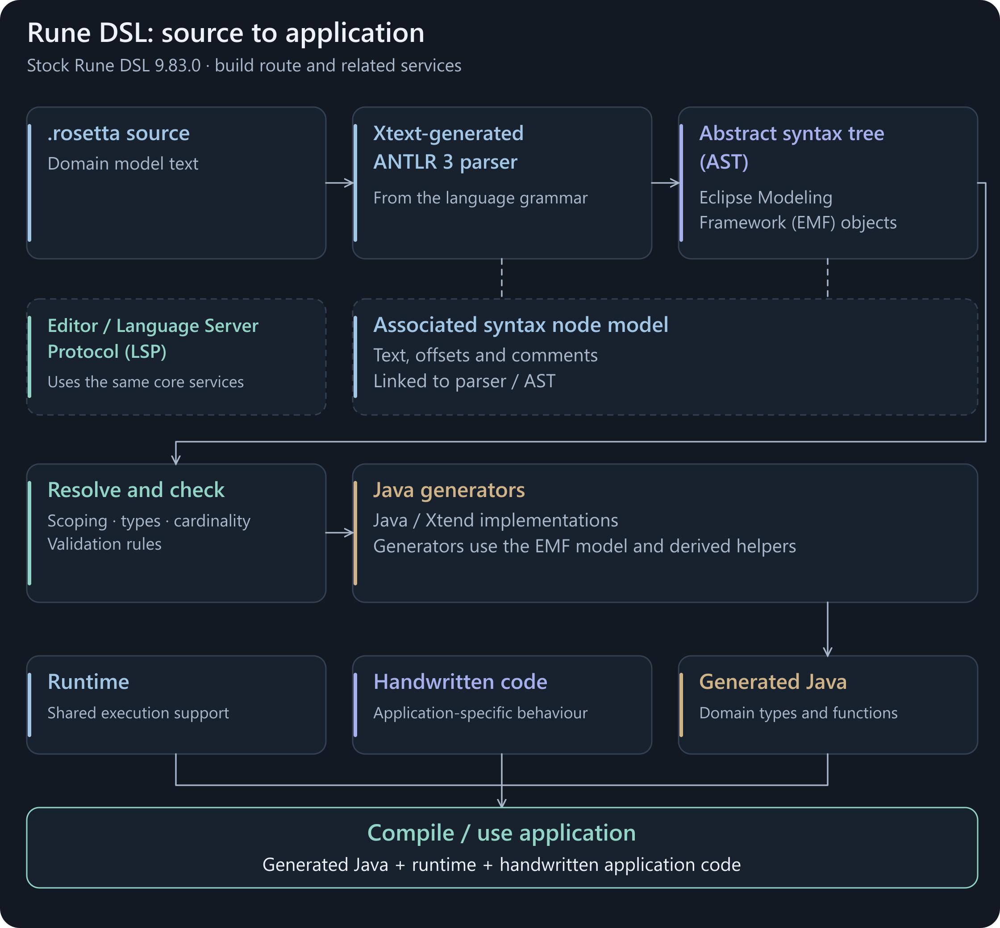
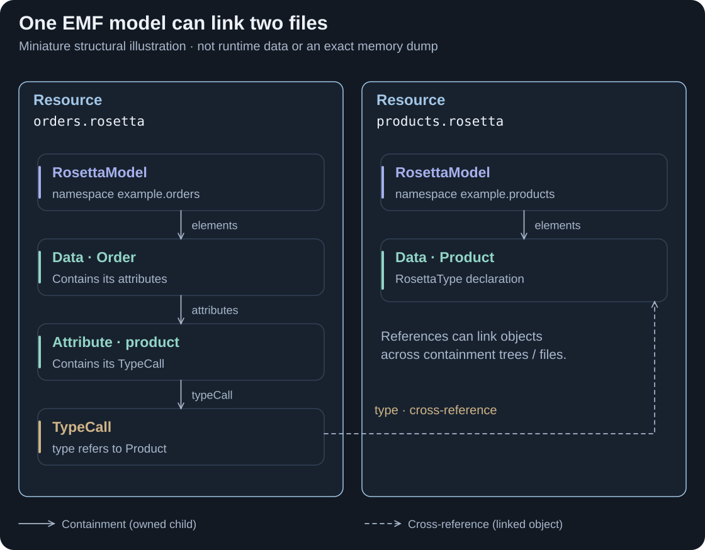
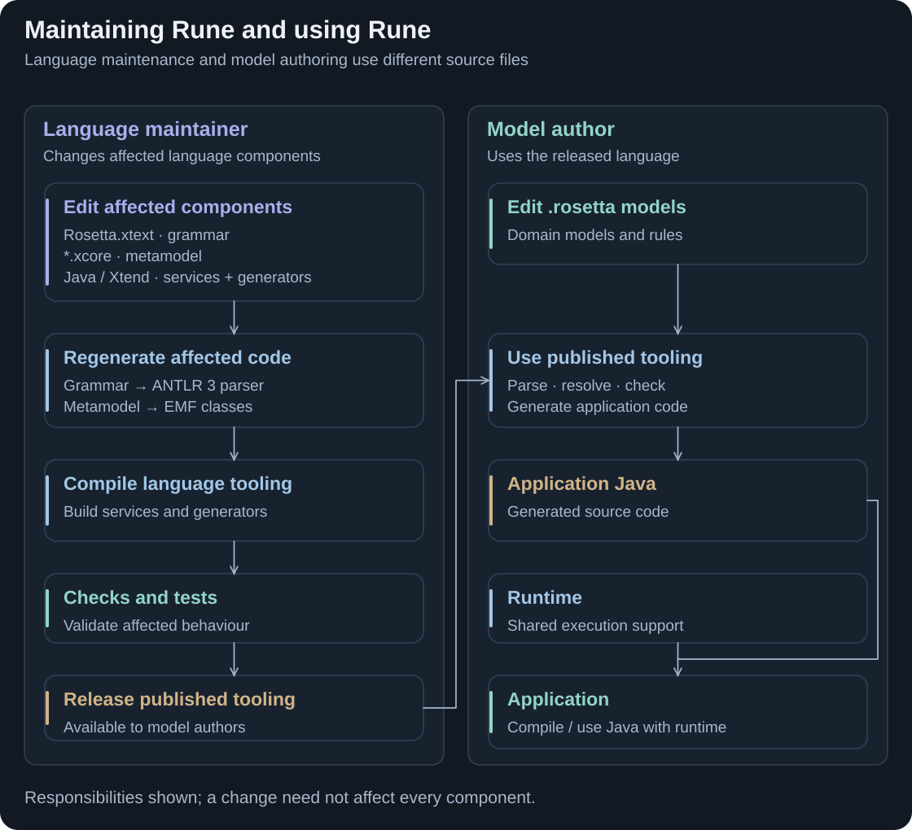

[← Model-driven software development](model-driven-development.md) · [Contribution guide](../README.md)

# Rune DSL architecture

Rune's established compiler represents source models as linked objects, then uses language services and generators to produce application code.

<picture>
  <source media="(prefers-reduced-motion: reduce) and (max-width: 600px)" srcset="assets/rune-architecture-flow-mobile.svg">
  <source media="(prefers-reduced-motion: reduce)" srcset="assets/rune-architecture-flow.svg">
  <source media="(max-width: 600px)" srcset="assets/rune-architecture-flow-mobile.png">
  
</picture>

**Figure 1. The established Java generation route.** Scope: the stock Rune DSL **9.83.0** compiler. The **abstract syntax tree (AST)** is stored as **Eclipse Modeling Framework (EMF)** objects. Generators consume that model and derived helper structures; there is no separate, fully lowered, whole-language **intermediate representation (IR)** boundary in this route. Motion illustrates responsibilities, rather than measured timing. [View the static diagram](assets/rune-architecture-flow.svg). [Generator dispatch](https://github.com/finos/rune-dsl/blob/5fb8d697911d2ca62532d1801265b67752d03ef9/rune-lang/src/main/java/com/regnosys/rosetta/generator/RosettaGenerator.java#L155).

This page follows the built-in Java route. **Python generation is also available for CDM** through the separate [Rune Python generator](https://github.com/finos/rune-python-generator#generating-cdm-from-rune) and [Python runtime](https://github.com/finos/rune-python-runtime#readme). The Python backend reads Rune's model and produces Python code. The next page, [Rune in CDM and DRR](rune-cdm-drr.md), will cover how these generation and runtime paths fit into CDM usage.

<strong>BACKGROUND</strong> · Established architecture · Rune DSL 9.83.0 baseline

[Processing](#the-model-driven-route-in-rune) · [Model graph](#one-ast-linked-as-a-graph) · [Frameworks](#what-the-frameworks-do) · [Generation](#from-model-to-generated-java) · [Editor and build](#editor-and-build-use-language-services) · [Maintenance](#changing-a-model-and-changing-the-language)

## The model-driven route in Rune

The previous page introduced [parsing, representation, checking, optional transformation and emission](model-driven-development.md#from-source-to-software). Rune implements those responsibilities as follows:

- **Parse:** an Xtext-generated ANTLR 3 lexer/parser reads `.rosetta` files using the Rune grammar, creating model objects through Xtext's parsing infrastructure.
- **Represent:** the parser creates EMF objects for declarations and expressions. A separate syntax node model preserves their relationship to the text.
- **Resolve and check:** language services resolve names, derive implicit constructs, analyse types and cardinalities, and validate the model.
- **Generate:** Java generators traverse the model, use derived semantic helpers and assemble Java output.
- **Run:** generated Java is compiled and combined with runtime libraries and application code.

These are responsibilities, not a claim that every check runs once in a fixed order. Xtext supports lazy reference resolution and incremental processing. [Xtext's parser/model mapping](https://eclipse.dev/Xtext/documentation/301_grammarlanguage.html#parser-rules) · [Linking and validation](https://eclipse.dev/Xtext/documentation/303_runtime_concepts.html#linking).

## One AST, linked as a graph

<picture>
  <source media="(max-width: 600px)" srcset="assets/rune-architecture-model-mobile.svg">
  
</picture>

**Figure 2. Containment gives structure; references connect it.** A structural illustration using Rune's actual metamodel classes, rather than an application data instance or a memory dump. [Model containment and TypeCall](https://github.com/finos/rune-dsl/blob/5fb8d697911d2ca62532d1801265b67752d03ef9/rune-lang/model/Rosetta.xcore#L20) · [Data and attributes](https://github.com/finos/rune-dsl/blob/5fb8d697911d2ca62532d1801265b67752d03ef9/rune-lang/model/RosettaSimple.xcore#L93).

The **EMF graph is the AST's representation**, not a second model created after the AST. Declarations contain attributes and expressions. References connect a use of a name to its declaration, including declarations in other files. Together, these containment trees and references form a graph.

For example, an Order's `product` attribute contains a `TypeCall`. Its `type` reference identifies the Product declaration. A scope provider determines which declarations are visible; linking resolves the reference. [Rune scoping](https://github.com/finos/rune-dsl/blob/5fb8d697911d2ca62532d1801265b67752d03ef9/rune-lang/src/main/java/com/regnosys/rosetta/scoping/RosettaScopeProvider.java#L103) · [Xtext scoping](https://eclipse.dev/Xtext/documentation/303_runtime_concepts.html#scoping).

Syntax tree, semantic objects and model resources

The parser maintains two related views:

- **Syntax node model:** parsed text, tokens and positions, including formatting and comments. It supports locating model elements in source text.
- **Semantic model:** EMF objects such as `Data`, `Attribute`, `TypeCall` and `RosettaExpression`. These are the language elements consumed by language services and generators.

An EMF **Resource** holds the model for a source file. A **ResourceSet** manages related resources. References can initially be proxies and resolve when accessed. Parsing creates the objects; it does not, by itself, prove that every reference resolves or that every expression is valid. [Xtext's node and semantic models](https://eclipse.dev/Xtext/documentation/301_grammarlanguage.html#parser-rules) · [Lazy linking](https://eclipse.dev/Xtext/documentation/303_runtime_concepts.html#lazy-linking).

Rune also installs derived state in the same model—for example, implicit inputs and omitted expression branches. This is an additional responsibility of the existing language services. [Derived-state implementation](https://github.com/finos/rune-dsl/blob/5fb8d697911d2ca62532d1801265b67752d03ef9/rune-lang/src/main/java/com/regnosys/rosetta/derivedstate/RosettaDerivedStateComputer.java#L49).

## What the frameworks do

| Component | Role in Rune |
| --- | --- |
| **Xtext** | Connects the grammar, generated parser, model resources, linking and language infrastructure. Rune adds its own scoping, type analysis, validators and editor services. |
| **ANTLR 3** | Supplies the generated lexer/parser for Rune syntax and a separate content-assist parser. Xtext integrates these parsers with model-building services. Type analysis, validation and code generation belong to other components. |
| **EMF** | Provides the model objects, containment, references and resource APIs used by the compiler and tooling. |
| **Ecore and Xcore** | Ecore describes the metamodel. Xcore is the notation used to maintain it and generate its Java model classes. Rune's grammar imports these metamodels. |
| **Xtend** | An implementation language used for parts of the toolchain, including generator templates. Xtend sources compile to Java; their templates help assemble generated text. |
| **Java** | Implements other compiler/tooling services and is the target of the built-in application-code generators. |

Sources: [Rune grammar imports](https://github.com/finos/rune-dsl/blob/5fb8d697911d2ca62532d1801265b67752d03ef9/rune-lang/src/main/java/com/regnosys/rosetta/Rosetta.xtext#L1) · [Parser generation](https://github.com/finos/rune-dsl/blob/5fb8d697911d2ca62532d1801265b67752d03ef9/rune-lang/src/main/java/com/regnosys/rosetta/GenerateRosetta.mwe2#L67) · [ANTLR backend](https://github.com/eclipse-xtext/xtext/blob/a90e0aec9c0a28776fa69e37f84fc36df49e1175/org.eclipse.xtext.xtext.generator/src/org/eclipse/xtext/xtext/generator/parser/antlr/XtextAntlrGeneratorFragment2.xtend#L133) · [Content-assist parser](https://github.com/finos/rune-dsl/blob/5fb8d697911d2ca62532d1801265b67752d03ef9/rune-ide/src/main/java/com/regnosys/rosetta/ide/contentassist/cancellable/CancellableInternalRosettaParser.java#L19) · [EMF](https://eclipse.dev/emf/) · [Xcore](https://help.eclipse.org/latest/topic/org.eclipse.emf.doc/tutorials/xcore/xcore.html) · [Xtend](https://eclipse.dev/Xtext/xtend/documentation/index.html).

**Xtend is not a processing stage between the AST and generated code.** Java and Xtend are languages in which generator logic is written. This is separate from the Rune language whose models that logic processes.

## From model to generated Java

`RosettaGenerator` selects generators for model elements. These emit data types, builders, validators, functions, enums, reports and supporting files. Templates and Java output builders control the resulting source. [Dispatch and generator registration](https://github.com/finos/rune-dsl/blob/5fb8d697911d2ca62532d1801265b67752d03ef9/rune-lang/src/main/java/com/regnosys/rosetta/generator/RosettaGenerator.java#L169).

There **are** intermediate abstractions: `RType`, `RDataType` and `RFunction` provide derived semantic views, while Java statement builders represent target code. They retain connections to the source model. For example, `ROperation` stores a `RosettaExpression`, which the expression generator translates into Java. That is why “no intermediate representations” would be inaccurate. [Operation's source expression](https://github.com/finos/rune-dsl/blob/5fb8d697911d2ca62532d1801265b67752d03ef9/rune-lang/src/main/java/com/regnosys/rosetta/types/ROperation.java#L24) · [Expression generation](https://github.com/finos/rune-dsl/blob/5fb8d697911d2ca62532d1801265b67752d03ef9/rune-lang/src/main/java/com/regnosys/rosetta/generator/java/expression/ExpressionGenerator.xtend#L170).

Follow a data type or function through the generators

**Data type:** a `Data` model element is adapted to an `RDataType`. The model-object generator prepares a Java interface description and emits source through a template. Related generators produce builders, metadata and validators. [ModelObjectGenerator](https://github.com/finos/rune-dsl/blob/5fb8d697911d2ca62532d1801265b67752d03ef9/rune-lang/src/main/java/com/regnosys/rosetta/generator/java/object/ModelObjectGenerator.xtend#L59).

**Function:** a `Function` is adapted to `RFunction`. Its operations still refer to Rune expression objects. `ExpressionGenerator` selects logic for those expression kinds, consults type/cardinality services and assembles Java expressions/statements. The function template combines the pieces into a Java class. [FunctionGenerator](https://github.com/finos/rune-dsl/blob/5fb8d697911d2ca62532d1801265b67752d03ef9/rune-lang/src/main/java/com/regnosys/rosetta/generator/java/function/FunctionGenerator.xtend#L104) · [RObjectFactory](https://github.com/finos/rune-dsl/blob/5fb8d697911d2ca62532d1801265b67752d03ef9/rune-lang/src/main/java/com/regnosys/rosetta/types/RObjectFactory.java#L73) · [Java statement builder](https://github.com/finos/rune-dsl/blob/5fb8d697911d2ca62532d1801265b67752d03ef9/rune-lang/src/main/java/com/regnosys/rosetta/generator/java/statement/builder/JavaStatementBuilder.java#L31).

Rune also supports **external generators**. The existing extension contract receives model resources and model elements. This page does not make claims about representations used inside individual external implementations. [External-generator dispatch](https://github.com/finos/rune-dsl/blob/5fb8d697911d2ca62532d1801265b67752d03ef9/rune-lang/src/main/java/com/regnosys/rosetta/generator/RosettaGenerator.java#L195).

## Editor and build use language services

An editor communicates with the language server using the **Language Server Protocol (LSP)**. Rune's server extends Xtext's server and provides services over the model resources, such as diagnostics, semantic tokens, formatting and inlay hints. [Rune language server](https://github.com/finos/rune-dsl/blob/5fb8d697911d2ca62532d1801265b67752d03ef9/rune-ide/src/main/java/com/regnosys/rosetta/ide/server/RosettaLanguageServerImpl.java#L61) · [Xtext LSP support](https://eclipse.dev/Xtext/documentation/340_lsp_support.html).

A Maven build uses standalone language infrastructure and generator callbacks to produce files. Editor and build reuse language components; they need not share one live model instance or run in the same process. [Maven entry point](https://github.com/finos/rune-dsl/blob/5fb8d697911d2ca62532d1801265b67752d03ef9/rune-maven-plugin/src/main/java/com/regnosys/rosetta/maven/AbstractRuneGeneratorMojo.java#L133) · [Standalone builder](https://github.com/finos/rune-dsl/blob/5fb8d697911d2ca62532d1801265b67752d03ef9/rune-maven-plugin/src/main/java/com/regnosys/rosetta/maven/RuneStandaloneBuilder.java#L76).

The **application runtime** is a separate responsibility. Generated code calls runtime APIs for model objects, mapping, functions and validation. It does not normally parse Rune source to execute each generated function. The baseline runtime still declares the Xtend utility library, so its dependency boundary should not be described as having no Eclipse-related libraries. [Runtime module and dependencies](https://github.com/finos/rune-dsl/blob/5fb8d697911d2ca62532d1801265b67752d03ef9/rune-runtime/pom.xml#L31).

## Changing a model and changing the language

<picture>
  <source media="(max-width: 600px)" srcset="assets/rune-architecture-maintenance-mobile.svg">
  
</picture>

**Figure 3. The language toolchain and the models it processes have different sources.** This maps Rune onto the [model-development and language-maintenance distinction](model-driven-development.md#developing-models-and-maintaining-the-language) from the previous page. A change affects the relevant components; it does not necessarily change every box.

- **Change a domain model:** edit `.rosetta` definitions and run the existing validation and generation tools. Examples include adding a field or changing a rule within supported language constructs.
- **Change the language:** update the affected grammar/metamodel, semantic services, generators, runtime or editor behaviour; regenerate or compile what changed and test it before release.

Where language changes are implemented and checked

- `Rosetta.xtext` specifies syntax and its mapping into model features.
- `Rosetta.xcore`, `RosettaSimple.xcore` and `RosettaExpression.xcore` define the metamodel and generated EMF classes.
- Java/Xtend sources implement scoping, type/cardinality analysis, validation, editor behaviour and code generation.
- The language module's build generates model/parser infrastructure and compiles handwritten Java/Xtend sources.
- Relevant checks include parsing/linking, validation, editor behaviour, generated-source comparisons and generated-code execution. The selection depends on the change.

[Language generation workflow](https://github.com/finos/rune-dsl/blob/5fb8d697911d2ca62532d1801265b67752d03ef9/rune-lang/src/main/java/com/regnosys/rosetta/GenerateRosetta.mwe2#L59) · [Language module build](https://github.com/finos/rune-dsl/blob/5fb8d697911d2ca62532d1801265b67752d03ef9/rune-lang/pom.xml#L157) · [Representative generation test](https://github.com/finos/rune-dsl/blob/5fb8d697911d2ca62532d1801265b67752d03ef9/rune-integration-tests/src/test/java/com/regnosys/rosetta/generator/java/function/CalculationFunctionGeneratorTest.xtend#L125).

## Sources and code references

This chapter describes the established **Rune DSL 9.83.0 baseline**, not the contribution's replacement compiler or a claim about the latest upstream release. Baseline code links are fixed to upstream commit `5fb8d697911d2ca62532d1801265b67752d03ef9`. The Python links identify separate ecosystem projects; they are not part of this code snapshot and do not imply identical Java/Python feature coverage.

Primary sources and the boundaries of this explanation

- Eclipse: [Xtext grammar and semantic models](https://eclipse.dev/Xtext/documentation/301_grammarlanguage.html), [language implementation](https://eclipse.dev/Xtext/documentation/303_runtime_concepts.html), [EMF](https://eclipse.dev/emf/), [Xcore](https://help.eclipse.org/latest/topic/org.eclipse.emf.doc/tutorials/xcore/xcore.html), [Xtend templates](https://eclipse.dev/Xtext/xtend/documentation/203_xtend_expressions.html#template-expressions), [LSP support](https://eclipse.dev/Xtext/documentation/340_lsp_support.html).
- FINOS Rune DSL: grammar/metamodel definitions, language-service implementations, stock generator dispatch, Java output builders, Maven/server entry points, runtime dependencies and test fixtures linked above.
- The absence of a separate whole-language IR boundary is based on those stock generation paths. It is not a claim that Rune has no intermediate abstractions or that external generators cannot introduce their own.
- Diagrams simplify control flow. Resolution, validation, derived state and generation can revisit the same model. Animation is illustrative.
- This is source-based architectural evidence. It does not establish performance, complete language coverage or newly tested compiler behaviour.

[← Model-driven software development](model-driven-development.md) · [Next: Rune in CDM and DRR →](rune-cdm-drr.md) · [Contribution guide](../README.md)
