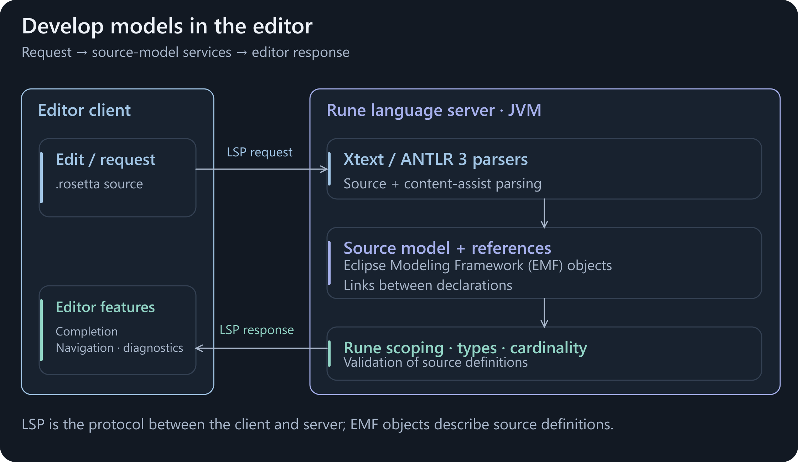
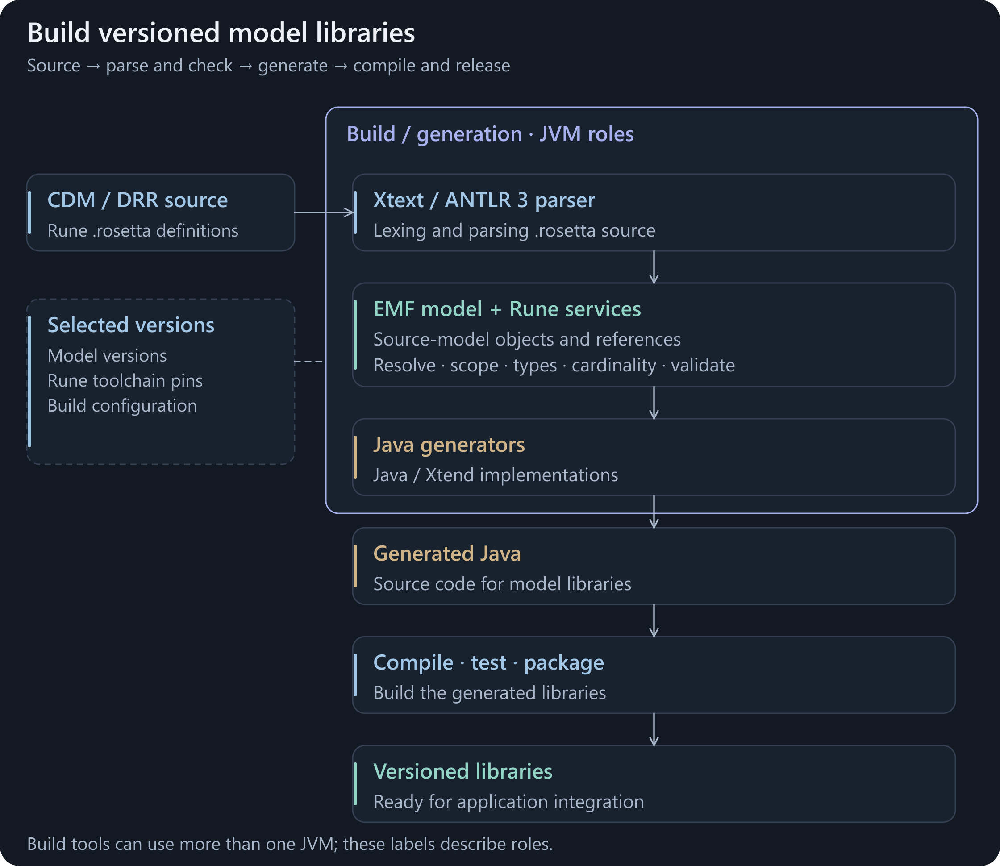
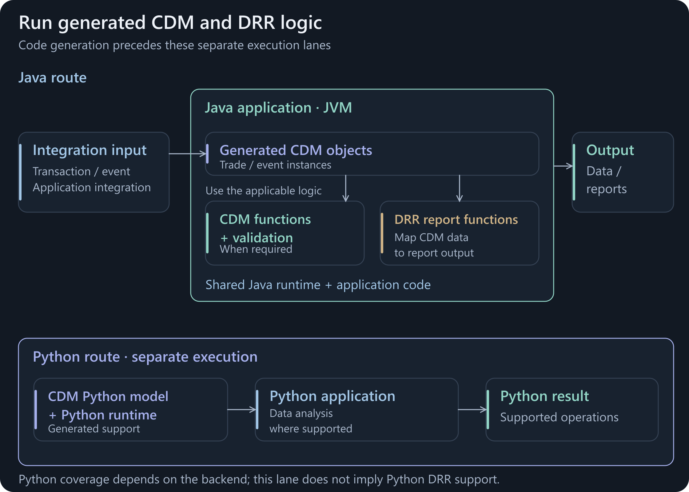
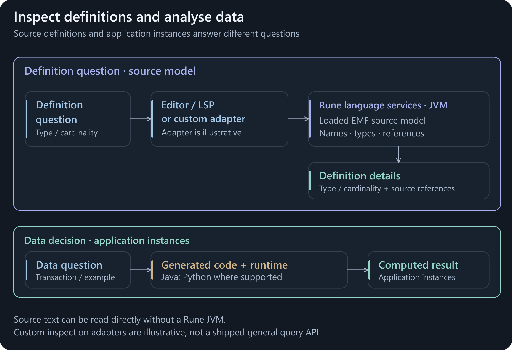
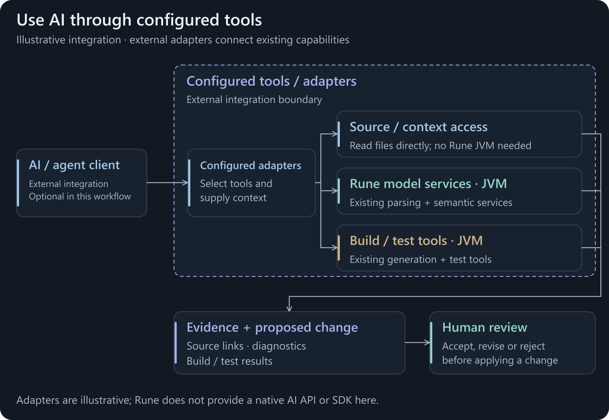

# Rune in CDM and DRR

Rune connects **Common Domain Model (CDM)** and **Digital Regulatory Reporting (DRR)** definitions to developer tools and executable software. An editor uses the **Language Server Protocol (LSP)** to communicate with Rune's language server in a **Java Virtual Machine (JVM)**.

<picture>
  <source media="(prefers-reduced-motion: reduce) and (max-width: 600px)" srcset="assets/cdm-drr-editor-mobile.svg">
  <source media="(prefers-reduced-motion: reduce)" srcset="assets/cdm-drr-editor.svg">
  <source media="(max-width: 600px)" srcset="assets/cdm-drr-editor-mobile.png">
  
</picture>

**Figure 1. Editing connects to the source model.** The language server uses the parser, model graph and semantic services explained on the [architecture page](rune-architecture.md). [Static diagram](assets/cdm-drr-editor.svg) · [Open animation](assets/cdm-drr-editor.png) · [Server setup](https://github.com/finos/rune-dsl/blob/5fb8d697911d2ca62532d1801265b67752d03ef9/rune-ide/src/main/java/com/regnosys/rosetta/ide/server/RosettaServerSetup.java#L31).

<strong>BACKGROUND</strong> · Development, execution and inspection · Rune DSL 9.83.0 baseline

[Develop](#develop-models) · [Run](#run-cdm-and-drr-logic) · [Inspect and analyse](#inspect-models-and-analyse-data) · [AI workflows](#use-ai-with-these-workflows)

**CDM** defines financial products, transactions and lifecycle behaviour. **DRR** adds reporting models and rules that derive regulatory reports from CDM data. **Rune** supplies the language and tooling used to express and process those definitions. [FINOS CDM](https://cdm.finos.org/docs/cdm-overview/#finos-cdm-distribution) · [DRR and CDM](https://drr-docs.isda.org/docs/get-started/drr-and-cdm/#how-drr-uses-the-cdm).

## Develop models

Start with a model release and its declared toolchain versions. Edit the Rune definitions, use editor feedback to check the change, then run the project's build and tests before packaging the generated libraries.

The baseline uses **ANTLR 3 inside Xtext** for Rune's lexer/parser and a separate content-assist parser. Parsing creates the **Eclipse Modeling Framework (EMF) source model** through Xtext. Xtext provides resources and linking; Rune adds scoping, types, cardinalities and validation. Completion combines parser information with semantic services. ANTLR is not the code generator or the generated application's runtime. [Parser generation](https://github.com/finos/rune-dsl/blob/5fb8d697911d2ca62532d1801265b67752d03ef9/rune-lang/src/main/java/com/regnosys/rosetta/GenerateRosetta.mwe2#L67) · [Content-assist parser](https://github.com/finos/rune-dsl/blob/5fb8d697911d2ca62532d1801265b67752d03ef9/rune-ide/src/main/java/com/regnosys/rosetta/ide/contentassist/cancellable/CancellableInternalRosettaParser.java#L19) · [Xtext parser backend](https://github.com/eclipse-xtext/xtext/blob/a90e0aec9c0a28776fa69e37f84fc36df49e1175/org.eclipse.xtext.xtext.generator/src/org/eclipse/xtext/xtext/generator/parser/antlr/XtextAntlrGeneratorFragment2.xtend#L133).

<picture>
  <source media="(prefers-reduced-motion: reduce) and (max-width: 600px)" srcset="assets/cdm-drr-build-mobile.svg">
  <source media="(prefers-reduced-motion: reduce)" srcset="assets/cdm-drr-build.svg">
  <source media="(max-width: 600px)" srcset="assets/cdm-drr-build-mobile.png">
  
</picture>

**Figure 2. Build model definitions into libraries.** Standalone tooling reuses the parser, source model and semantic services. Java and Xtend implement the generators; generated Java is their output. Version pins configure the chosen model and toolchain. [Static diagram](assets/cdm-drr-build.svg) · [Open animation](assets/cdm-drr-build.png) · [Maven entry](https://github.com/finos/rune-dsl/blob/5fb8d697911d2ca62532d1801265b67752d03ef9/rune-maven-plugin/src/main/java/com/regnosys/rosetta/maven/AbstractRuneGeneratorMojo.java#L132).

Where editor and build responsibilities meet

- The source **abstract syntax tree (AST)** consists of EMF objects. Resources, references and semantic services give tools access to the model's structure and meaning.
- The language server combines the core language module with IDE/server services. Hover, navigation and diagnostics use model resources through that infrastructure.
- The Maven builder uses standalone language infrastructure and generator callbacks. It can process the same sources independently of an editor session.
- These workflows share components. They need not share one live model instance or run in one JVM. The diagrams mark execution responsibilities, not a fixed number of processes.
- A model change may affect types, functions, conditions or reporting rules. Tests should exercise the changed model logic and its generated implementation.

[AST and resource graph](rune-architecture.md#one-ast-linked-as-a-graph) · [Rune standalone builder](https://github.com/finos/rune-dsl/blob/5fb8d697911d2ca62532d1801265b67752d03ef9/rune-maven-plugin/src/main/java/com/regnosys/rosetta/maven/RuneStandaloneBuilder.java#L76) · [Generator dispatch](https://github.com/finos/rune-dsl/blob/5fb8d697911d2ca62532d1801265b67752d03ef9/rune-lang/src/main/java/com/regnosys/rosetta/generator/RosettaGenerator.java#L169) · [DRR testing](https://drr-docs.isda.org/docs/get-started/how-drr-works/).

Release pins: model, language and supporting libraries

A model release, a Rune DSL release and a supporting Bundle release have separate version numbers. The project's dependency declarations select its compiler/plugin, generators and runtime libraries. Follow those declarations when building or changing a model.

These are **three representative CDM releases**, not a complete compatibility matrix:

| CDM release | Rune DSL pin | Bundle pin | Release build file |
|---|---|---|---|
| 6.0.0 | 9.28.2 | 11.34.0 | [Pinned POM](https://github.com/finos/common-domain-model/blob/2f86259ee6002e173c7ab3e6f8b0df33ac9754cc/pom.xml#L83) |
| 6.27.0 | 9.92.1 | 11.132.0 | [Pinned POM](https://github.com/finos/common-domain-model/blob/3d2ea87b19970e2b0dcea0858b212e586d5e22ec/pom.xml#L84) |
| 7.0.0 | 10.2.2 | 12.3.1 | [Pinned POM](https://github.com/finos/common-domain-model/blob/a6ffe777bc12ef3d289579cb3a86d1cbffea63d2/pom.xml#L84) |

These examples span Rune 9 and 10. Rune's release history records 9.x backports alongside 10.x changes; the CDM 7 upgrade includes stricter validation and changes to choice modelling. Different model release lines can therefore require different toolchains. These build and release records do not establish a formal support or end-of-life policy. [Rune 9 backports](https://github.com/finos/rune-dsl/releases/tag/9.96.0) · [Rune 10 release](https://github.com/finos/rune-dsl/releases/tag/10.14.0) · [CDM 7 migration](https://github.com/finos/common-domain-model/releases/tag/7.0.0).

DRR also requires suitable CDM and tooling dependencies. Follow its release prerequisites; the table above makes no DRR-specific version claim. The contribution's Rune DSL 9.83.0 compatibility baseline is separate from these ecosystem examples. [DRR prerequisites](https://drr-docs.isda.org/docs/get-started/pre-req/).

The proposed contribution will consider **project profiles** for grouping compatible model, compiler, generator and runtime settings. This is a design possibility for the [Goals](design-goals.md) page, rather than an existing capability shown here.

## Run CDM and DRR logic

<picture>
  <source media="(prefers-reduced-motion: reduce) and (max-width: 600px)" srcset="assets/cdm-drr-runtime-mobile.svg">
  <source media="(prefers-reduced-motion: reduce)" srcset="assets/cdm-drr-runtime.svg">
  <source media="(max-width: 600px)" srcset="assets/cdm-drr-runtime-mobile.png">
  
</picture>

**Figure 3. Applications execute the generated implementation.** Model definitions have already been turned into code. Application code supplies data and chooses the functions, validation or reports to run. [Static diagram](assets/cdm-drr-runtime.svg) · [Open animation](assets/cdm-drr-runtime.png) · [Java runtime](https://github.com/finos/rune-dsl/blob/5fb8d697911d2ca62532d1801265b67752d03ef9/rune-runtime/pom.xml#L31).

In **Java**, an application maps incoming data to CDM objects and calls the required generated functions or reports in its **application JVM**. DRR's documented flow is **Ingest → Enrich → Report → Project**: prepare CDM-based input, supply enrichment, evaluate reporting logic, then project the result to a submission format. Firm integrations and external function implementations form part of that application. [CDM Java distribution](https://cdm.finos.org/docs/cdm-java-distribution/#initialising-the-injector-option-1-using-provided-cdmruntimemodule) · [DRR pipeline](https://drr-docs.isda.org/docs/using-drr/implement-drr/#the-drr-pipeline).

In **Python**, CDM has a separate generator and runtime. Generation uses Rune's JVM model infrastructure; the emitted Python and its runtime execute in a Python application. Available features depend on the selected generator and model release. [Python generator](https://github.com/finos/rune-python-generator/blob/7d8f695aa9ef749254aa59ad70dcf577c4147d13/src/main/java/com/regnosys/rosetta/generator/python/PythonCodeGeneratorCLI.java#L311) · [Python runtime](https://github.com/finos/rune-python-runtime/blob/b0fa1cdbf3ac40635f5191aa5b6503d068b53105/README.md#L5).

Source definitions and application data have different roles

- The EMF graph represents model definitions. A generated CDM object represents application data, such as a transaction or event.
- Generated Java functions are compiled implementations supported by runtime libraries. Calling one normally does not require parsing the Rune source again. The application selects which operations to perform.
- The Java diagram shows CDM and DRR responsibilities and dependencies. It does not require every lifecycle function to run before every report. Reporting output and delivery to a regulator are separate steps.
- Python uses a separate backend and runtime. The cited generator documents incomplete function coverage and unsupported reporting constructs. The diagram does not claim complete Java/Python parity or a Python DRR implementation.
- Runtime dependencies are release-specific. For example, the Rune 9.83.0 Java runtime includes Xtend utility libraries, even though applications execute generated Java.

[Java function generation](https://github.com/finos/rune-dsl/blob/5fb8d697911d2ca62532d1801265b67752d03ef9/rune-lang/src/main/java/com/regnosys/rosetta/generator/java/function/FunctionGenerator.xtend#L258) · [Report-function interface](https://github.com/finos/rune-dsl/blob/5fb8d697911d2ca62532d1801265b67752d03ef9/rune-runtime/src/main/java/com/rosetta/model/lib/reports/ReportFunction.java#L21) · [CDM host implementations](https://cdm.finos.org/docs/process-model/#granularity) · [Python coverage](https://github.com/finos/rune-python-generator/blob/7d8f695aa9ef749254aa59ad70dcf577c4147d13/README.md#L8) · [Python reporting gaps](https://github.com/finos/rune-python-generator/blob/7d8f695aa9ef749254aa59ad70dcf577c4147d13/docs/RUNE_LANGUAGE_GAPS.md#L50).

## Inspect models and analyse data

<picture>
  <source media="(prefers-reduced-motion: reduce) and (max-width: 600px)" srcset="assets/cdm-drr-inspection-mobile.svg">
  <source media="(prefers-reduced-motion: reduce)" srcset="assets/cdm-drr-inspection.svg">
  <source media="(max-width: 600px)" srcset="assets/cdm-drr-inspection-mobile.png">
  
</picture>

**Figure 4. Choose the path that answers the question.** Definition inspection and execution over application data use different representations. [Static diagram](assets/cdm-drr-inspection.svg) · [Open animation](assets/cdm-drr-inspection.png) · [Core model loader](https://github.com/finos/rune-dsl/blob/5fb8d697911d2ca62532d1801265b67752d03ef9/rune-lang/src/main/java/com/regnosys/rosetta/transgest/ModelLoader.java#L29).

**Model questions** ask what a field means, its type or cardinality, or where a referenced definition lives. Editor hover and navigation use the linked source model. A custom JVM tool can also load and inspect that model using existing core classes.

**Data questions** ask what a rule produces or why validation fails for a sample transaction. These use the generated implementation and its target runtime. Source text or exported metadata can also be read directly; not every question requires a language-server request.

What a model-inspection tool would use

- Load the chosen Rune sources and their dependencies. The baseline's `ModelLoader` uses an Xtext resource set to read `RosettaModel` objects and exposes declaration lookup methods.
- Inspect declarations, attributes, references and cardinalities through the model and Rune's semantic services. Loading a resource alone does not imply that a full validation pass has run.
- Existing editor operations are provided through the language server. A general custom inspection adapter is an integration choice; this page does not identify a shipped universal query SDK or promise API stability.
- Evaluating a business result needs the selected generated implementation, runtime, inputs and any host implementations. Looking up a definition alone does not execute the business process.

[Model loading and lookup](https://github.com/finos/rune-dsl/blob/5fb8d697911d2ca62532d1801265b67752d03ef9/rune-lang/src/main/java/com/regnosys/rosetta/transgest/ModelLoaderImpl.java#L45) · [Hover and references](https://github.com/finos/rune-dsl/blob/5fb8d697911d2ca62532d1801265b67752d03ef9/rune-ide/src/main/java/com/regnosys/rosetta/ide/hover/RosettaHoverService.java#L38) · [Architecture: model and services](rune-architecture.md#one-ast-linked-as-a-graph).

## Use AI with these workflows

<picture>
  <source media="(prefers-reduced-motion: reduce) and (max-width: 600px)" srcset="assets/cdm-drr-ai-mobile.svg">
  <source media="(prefers-reduced-motion: reduce)" srcset="assets/cdm-drr-ai.svg">
  <source media="(max-width: 600px)" srcset="assets/cdm-drr-ai-mobile.png">
  
</picture>

**Figure 5. An AI client can use the same source and tool paths.** This is an illustrative external integration with configured adapters. [Static diagram](assets/cdm-drr-ai.svg) · [Open animation](assets/cdm-drr-ai.png).

An AI client can read definitions, obtain model-aware context through tools, propose a change and request validation or tests. The selected tool determines the execution path: direct source reading does not need Rune's JVM, while semantic inspection and Java generation/builds use JVM services. A developer reviews the proposed change and its evidence.

Existing services, configured integrations

The external client and its adapters translate requests into existing editor operations, model inspection or build commands. Those interfaces serve different purposes: a navigation response, a definition lookup and a test result are different kinds of evidence.

Rune's core supplies model structures and language services; the configured client decides how to use and present them. This illustration does not attribute a native AI API, natural-language query engine or the proposed new SDK to Rune DSL 9.83.0.

[Language-server setup](https://github.com/finos/rune-dsl/blob/5fb8d697911d2ca62532d1801265b67752d03ef9/rune-ide/src/main/java/com/regnosys/rosetta/ide/server/RosettaServerSetup.java#L31) · [Model loader](https://github.com/finos/rune-dsl/blob/5fb8d697911d2ca62532d1801265b67752d03ef9/rune-lang/src/main/java/com/regnosys/rosetta/transgest/ModelLoader.java#L29) · [Build entry](https://github.com/finos/rune-dsl/blob/5fb8d697911d2ca62532d1801265b67752d03ef9/rune-maven-plugin/src/main/java/com/regnosys/rosetta/maven/AbstractRuneGeneratorMojo.java#L132).

## Sources and scope

The architecture references use the fixed **Rune DSL 9.83.0** [source revision](https://github.com/finos/rune-dsl/tree/5fb8d697911d2ca62532d1801265b67752d03ef9). CDM release examples and Python references describe their own ecosystem versions; they do not extend the code snapshot's compatibility claims.

Primary sources and diagram conventions

FINOS CDM and ISDA DRR documentation establish the domain and application roles. Eclipse documentation explains Xtext's LSP support. Linked baseline source files establish the Rune language-server, model-loader, generator and Java runtime responsibilities.

The separate Python references use fixed generator and runtime revisions. The [generator build file](https://github.com/finos/rune-python-generator/blob/7d8f695aa9ef749254aa59ad70dcf577c4147d13/pom.xml#L75) selects Rune DSL 10.14.0, rather than this guide's 9.83.0 baseline. Its [CDM packaging script](https://github.com/finos/rune-python-generator/blob/7d8f695aa9ef749254aa59ad70dcf577c4147d13/python-test/cdm-tests/setup/build_cdm.sh#L112) separates JVM generation from Python packaging.

The diagrams simplify responsibilities and omit implementation detail such as incremental resource updates. Animation highlights explain the route, not measured processing time. Each animation plays three times, then settles on its static diagram; static alternatives are linked and selected for reduced-motion preferences where supported. This chapter documents execution paths; it reports no new compiler tests, performance measurements or cross-version compatibility results.

[← Rune DSL architecture](rune-architecture.md) · [Next: Drawbacks →](current-drawbacks.md) · [Contribution guide](../README.md)
