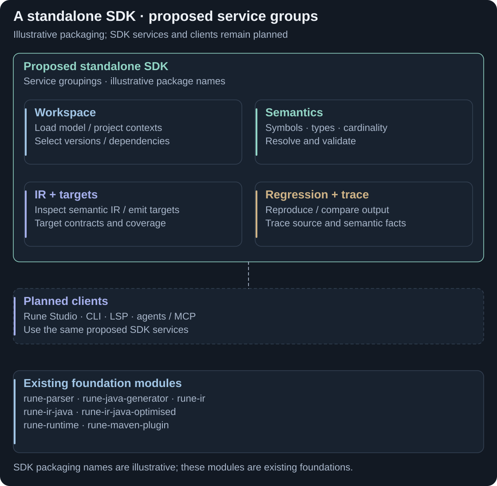
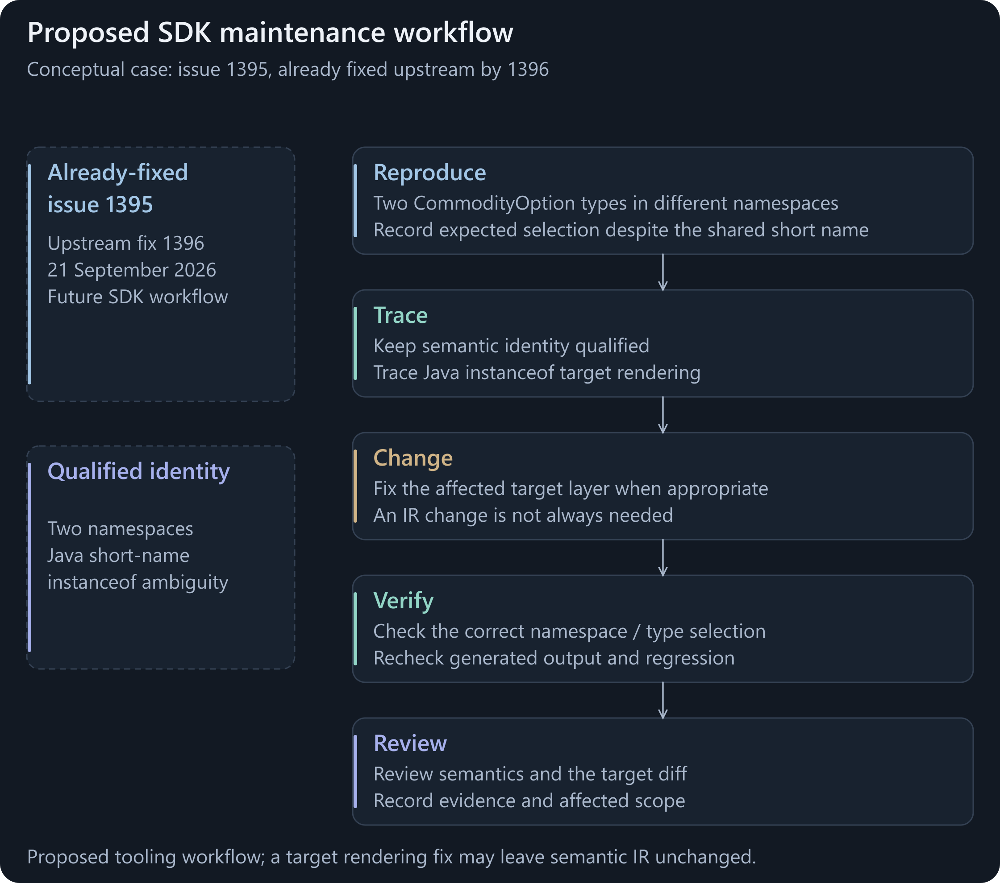
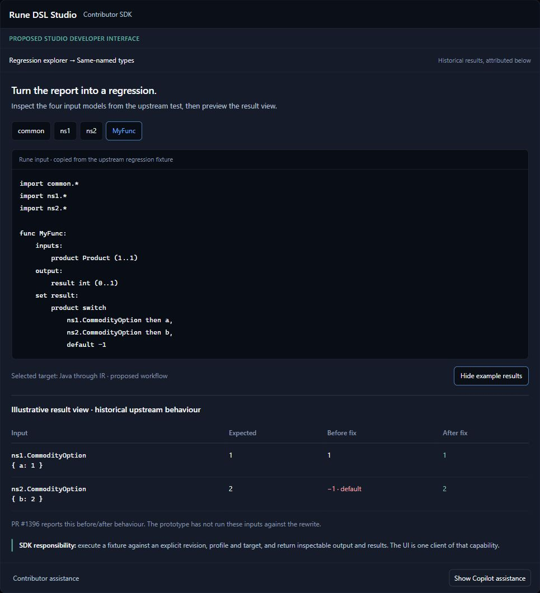
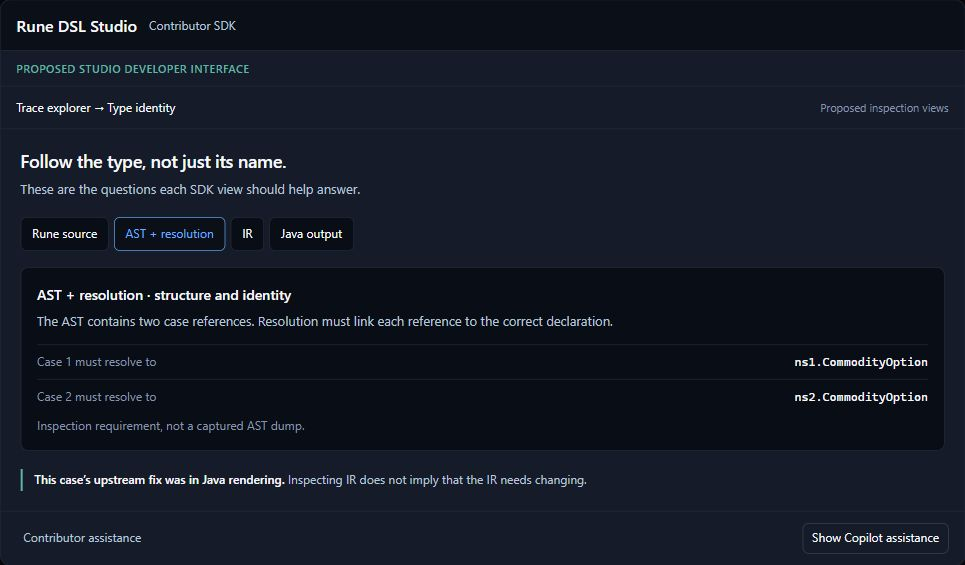

# DSL maintenance · SDK preview

A standalone **software development kit (SDK)** should let developers inspect, extend, test and debug Rune DSL through supported libraries. Rune DSL Studio is one proposed interface; command-line tools, language servers and agents can use the same services.

<picture>
  <source media="(max-width: 800px)" srcset="assets/contribution-sdk-libraries-mobile.svg">
  
</picture>

**Libraries first; interfaces share them.** Groupings are proposed responsibilities, not committed Maven artifact names. [Full-size library map](assets/contribution-sdk-libraries.svg).

<strong>CONTRIBUTION</strong> · Proposed design · SDK delivery follows core IR completion

## A developer's change workflow

<picture>
  <source media="(prefers-reduced-motion: reduce) and (max-width: 800px)" srcset="assets/contribution-sdk-workflow-mobile.svg">
  <source media="(prefers-reduced-motion: reduce)" srcset="assets/contribution-sdk-workflow.svg">
  <source media="(max-width: 800px)" srcset="assets/contribution-sdk-workflow-mobile.png">
  
</picture>

**From a reproducible case to a reviewable change.** [Static workflow](assets/contribution-sdk-workflow.svg) · [Open animation](assets/contribution-sdk-workflow.png).

The preview uses a real upstream namespace/switch issue, [#1395](https://github.com/finos/rune-dsl/issues/1395), already fixed by [#1396](https://github.com/finos/rune-dsl/pull/1396). It illustrates how a future SDK could help maintainers make that kind of change; the contribution SDK did not make the upstream fix.

## Proposed Studio developer interface

<picture>
  <source media="(max-width: 800px)" srcset="assets/sdk-preview-reproduce-mobile.png">
  
</picture>

**Regression Lab:** turn a reported language or target problem into a small fixture. [Full-size screen](assets/sdk-preview-reproduce.png).

<picture>
  <source media="(max-width: 800px)" srcset="assets/sdk-preview-trace-mobile.png">
  
</picture>

**Trace Explorer:** inspect the affected source, representation and target path before editing. [Full-size screen](assets/sdk-preview-trace.png).

[Open the interactive design walkthrough](sdk-walkthrough.html) to explore Reproduce, Trace, Change, Verify and Review. It is a simulated design, with no compiler/SDK running. In GitHub this HTML is a source/download link; the static screens above are the repository preview.

## Proposed library surface

| Service grouping | Developer use |
|---|---|
| Workspace and project configuration | Load sources/dependencies, manage updates and select supported project settings. |
| Semantic inspection and diagnostics | Query resolved identities, types, cardinality and validation with source provenance. |
| Representation and targets | Inspect/transform supported IR, integrate emitters and declare unsupported cases. |
| Regression, trace and evidence | Reproduce issues; compare generated output; compile and execute fixtures; assemble attributable evidence. |
| Client adapters | Expose the shared requests/results through CLI, LSP, Studio or agent protocols. |

Changes from 9.83 through later language versions are intended as **SDK maintenance exercises**: how a developer updates grammar, semantics or generation, then verifies the change. Some changes still require core compiler edits. Project profiles and new targets also require explicit supported contracts.

Existing foundations and remaining design work

The snapshot contains `rune-parser`, `rune-java-generator`, `rune-ir`, `rune-ir-java`, `rune-ir-java-optimised`, `rune-maven-plugin` and `rune-runtime`, plus verification modules. It does not ship supported `rune-sdk-*` artifacts, a replacement LSP or an MCP server.

Current workspace/semantic APIs, IR objects and generator providers supply foundations. The SDK still needs public API packaging/versioning, lifecycle and cancellation, extension contracts, source/IR/target tracing and reusable external regression orchestration. Internal harnesses are not already a supported SDK. LSP here means Language Server Protocol; editor completion, navigation, rename, formatting, error recovery and responsiveness need separate acceptance.

The existing walkthrough's screens and guidance have been retained as a design reference, with optional assistance and behind-the-scenes explanations. Its upstream case is already closed. Reproduction results, proposed source-to-IR tracing and verification automation are illustrative. Source basis: [architecture](ARCHITECTURE.md), [tooling acceptance](LIMITATIONS-AND-PLAN.md) and [roadmap](ROADMAP.md#later-acceptance-and-exploratory-work).

[Previous: Performance](measured-outcomes.md) · [Guide index](../README.md) · [Next: Execute](BUILDING.md)
